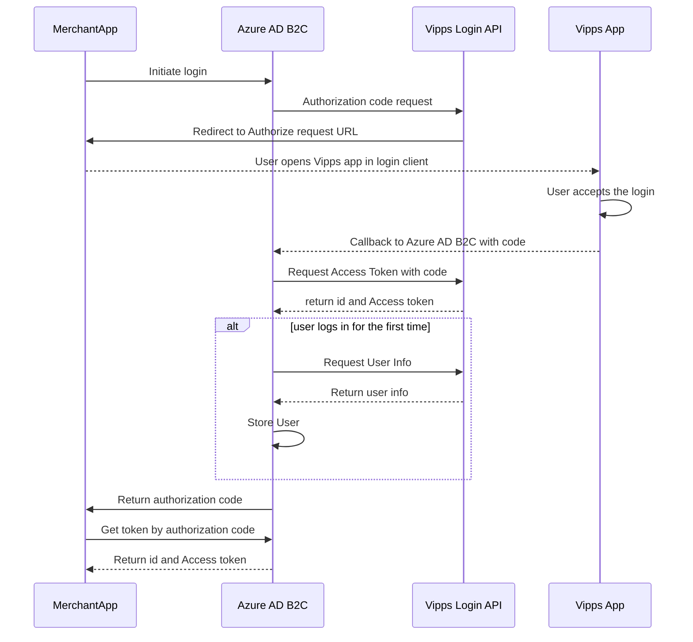

# Vipps login in Azure AD B2C using Custom Policies

## Table of Contents


- [Introduction](#introduction)
- [Prerequisites](#prerequisites)
- [Custom policy template](#custom-policy-template)
- [Client ID and secret](#client-id-and-secret)
- [Scope](#scope)
- [Upload the policy](#upload-the-policy)
- [Sequence Diagram of the flow implementation](#sequence-diagram-of-the-flow-implementation)
- [References](#references)  


## Introduction

This guide will describe how to use Azure AD B2C's custom policies to automatically create and log users in using Vipps. The custom policy implementation will provide the same login process as described in the [Vipps Login API documentation](https://developer.vippsmobilepay.com/docs/APIs/login-api/how-it-works/vipps-login-api-howitworks/#the-login-process).

With Azure AD B2C's custom policies, merchants can implement a Vipps login flow by using Vipps as an identity provider. Other identity providers can be configured to correspond to the same user in Azure AD B2C as Vipps. For more details on creating custom policies with identity providers in Azure AD B2C, see [References](#references).

Note: Azure AD B2C provides preconfigured user flows that can be used to authenticate, create, and log in users. This will however not provide any user information like name, email, etc. To achieve this, a custom policy must be provided.

## Prerequisites


- [Create an Azure AD B2C tenant](https://learn.microsoft.com/en-us/azure/active-directory-b2c/tutorial-create-tenant).
- [Register a web application](https://learn.microsoft.com/en-us/azure/active-directory-b2c/tutorial-register-applications?tabs=app-reg-ga). For testing in the Azure portal it is necessary to enable ID token implicit grant.
- Create a test unit in the [Vipps portal](https://developer.vippsmobilepay.com/docs/vipps-developers/developer-resources/portal/).

  - Save the `client_id` and `client_secret` for use in later steps.
  - Set the Token endpoint authentication method to `client_secret_post`.
  - Add the following redirect URI to the list of callback URIs, and replace `yourtenantname` with the name of your tenant.  


```bash
https://yourtenantname.b2clogin.com/yourtenantname.onmicrosoft.com/oauth2/authresp
```  


## Custom policy template

To implement Vipps login as a custom policyc download the [Custom Policy template](../CustomPolicyTemplate/).

This repository is a modified version of the [Azure AD B2C Custom Policy starter pack](https://github.com/Azure-Samples/active-directory-b2c-custom-policy-starterpack) that contains only the required files for sign-up and sign-in with Vipps as an identity provider.

The repository contains:


- **TrustFrameworkBase.xml** - Few modifications are required.
- **TrustFrameworkLocalization.xml** - Few modifications are required.
- **TrustFrameworkExtensions.xml** - Modifications are required.
- **SignUpOrSignin.xml** - Few modifications are required.


To make the custom policy work with your Azure AD B2C tenant, all files must have all instances of `yourtenantid` replaced by the name of your tenant. For example: `yourtenantname.onmicrosoft.com`.

## Client ID and secret

To configure the client ID, locate the `<TechnicalProfile Id="Vipps-OpenIdConnect">` in the TrustFrameworkExtentions file. Under `<Metadata>`, locate the `<Item Key="client_id">` field and enter the client id of your test unit.

Also, enter your Merchant Serial number in the field `<Item Key="Merchant-Serial-Number">`.

### Create a policy key

Follow the steps in the _Create a policy key_ section in the [Generic OpenID Connect](https://learn.microsoft.com/en-us/azure/active-directory-b2c/identity-provider-generic-openid-connect?pivots=b2c-custom-policy) documentation. Under `<CryptographicKeys>` enter the name of your policy key.


For example:
`<Key Id="client_secret" StorageReferenceId="B2C_1A_VippsSecret"/>`


## Scope

Scope defines the information you are requesting from the users. The `openid` scope must be specified, but the Vipps custom policy template also supports `name`, `email`, and `phoneNumber`. These attributes will be used to create a user in Azure AD B2C.

Additional [scopes provided by Vipps](https://developer.vippsmobilepay.com/docs/APIs/login-api/api-guide/core-concepts/#scopes) can be added, by adding them to _TrustFrameworkExtensions.xml_ and _SignUpOrSignin.xml_.

## Upload the policy


1. Select the **Identity Experience Framework** menu in your B2C tenant in the Azure portal.
2. Select *Upload custom policy*.
3. In this order, upload the policy files:

   a. TrustFrameworkBase.xml

   b. TrustFrameworkLocalization.xml

   c. TrustFrameworkExtensions.xml

   d. SignUpOrSignin.xml


To test the policy select _B2C_1A_signup_signin_, select the web application you wish to test, specify a Reply URL (for example https://jwt.ms), and click *Run Now*.

## Sequence Diagram of the flow implementation



## References

Creating a custom policy

- [Azure AD B2C custom policy overview](https://learn.microsoft.com/en-us/azure/active-directory-b2c/custom-policy-overview)
- [Create user flows and custom policies in Azure Active Directory B2C](https://learn.microsoft.com/en-us/azure/active-directory-b2c/tutorial-create-user-flows?pivots=b2c-custom-policy)
- [Set up sign-up and sign-in with generic OpenID Connect using Azure Active Directory B2C](https://learn.microsoft.com/en-us/azure/active-directory-b2c/identity-provider-generic-openid-connect?pivots=b2c-custom-policy)

Calling a REST API using a custom policy

- [Define a RESTful technical profile in an Azure Active Directory B2C custom policy](https://learn.microsoft.com/en-us/azure/active-directory-b2c/restful-technical-profile)
- [Call a REST API by using Azure Active Directory B2C custom policy](https://learn.microsoft.com/en-us/azure/active-directory-b2c/custom-policies-series-call-rest-api)