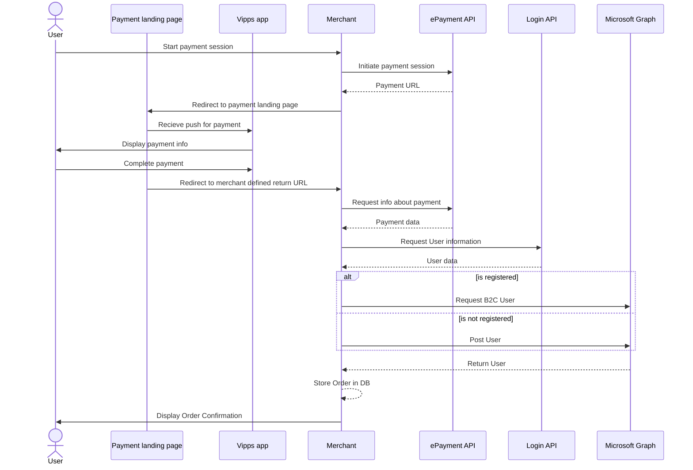

# Vipps login in Azure AD B2C using Custom Policies

## Table of Contents

- [Introduction](#introduction)
- [Prerequisites](#prerequisites)
- [Sequence Diagram](#sequence-diagram)
- [Initiate payment session with profle sharing](#initiate-payment-session-with-profile-sharing)
- [Store user in Azure AD B2C](#store-user-in-azure-ad-b2c)
- [Note about custom policies](#note-about-custom-policies)
- [References](#references)

## Introduction


This first part of this guide will describe how to implement a simple paymentflow where a user can pay for an order and give consent to sharing userinfo without the need of being signed in. The second part will show how the payment can be used to get information to store a user in Azure AD B2C. The code snippets are using the [Vipps .NET SDK](https://developer.vippsmobilepay.com/docs/SDKs/dotnet-sdk/) to communicate with the internal Vipps API´s. By following these steps a user can pay for an order, and later use Vipps Login to get an overview of his/her orders.

## Prerequisites

- [Create an Azure AD B2C tenant](https://learn.microsoft.com/en-us/azure/active-directory-b2c/tutorial-create-tenant).
- [Register a web application](https://learn.microsoft.com/en-us/azure/active-directory-b2c/tutorial-register-applications?tabs=app-reg-ga) to use the [Microsoft Graph API](https://learn.microsoft.com/en-us/azure/active-directory-b2c/microsoft-graph-operations)
- Create a test unit in the [Vipps portal](https://developer.vippsmobilepay.com/docs/vipps-developers/developer-resources/portal/).
  - Save the `client_id` and `client_secret` for use in later steps.
- Add the Vipps configuration to Program.cs -
  ```
  var vippsConfigurationOptions = new VippsConfigurationOptions
  {
      ClientId = "CLIENT-ID",
      ClientSecret = "CLIENT-SECRET",
      MerchantSerialNumber = "MERCHANT-SERIAL-NUMBER",
      SubscriptionKey = "SUBSCRIPTION-KEY",
      UseTestMode = true
  };
  ```
  For further explanation refer to the [Vipps SDK](https://developer.vippsmobilepay.com/docs/SDKs/) Documentation.

## Sequence Diagram

The Azure AD B2C payment flow consists of

1. Initiating a payment session
2. Storing user in Azure AD B2C



## Initiate payment session with profile sharing

To initiate a payment the merchant backend uses the [ePayment API](https://developer.vippsmobilepay.com/docs/APIs/epayment-api/) to create a payment endpoint. The endpoint will return a redirectURL. The redirectURL is where the user is sent to confirm the payment. The ReturnUrl is the URL where the user will be sent to after a successful payment. For example an order confirmation page/endpont.

The parameters needed to create a payment are:

- Phone Number: The phone number of the user
- Amount: The payment amount
- Payment Description: Description of what the user is paying for
- Reference: An unique identifier for an order

```bash
public async Task<string> CreatePayment(string phoneNumber, long amount, string paymentDescription, string reference)
    {
        var request = new CreatePaymentRequest
        {
            Amount = new Amount
            {
                Value = amount,
                Currency = Currency.NOK
            },
            PaymentMethod = new PaymentMethod
            {
                Type = PaymentMethodType.WALLET
            },
            Customer = new Customer
            {
                PhoneNumber = phoneNumber
            },
            Reference = reference ,
            UserFlow = CreatePaymentRequestUserFlow.WEB_REDIRECT,
            ReturnUrl = "<ReturnURL>",
            PaymentDescription = paymentDescription,
            Profile = new ProfileRequest
            {
                Scope = "name phoneNumber address birthDate"
            }
        };
        var result = await EpaymentService.CreatePayment(request);
        return result.RedirectUrl.ToString();
    }
```

## Store user in Azure AD B2C

If the user confirms the payment and gives consent to user information it will be redirected to the ReturnURL. The Merchant is now able to collect user information, and store it to Azure AD B2C. In this part the merchant will have to

1. Get the payment by the reference, and collect the users sub
2. Use the sub to collect user information
3. Store the user information to Azure AD B2C

### Get sub from Vipps Payment

```bash
public async Task<string> GetSubFromVippsPayment(string reference)
{
    var request = await EpaymentService.GetPayment(reference);
    return request.Profile.Sub;
}
```

### Use the sub to collect user information

To get user information you will have to use the Login API which is not supported by the SDK. Here you will have to configure a HttpClient where you will have to add a Bearer token in the authorization header. You could get the access token by following the [Access token API guide](https://developer.vippsmobilepay.com/docs/APIs/access-token-api/#get-an-access-token) or use the SDK like this

```bash
public async Task<User?> GetUserInfo(string sub)
    {
        var accessToken = await AccessTokenService.GetAccessToken();
        HttpClient client = new HttpClient();
        client.DefaultRequestHeaders.Add("Authorization", $"Bearer {accessToken}");
        var response = await client.GetAsync($"<base_url>/vipps-userinfo-api/userinfo/{sub}");

        if (!response.IsSuccessStatusCode)
        {
            return null;
        }

        var body = await response.Content.ReadAsStringAsync();
        User? user = JsonConvert.DeserializeObject<User>(body);
        return user;
    }
```

### Store the user information to Azure AD B2C

Once userinfo has been recieved from Vipps, we can create and store the users in Azure AD B2C. This can be done through the [Microsoft Graph API](https://learn.microsoft.com/en-us/azure/active-directory-b2c/microsoft-graph-operations). An example of how this can be implemented using the [Microsoft Graph .NET Client Library](https://www.nuget.org/packages/Microsoft.Graph) is shown below

```bash
private async Task PostUser(GraphServiceClient graphClient,string sub, string name, string email, string phoneNumber)
{
    var requestBody = new Microsoft.Graph.Models.User
    {
        DisplayName = name,
        MobilePhone = phoneNumber,
        UserPrincipalName = email,
        Identities = new List<ObjectIdentity>
        {
            new ObjectIdentity
            {
                SignInType = "federated",
                Issuer = "https://apitest.vipps.no/access-management-1.0/access/",
                IssuerAssignedId = sub,
            },
        },
    };
    var result = await graphClient.Users.PostAsync(requestBody);
}
```

Make sure that the parameters in `ObjectIdentity` are set to the same values as in the example and make sure that `IssuerAssignedId` is set to the sub recieved from the Vipps API.

Note: before `PostAsync` can be called, you need to make sure that there are no other users already registered with the same combination of `Issuer` and `IssuerAssignedId`.

An example of how to recieve a user from B2C is shown below.

```bash
private async Task<Microsoft.Graph.Models.User?> GetAzureB2CUser(GraphServiceClient graphClient, string sub)
{
    var response = await graphClient.Users
        .GetAsync(requestConfiguration =>
        {
            requestConfiguration.QueryParameters.Filter =
                $"identities/any(c:c/issuerAssignedId eq '{sub}' and issuer eq 'https://apitest.vipps.no/access-management-1.0/access/')";
        });
    return response?.Value?.FirstOrDefault();
}
```

This can be used to check if a user has already been created.

## Note about custom policies

We investigated the possibility of implementing a Vipps payment flow while storing users in B2C as a custom policy similar to [Vipps login using a custom policy](./CustomPolicyLogin.md). One could possibly create multiple policies for each step in the payment process that are called sequentially, but since there currently is no support for passing parameters to a custom policy before it is called, this flow will require i backend. Ultimatlely this means that it is arguably more cumbersome to use custom policies rather than using the Vipps API's directly.

## References

Implementing a payment flow

- [Vipps SDK](https://developer.vippsmobilepay.com/docs/SDKs/)
- [Vipps ePayment api](https://developer.vippsmobilepay.com/docs/APIs/epayment-api/)

Storing users in Azure AD B2C

- [Setting up Azure AD B2C](https://learn.microsoft.com/en-us/azure/active-directory-b2c/tutorial-create-tenant)
- [Microsoft Graph API](https://learn.microsoft.com/en-us/azure/active-directory-b2c/microsoft-graph-operations)
