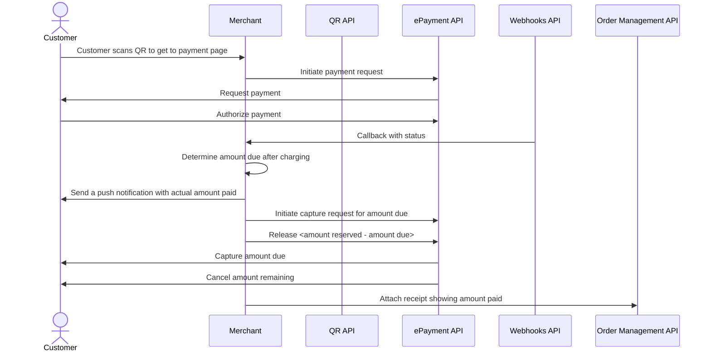

<!-- START_METADATA
---
title: Electric vehicle charging flow
sidebar_label: Electric vehicle charging
sidebar_position: 80
hide_table_of_contents: false
pagination_next: null
pagination_prev: null
---

import AUTHORIZEPAYMENT from '../_common/_customer_authorizes_epayment.md'
END_METADATA -->

# Electric vehicle charging

Vipps MobilePay is an excellent choice for Electric Vehicle (EV) charging, as practically all Nordic people have
the app on their phone. This removes the need to download a specific charging app.

This is a simple and efficient
solution that enables your customers to use your charging network with no hassle.


The best drop-in charging flow provides QR codes that can be scanned by
the customer with their phone's camera or the Vipps MobilePay app.

## Details

Combine the [QR API](https://developer.vippsmobilepay.com/docs/APIs/qr-api)
and
[ePayment API](https://developer.vippsmobilepay.com/docs/APIs/epayment-api)
to build this flow.


### Step 1: Generate a merchant redirect QR code

Generate a
[merchant redirect QR code](https://developer.vippsmobilepay.com/docs/APIs/qr-api/vipps-qr-api#merchant-redirect-qr-codes)
that contains the link to your website and the ID of the charging station.
Place it on the charging station.

The customer scans the QR code and is redirected to your website.

<details>
<summary>Detailed example</summary>
<div>

The QR code contains a `Id` that connects it to the taxi where it is located.

Here is an example HTTP POST:

[`POST:/qr/v1/merchant-redirect`](https://developer.vippsmobilepay.com/api/qr/#operation/CreateMerchantRedirectQr)

```json
{
  "id": "charging_unit_122_qr",
  "redirectUrl": "https://example.com/myChargingSite"
}
```

</div>
</details>

### Step 2. Initiate payment request

The website that the customer lands on should contain payment options, in addition to terms and conditions.
If the QR code contained an identification of the charging point, the customer doesn't have to type in any identification code to start charging.

When the customer is ready to pay, initiate a payment request.

The payment request amount should be large enough to cover the cost of a charging session. It is usually sufficient to reserve an amount between 350 NOK and 500 NOK, but with higher electricity costs, this may change.
It is also possible to let the customer choose maximum amount or reserved amount.
This amount will be reserved on the customer's account and the unused amount will be released when they are finished charging.

<details>
<summary>Detailed example</summary>
<div>

Since the customer has scanned from their phone, you don't need their phone number.
This payment command can do an app-switch and open their Vipps app with the payment request.
Specify `"userFlow": "WEB_REDIRECT"` to redirect the user to the Vipps app.

Specify `"customerInteraction": "CUSTOMER_PRESENT"`.

Here is an example HTTP POST:

[`POST:/epayment/v1/payments`](https://developer.vippsmobilepay.com/api/epayment#tag/CreatePayments/operation/createPayment)

```json
{
  "amount": {
    "value": 35000,
    "currency": "NOK"
  },
  "paymentMethod": {
    "type": "WALLET"
  },
  "customerInteraction": "CUSTOMER_PRESENT",
  "reference": 2486791679658155992,
  "userFlow": "WEB_REDIRECT",
  "returnUrl": "http://example.com/redirect?reference=2486791679658155992",
  "paymentDescription": "Charging session at station 21678 on October 9, 2029, 13:12."
}
```

</div>
</details>

### Step 3. Customer approves the payment

The customer's Vipps app should open automatically, with the maximum reservation amount visible.
They can then confirm the payment.

Afterwards, they are redirected back to the charging provider's website, where the status of the charge session is presented.

Once you know that payment was approved you, can start charging.
To get confirmation, monitor
[webhooks](https://developer.vippsmobilepay.com/docs/APIs/webhooks-api) and
[query the payment](https://developer.vippsmobilepay.com/api/epayment#tag/QueryPayments/operation/getPayment).

### Step 4. Start charging

Once the customer has approved the payment, you can start charging.
The customer can stop the charging at any time from your website screen or from the charging station's user interface.

Stop charging when charging is complete or when the customer selects to stop.

### Step 5. Capture the payment

After final amount is confirmed, do a
[partial capture](https://developer.vippsmobilepay.com/docs/APIs/epayment-api/operations/capture#partial-capture).
Then, release the remaining amount from the reservation with a
[cancel](https://developer.vippsmobilepay.com/docs/APIs/epayment-api/operations/cancel#cancel-after-a-partial-capture).

Check the status of the captured payment.

<details>
<summary>Detailed example</summary>
<div>

First, the capture:

[`POST:/epayment/v1/payments/{reference}/capture`](https://developer.vippsmobilepay.com/api/epayment/#tag/AdjustPayments/operation/capturePayment)

With body:

```json
{
  "modificationAmount": {
    "value": 21614,
    "currency": "NOK"
  }
}
```

</div>
</details>

If you are set up in Vipps' systems with the correct MCC (Merchant Category Code) for EV charging (5552), we will automatically send a push notification to the customer with the captured amount.

### Step 6. Cancel remaining amount

Cancel the purchase for the remaining amount.

[`POST:/epayment/v1/payments/{reference}/cancel`](https://developer.vippsmobilepay.com/api/epayment/#tag/AdjustPayments/operation/capturePayment)

### Step 7. Add a receipt

Send a digital receipt with the amount paid.

<details>
<summary>Detailed example</summary>
<div>

Here is an example HTTP POST:

[`POST:/order-management/v2/{paymentType}/receipts/{orderId}`](https://developer.vippsmobilepay.com/api/order-management/#operation/postReceiptV2)

For `paymentType`, use `eCom` for eCom or ePayment payments.
For `orderId`, use the `chargeId` of the charge.

Body:

```json
{
  "orderLines": [
    {
        "name": "charging",
        "id": "21678",
        "totalAmount": 21614,
        "totalAmountExcludingTax": 16210,
        "totalTaxAmount": 5404,
        "taxPercentage": 25,
        "productUrl": "https://www.example.com/evcharging",
      },
    },
  ],
  "bottomLine": {
    "currency": "NOK",
    "posId": "21678"
  }
}
```

</div>
</details>

## Related links

* [Merchant Redirect QR codes](https://developer.vippsmobilepay.com/docs/APIs/qr-api/vipps-qr-api#merchant-redirect-qr-codes)

## Sequence diagram

Sequence diagram for the electric vehicle charging payment flow.


