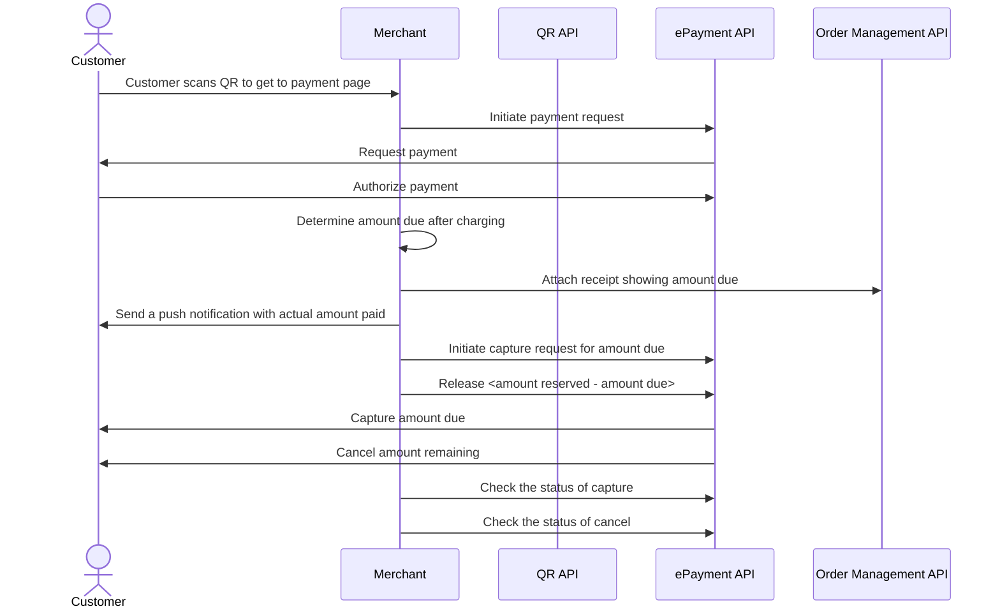

<!-- START_METADATA
---
title: Electric vehicle charging flow
sidebar_label: Electric vehicle charging
sidebar_position: 80
hide_table_of_contents: true
pagination_next: null
pagination_prev: null
---

import PARTIALCAPTURE from '../_common/_partial_capture.md'
import AUTHORIZEPAYMENT from '../_common/_customer_authorizes_epayment.md'
import ATTACHRECEIPT from '../_common/_attach_receipt.md'
END_METADATA -->

# Electric vehicle charging

Vipps is an excellent choice for electric vehicle (EV) charging as practically all Nordic people have
the app on their phone. This removes the need to download a specific charging app.

This is a simple and efficient
solution that lets your customers use your charging network with no hassle.

Drop-in charging is best implemented using QR codes, scanned either
with the Vipps app or the phone's camera.

The [QR API](https://developer.vippsmobilepay.com/docs/APIs/qr-api)
and
[ePayment API](https://developer.vippsmobilepay.com/docs/APIs/epayment-api)
allow you to set up and start a payment.

## Details

### Step 1. Customer scans the QR code

A Vipps QR code, generated using the QR API,
is placed on the charging station.
The QR code contains a link to the merchant's website and identifies the charging station.

The user can scan the QR code using either their mobile camera or the Vipps app.

See [Merchant Redirect QR codes](https://developer.vippsmobilepay.com/docs/APIs/qr-api/vipps-qr-api#merchant-redirect-qr-codes)
in the QR API guide for more details.

### Step 2. Customer selects to pay with Vipps

When the customer scans the QR code, they are redirected to the merchant's website, where they select Vipps as payment option for charging and click *Pay with Vipps*.

Details

The website that the user lands on should contain payment options, in addition to terms and conditions. If the QR code contained an identification of the charging point, the user doesn't have to type in any identification code to start charging. It is also possible to let the user choose maximum amount or reserved amount.

### Step 3. Initiate payment request

When the customer is ready to pay, initiate a
[payment request](https://developer.vippsmobilepay.com/api/epayment#tag/CreatePayments).

Details

The payment request amount should be large enough to cover the cost of a charging session. It is usually sufficient to reserve an amount between 350 NOK and 500 NOK, but with higher electricity costs, this may change.

If the payment is approved, this amount will be reserved on user's account. The amount that is unused will be released when they are finished charging.

### Step 4. Customer approves the payment

The customer's Vipps should open automatically, with the maximum reservation amount visible.
They can then confirm the payment.

The user is redirected back to the charging provider's website, where the status of the charge session is presented.

Details

<AUTHORIZEPAYMENT />

### Step 5. Start charging

Once the user has approved the payment, you can start charging.
The user can stop the charging at any time from your website screen or from the charging station's user interface.

Stop charging when charging is complete or when the customer selects to stop.

### Step 5. Add a receipt

Send a digital receipt and a hyperlink to the charging session after charging is done.

<ATTACHRECEIPT />

### Step 6. Capture the payment

<PARTIALCAPTURE />

Details

If you are set up in Vipps' systems with the correct MCC (Merchant Category Code) for EV charging (5552), we will automatically send a push notification to the user with the captured amount.

## Sequence diagram

Sequence diagram for the electric vehicle charging payment flow.

