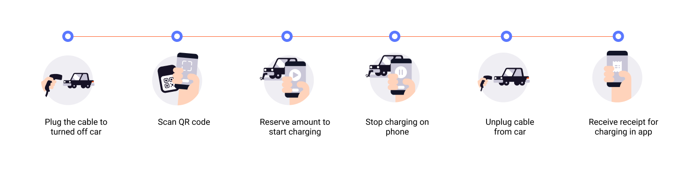
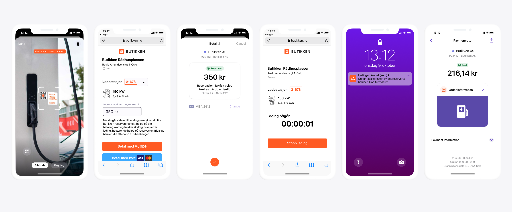

<!-- START_METADATA
---
title: Vipps MobilePay electric vehicle charging flow
sidebar_label: Electric vehicle charging
sidebar_position: 80
description: Using Vipps MobilePay for EV charging.
hide_table_of_contents: true
pagination_next: null
pagination_prev: null
---
END_METADATA -->

# Electric vehicle charging

Vipps is an excellent choice for Electric vehicle (EV) charging as practically all Norwegians have
the Vipps app in their pocket. This removes the need to download a
specific charging app.

Implemented correctly, EV charging with Vipps, is a simple and efficient
solution that lets your customers use your charging network with no hassle.

Drop-in charging with Vipps is best implemented using QR codes, scanned either
with the Vipps app or the phone's camera. Vipps provides a
[QR API](https://developer.vippsmobilepay.com/docs/APIs/qr-api)
that can be used in combination with the
[Vipps ePayment API](https://developer.vippsmobilepay.com/docs/APIs/epayment-api)
to set up and start a Vipps payment.

## User experience

1. The user scans a QR code on the charging station. Both the camera and the QR scanner in Vipps may be used.
2. The user is redirected to a website, provided by the charging provider, where they select Vipps as payment option for charging and click *Pay with Vipps*.
3. Vipps opens automatically, with the maximum reservation amount visible. The user confirms payment.
4. The user is redirected back to the charging provider's website, where the status of the charge session is presented. The user can stop the charging from this screen or from the charging station's user interface.
5. When the charging is complete, the user gets a push message stating the final sum that will be deducted from their account.
6. A receipt with the payment details is available in Vipps.

## Charging operator recommendations

As the charging provider, we recommend that your technical flow resembles the steps below:

1. The QR code on the charging station contains a link to a website provided by the charging provider. It is recommended that the particular charging station / charging point is identified in the QR code. QR codes should be Vipps-branded. This is achieved by generating QR codes using the [QR API](https://developer.vippsmobilepay.com/docs/APIs/qr-api).
2. The website that the user lands on should contain payment options, in addition to terms and conditions. If the QR code contained an identification of the charging point, the user doesn't have to type in any identification code to start charging. It is also possible to let the user choose maximum amount or reserved amount.
3. When the user clicks *Pay with Vipps*, your system should [create a payment](https://developer.vippsmobilepay.com/api/epayment#tag/CreatePayments) with an amount that will cover most charging sessions. Between 350 NOK and 500 NOK is usually sufficient, but with higher electricity costs, this may change.  If payment is approved by the user, this amount will be reserved on user's account.
4. To get confirmation that payment was approved, monitor [webhooks](https://developer.vippsmobilepay.com/docs/APIs/webhooks-api) and [query the payment](https://developer.vippsmobilepay.com/api/epayment#tag/QueryPayments/operation/getPayment). Once you know that payment was approved you, can start charging.
5. When the charging session is completed, you will know the amount the user should pay, and you can [capture](https://developer.vippsmobilepay.com/api/epayment#tag/AdjustPayments/operation/capturePayment) the amount due. After you have captured the amount due, you should release the remaining reserved amount on the user's account. This is done by doing a [cancel](https://developer.vippsmobilepay.com/api/epayment#tag/AdjustPayments/operation/cancelPayment) API call.
6. If you are set up in Vipps' systems with the correct MCC (Merchant Category Code) for EV charging (5552), we will automatically send a push notification to the user with the captured amount.
7. We recommend sending a digital receipt and a hyperlink to the charging session after charging is done. To do this, use the [Order Management API](https://developer.vippsmobilepay.com/docs/APIs/order-management-api).
