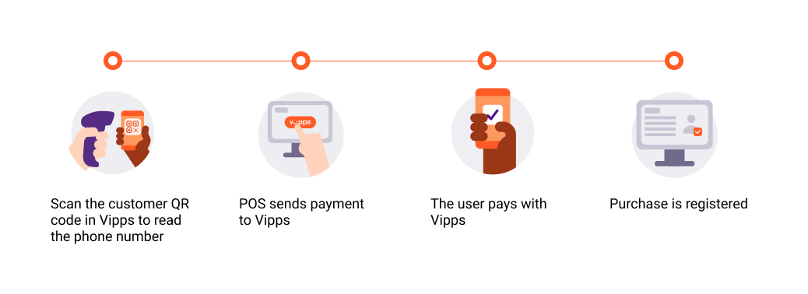
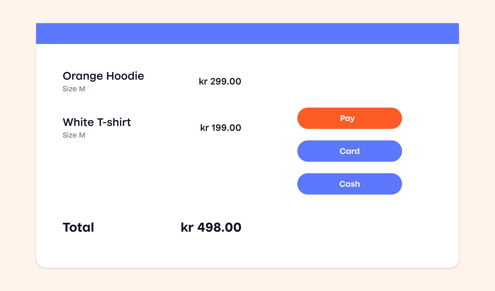
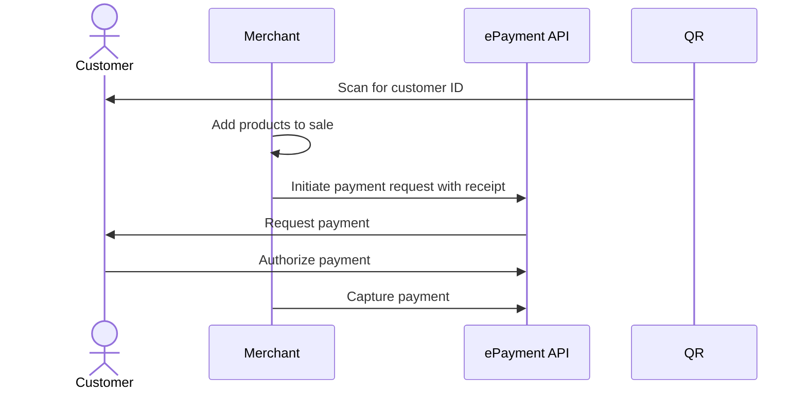

<!-- START_METADATA
---
title: Vipps MobilePay in-store payments
sidebar_label: In-store payments
sidebar_position: 20
description: Using Vipps MobilePay in a physical setting
hide_table_of_contents: false
pagination_next: null
pagination_prev: null
---

import AUTHORIZEPAYMENT from '../_common/_customer_authorizes_epayment.md'
END_METADATA -->

# In-store payments

This is the recommended flow for in-store payments.
This solution is a combination of the personal QR codes in the Vipps MobilePay app
and the
[ePayment API](https://developer.vippsmobilepay.com/docs/APIs/epayment-api).



## Details

### Step 1: Identify the customer

The customer presents their personal Vipps MobilePay QR code to the merchant.


<details>
<summary>How it works</summary>
<div>

This can happen in two ways:

* Customer-facing scanner - The store will have a permanent customer-facing scanner and customers can scan their QR code at any time.
* Cashier scanner - The QR code is scanned by the cashier using a wired scanner. This could happen while the cashier is scanning wares or immediately before the payment.

The customer's personal QR code contains a URL like this:
`https://qr.vipps.no/28/2/01/031/4791234567?v=1`, where `4791234567` is their phone number in
[MSISDN](https://en.wikipedia.org/wiki/MSISDN) format.

When this QR code is scanned, your POS system will get their phone number.
If you don't have a scanner, you can enter the customer's phone number manually.

</div>
</details>

### Step 2: Add the products to be purchased

Add the products that the customer wants to buy in the POS system.



### Step 3: Send a payment request

Send a payment request to the customer.

<details>
<summary>Detailed example</summary>
<div>

You already have the customer's phone number from step 1, so you don't need to ask for it.
Just provide a button in your user interface to allow the cashier to send the payment request.

Your system can send the payment request by using the
[`createPayment`](https://developer.vippsmobilepay.com/api/epayment#tag/CreatePayments/operation/createPayment)
endpoint.

Set `userFlow` to `PUSH_MESSAGE`. This will send a push directly to the customer.
Attach the receipt simultaneously.

Here is an example HTTP POST:

[`POST:/epayment/v1/payments`](https://developer.vippsmobilepay.com/api/epayment#tag/CreatePayments/operation/createPayment)

With body:

```json
{
  "amount": {
    "value": 49800,
    "currency": "NOK"
  },
  "paymentMethod": {
    "type": "WALLET"
  },
  "customer": {
    "phoneNumber": 4791234567
  },
  "receipt":{
    "orderLines": [
      {
        "name": "Orange hoodie",
        "id": "hoodie1234",
        "totalAmount": 29900,
        "totalAmountExcludingTax": 22425,
        "totalTaxAmount": 7475,
        "taxPercentage": 25,
      },
      {
        "name": "White T-shirt",
        "id": "tshirt1234",
        "totalAmount": 19900,
        "totalAmountExcludingTax": 14925,
        "totalTaxAmount": 2975,
        "taxPercentage": 25,
      },
    ],
    "bottomLine": {
      "currency": "NOK",
      "posId": "Butikken-23412"
    },
   "receiptNumber": "0527013501"
  },
  "reference": 2486791679658155992,
  "userFlow": "PUSH_MESSAGE",
  "returnUrl": "http://example.com/redirect?reference=2486791679658155992",
  "paymentDescription": "Payment to Butikken"
}
```

</div>
</details>

### Step 4: Customer authorizes the payment

<AUTHORIZEPAYMENT />


### Step 5: Capture the payment

Capture the payment and confirm that it was successful.

<details>
<summary>Detailed example</summary>
<div>

[`POST:/epayment/v1/payments/{reference}/capture`](/api/epayment/#tag/AdjustPayments/operation/capturePayment)

With body:

```json
{
  "modificationAmount": {
    "value": 49800,
    "currency": "NOK"
  }
}
```

</div>
</details>

## Sequence diagram

Sequence diagram for the standard in-store payment.


