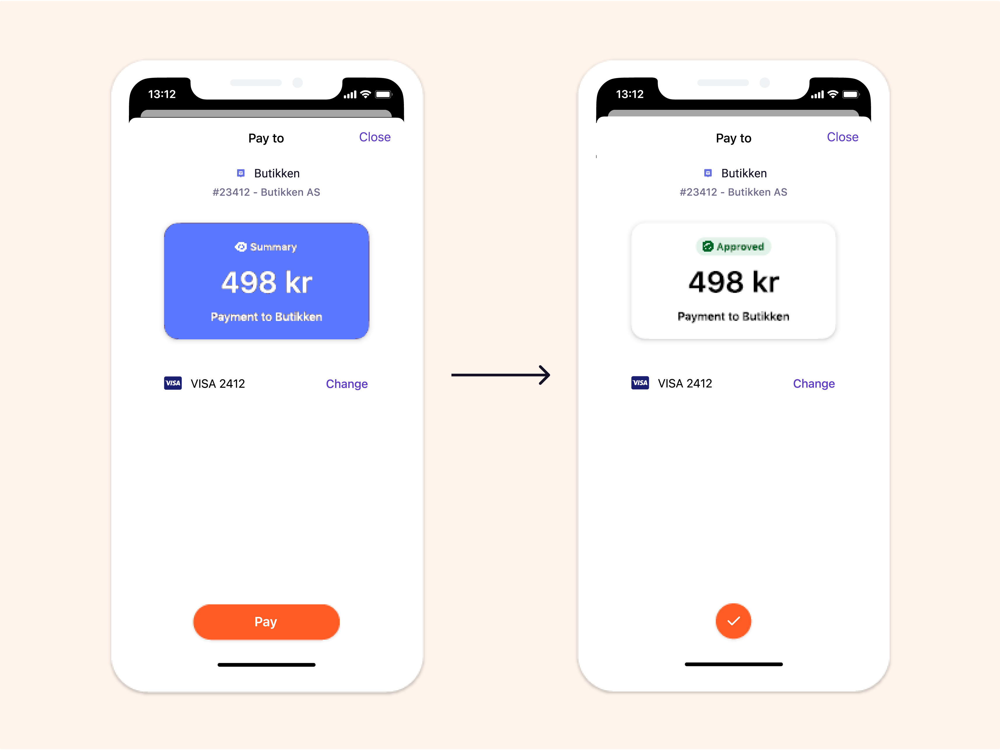
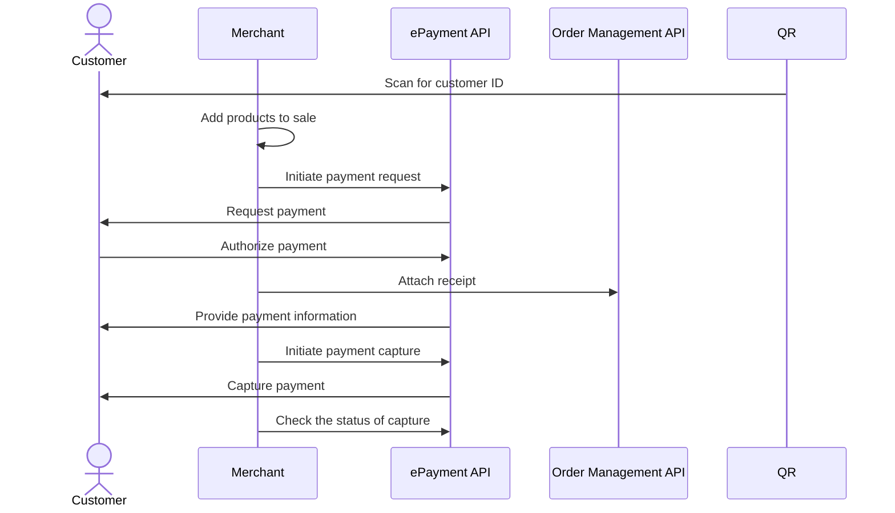

<!-- START_METADATA
---
title: Vipps MobilePay in-store payments
sidebar_label: In-store payments
sidebar_position: 20
description: Using Vipps MobilePay in a physical setting
hide_table_of_contents: true
pagination_next: null
pagination_prev: null
---

import ATTACHRECEIPT from '../_common/_attach_receipt.md'
END_METADATA -->

# In-store payments

This is the recommended flow for in-store payments.
This solution is a combination of the personal QR codes in the Vipps or MobilePay app
and the
[ePayment API](https://developer.vippsmobilepay.com/docs/APIs/epayment-api).


## Details

### Step 1: Identify the customer

The flow begins with the customer presenting their Vipps MobilePay QR code to the merchant. This can happen in two ways:

* Customer-facing scanner - The store will have a permanent customer-facing scanner and customers can scan their QR code at any time.
* Cashier scanner - The QR code is scanned by the cashier using a wired scanner. This could happen while the cashier is scanning wares or immediately before the payment.


The customer's personal QR code contains a URL like this:
`https://qr.vipps.no/28/2/01/031/4791234567?v=1`, where `4791234567` is their phone number in
[MSISDN](https://en.wikipedia.org/wiki/MSISDN) format.

When this QR code is scanned, your POS system will get their phone number.
If you don't have a scanner, you can enter the customer's phone number manually.

### Step 2: Add the products to be purchased

Add the products that the customer wants to buy in the POS system.


### Step 3: Send a payment request

You already have the phone number from step 1, so you don't need to ask for it again.
Just provide a button in your user interface to allow the cashier to send the payment request.

Your system can send the payment request by using the
[`createPayment`](https://developer.vippsmobilepay.com/api/epayment#tag/CreatePayments/operation/createPayment)
endpoint.

Set `userFlow` to `PUSH_MESSAGE`. This will send a push directly to the customer who scanned the QR code, and after the payment is completed, the POS will be updated with the status of the payment.

<details>
<summary>Detailed example</summary>
<div>
Here is an example HTTP POST:

[`POST:/epayment/v1/payments`](https://developer.vippsmobilepay.com/api/epayment#tag/CreatePayments/operation/createPayment)

With body:

```json
{
  "amount": {
    "value": 49800,
    "currency": "NOK"
  },
  "paymentMethod": {
    "type": "WALLET"
  },
  "customer": {
    "phoneNumber": 4796574209
  },
  "reference": 2486791679658155992,
  "userFlow": "PUSH_MESSAGE",
  "returnUrl": "http://example.com/redirect?reference=2486791679658155992",
  "paymentDescription": "Payment to Butikken"
}
```

</div>
</details>

### Step 4: Customer authorizes the payment

The customer confirms the payment in the app.



To get confirmation that payment was approved, monitor
[webhooks](https://developer.vippsmobilepay.com/docs/APIs/webhooks-api) and
[query the payment](https://developer.vippsmobilepay.com/api/epayment#tag/QueryPayments/operation/getPayment).

### Step 5. Update the POS system

Once the customer authorizes the payment, update the POS system with the status.

### Step 6. Attach a receipt to the order

<ATTACHRECEIPT />

### Step 7: Capture the payment

Once the customer authorizes the payment, update the POS system with the status.

The
[`capturePayment`](https://developer.vippsmobilepay.com/api/epayment/#tag/AdjustPayments/operation/capturePayment) endpoint
allows you to capture a payment.

Be sure to check the status of the captured payment.

## Sequence diagram

Sequence diagram for the standard in-store payment.


