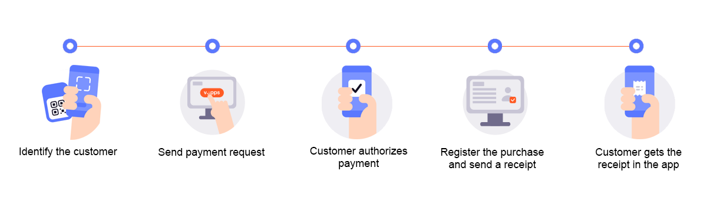
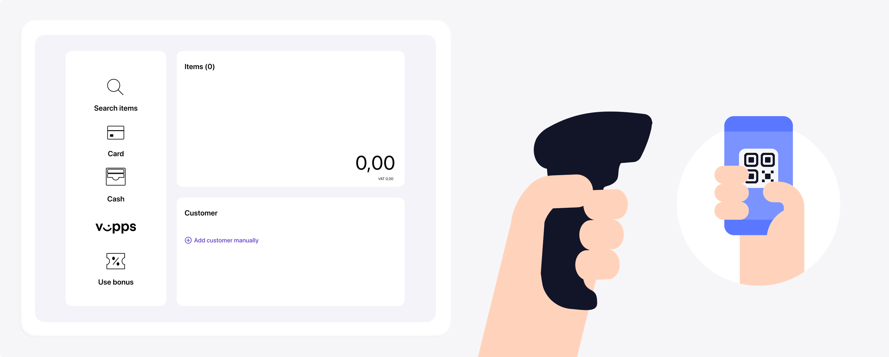
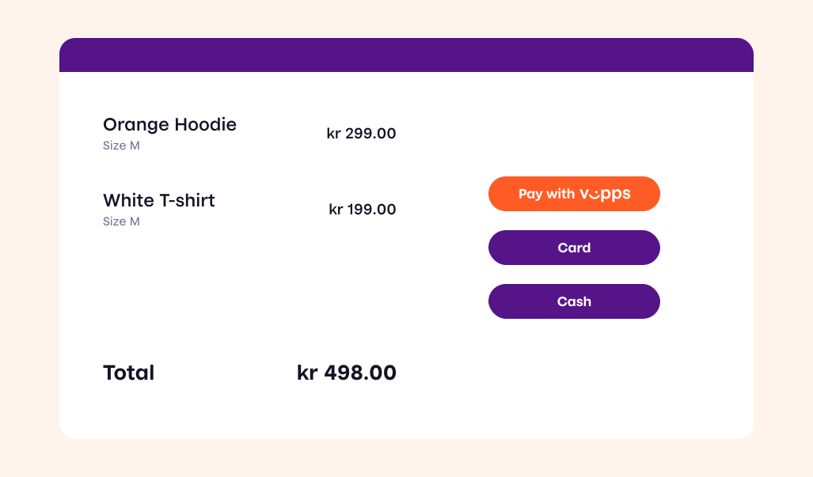
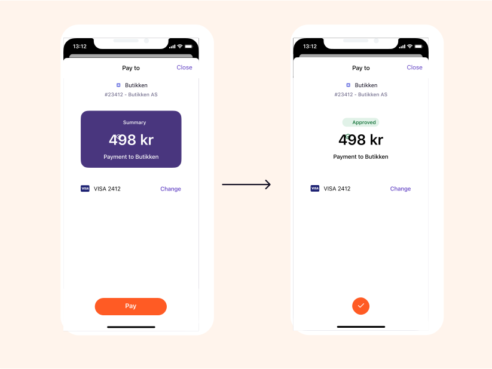

<!-- START_METADATA
---
title: Vipps MobilePay in-store payments
sidebar_label: In-store payments
description: Using Vipps MobilePay in a physical setting
hide_table_of_contents: true
pagination_next: null
pagination_prev: null
---
END_METADATA -->

# In-store payments

This is the recommended flow for in-store payments.
This solution is a combination of the personal QR codes in the Vipps app
and the
[ePayment API](https://developer.vippsmobilepay.com/docs/APIs/epayment-api).



## Step 1: Scan the customer's QR code

The flow begins with the customer presenting their QR code to the merchant. This can happen in two ways:

* Customer-facing scanner - The store will have a permanent customer-facing scanner and customers can scan their QR code at any time.
* Cashier scanner - The QR code is scanned by the cashier using a wired scanner. This could happen while the cashier is scanning wares or immediately before the payment.

If you don't have a scanner, you can enter the customer's phone number manually.



The customer's personal QR code contains a URL like this:
`https://qr.vipps.no/28/2/01/031/4791234567?v=1`, where `4791234567` is their phone number in
[MSISDN](https://en.wikipedia.org/wiki/MSISDN) format.

When this QR code is scanned in the store, the POS will get their phone number.

## Step 2: Add products to sell

Add the products that the customer wants to buy in the POS system.



## Step 3: Send a payment request

You already have the phone number from step 1, so you don't need to ask for it again.
Just provide a button in your user interface to allow the cashier to send the payment request.

Your system can send the payment request by using the
[`createPayment` endpoint](https://developer.vippsmobilepay.com/api/epayment#tag/CreatePayments/operation/createPayment).

Set `userFlow` to `PUSH_MESSAGE`. This will send a push directly to the customer who scanned the QR code, and after the payment is completed, the POS will be updated with the status of the payment.

<details>
<summary>Detailed example</summary>
<div>
Here is an example HTTP POST:

[`POST:/epayment/v1/payments`](https://developer.vippsmobilepay.com/api/epayment#tag/CreatePayments/operation/createPayment)

With body:

```json
{
  "amount": {
    "value": 49800,
    "currency": "NOK"
  },
  "paymentMethod": {
    "type": "WALLET"
  },
  "customer": {
    "phoneNumber": 4796574209
  },
  "reference": 2486791679658155992,
  "userFlow": "PUSH_MESSAGE",
  "returnUrl": "http://example.com/redirect?reference=2486791679658155992",
  "paymentDescription": "Payment to Butikken"
}
```

</div>
</details>

The customer confirms the payment in the app.



## Step 4: Register the payment

Once the customer authorizes the payment, the POS will be updated with the status.

## Step 5. Add the order receipt

After payment, add a payment receipt. This will appear in the Vipps MobilePay app.

The
[`postReceipt` endpoint](https://developer.vippsmobilepay.com/api/order-management/#operation/postReceiptV2)
allows you to send receipt information to the customer's app.
This is a combination of *order lines* and a *bottom line* with sum and VAT.
An *order line* is a description of each item present in the order.
