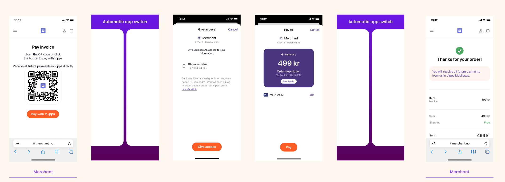
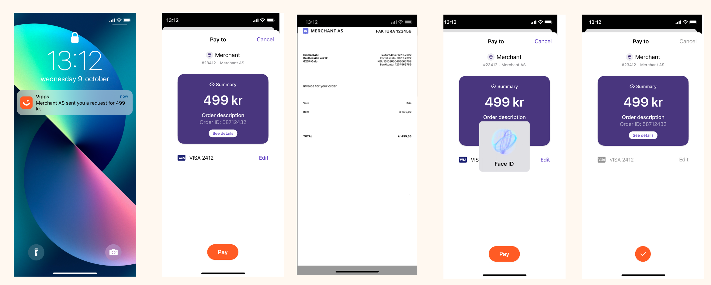

<!-- START_METADATA
---
title: Invoice through ePayment
sidebar_position: 54
---
END_METADATA -->

<!-- START_COMMENT -->

ℹ️ Please use the new documentation:
[Vipps Technical Documentation](https://vippsas.github.io/vipps-developer-docs/).

<!-- END_COMMENT -->

# Invoice through epayments

💥 Work in progress. 💥

Vipps may be used as a channel through which merchants can send invoices to their users by combining the
[ePayment API](https://vippsas.github.io/vipps-developer-docs/docs/APIs/epayment-api)
and
[Order Management API](https://vippsas.github.io/vipps-developer-docs/docs/APIs/order-management-api).

## Illustration

### First time payment of an invoice

1. Merchants in their website or mobile app can have an option for their users to opt for receiving invoices sent to their Vipps app
2. User is presented with their invoice in the merchant website or the merchant app with `Pay with Vipps` as an option
3. User clicks on `Pay with Vipps`
4. Merchant makes a
   [create payment](https://vippsas.github.io/vipps-developer-docs/api/epayment#tag/CreatePayments)
   call requesting for a profile scope `phoneNumber`:

```json
{
   "amount":{
      "currency":"NOK",
      "value":2000
   },
   "customer":{
      "phoneNumber":4748658141
   },
   "paymentMethod":{
      "type":"wallet"
   },
   "profile":{
      "scope":"phoneNumber"
   },
   "reference":"acme-shop-123-order123abc",
   "returnUrl":"https://example.io/redirect?orderId=1512202",
   "userFlow":"WEB_REDIRECT"
}
```

5. User is enters their phone number in Vipps landing page or the Vipps app is opened (if the user is on mobile and has Vipps app)
6. User consents for sharing phone number with the merchant
7. User approves the payment in Vipps app



8. Merchant retrieves the user's sub by making a call to
   [Get Payment](https://vippsas.github.io/vipps-developer-docs/api/epayment#tag/QueryPayments/operation/getPayment)
9. Merchant retrieves the user's phone number by making a call to
   [UserInfo](https://vippsas.github.io/vipps-developer-docs/api/login#tag/Userinfo-API/operation/userinfoAuthorizationCode)
10. Merchant can use the phone number to send direct payment request to the user for subsequent invoices

## Subsequent invoice payments

1. Merchant makes a call to
  [Adding and changing Category](https://vippsas.github.io/vipps-developer-docs/docs/APIs/order-management-api/vipps-order-management-api#adding-and-changing-category)
  to add invoice data (link to the invoice pdf)

PaymentType in the path must be `ecom`,
eg: `https://api.vipps.no/v2/ecom/categories/{orderId}`

```json
{
  "category": "GENERAL",
  "orderDetailsUrl": "https://www.vipps.no"
}
```
2. Merchant must use the **orderId** that they use in step 1 in step 3 inorder to link the order data and the payment.

3. Merchant makes a [create payment](https://vippsas.github.io/vipps-developer-docs/api/epayment#tag/CreatePayments) call with the following in the `CreatePaymentRequest`
    - **orderId** used in Step 1 must be passed as the value for **reference**
    - **expiresAt** must be set as the future date until which the user must be able to make payment for the invoice
    - If the merchant wants to allow the user to pay even after the last date for an invoice, then the **expiresAt** must be set accordingly
    - `userFlow: "PUSH_MESSAGE"` must be set
    - User's phone number which the merchant retrived earlier during the first time payment must be set

```json
{
   "amount":{
      "currency":"NOK",
      "value":2000
   },
   "customer":{
      "phoneNumber":4791234567
   },
   "paymentMethod":{
      "type":"wallet"
   },
   "reference":"acme-shop-123-order123abc",
   "returnUrl":"https://example.io/redirect?orderId=1512202",
   "userFlow":"PUSH_MESSAGE",
   "expiresAt":"2023-09-15T00:00:00Z"
}
```
4. User receives a push notification
5. User clicks on `See details` in the payment confirmation screen
6. User will be presented with the url that was provided by the merchant in
   step 1 in a web view. This way the user can see the invoice without leaving
   the Vipps App
7. User approves the payment



The subsequent invoice payments are long-living payments (because the merchants
define the expiration time) the users can The user can soft dismiss this payment
by clicking `Cancel` -> `I'll pay later` and come back into the app to pay it at
a later time.

Link to [Long-living payment (More than 10 minutes)](./long-expiry-time-for-payments-to-merchants/README.md)
