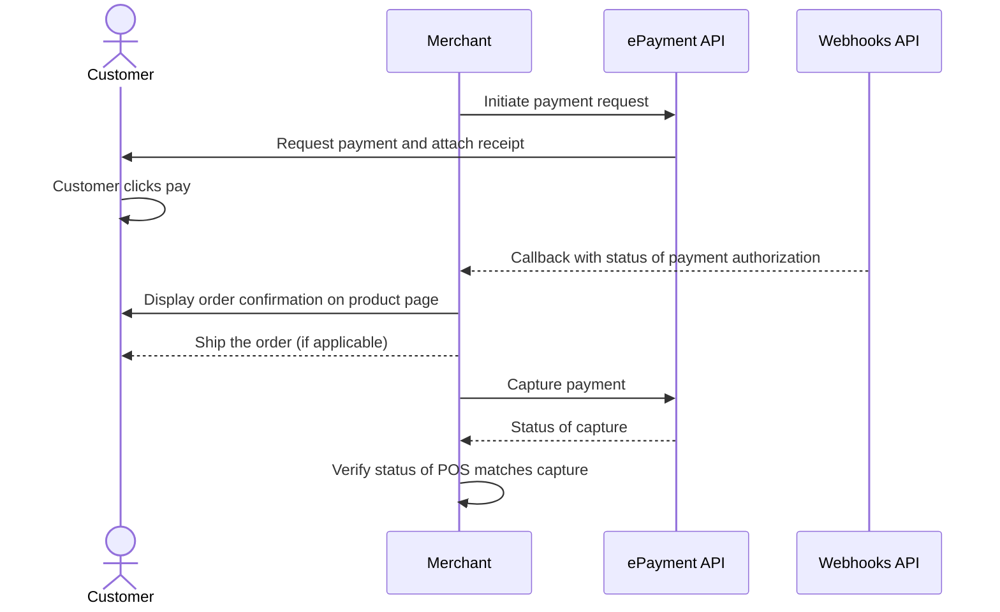

<!-- START_METADATA
---
title: Vipps MobilePay long-living payment requests
sidebar_label: Long-living payment requests
sidebar_position: 50
description: Using Vipps MobilePay for sending long-living payment requests payment requests.
hide_table_of_contents: false
pagination_next: null
pagination_prev: null
---

import ApiSchema from '@theme/ApiSchema';
import Tabs from '@theme/Tabs';
import TabItem from '@theme/TabItem';

import REGISTERWEBHOOK from '../_common/_register_epayment_webhook.md'
import AUTHORIZEPAYMENT from '../_common/_customer_authorizes_epayment.md'

END_METADATA -->

# Long-living payment requests

 *Available for Vipps.*

 *Available for MobilePay in selected markets at the [Vipps MobilePay joint platform launch](https://www.vippsmobilepay.com/#about).*

💥 *From Q4 2023, we will additionally send a push notification to the user when the payment is getting close to expiring.* 💥

Vipps MobilePay offers *Long-living payment requests* for creating invoices and payments that can be postponed up to 28 days.

**Please note:**  The user experience, including the standard timeout, should be as
consistent as possible, so this should only be used in special cases. To request this feature, please contact your key account manager, your partner manager, or
[customer service](https://vipps.no/kontakt-oss/).

<Tabs
defaultValue="vipps"
groupId="brand"
values={[
{label: 'Vipps', value: 'vipps'},
{label: 'MobilePay', value: 'mobilepay'},
]}>
<TabItem value="vipps">


</TabItem>
<TabItem value="mobilepay">


</TabItem>
</Tabs>

## Prerequisites

### Webhooks for ePayment events

<REGISTERWEBHOOK />

### Customer's phone number

If you have the customer's phone number and their consent to send payment requests through Vipps MobilePay,
you can send payment requests directly to them.

If you don't know your customer's phone number, you can start by sending them a link to your own landing page. There, you can trigger a payment request through Vipps, which will request their phone number automatically.

## Details

### Step 1. Create a payment request

Send a
[create payment](https://developer.vippsmobilepay.com/api/epayment#tag/CreatePayments) request,
where `customer.phoneNumber` is set.

The customer will receive a push notification in their Vipps MobilePay app.

<details>
<summary>Detailed example</summary>
<div>

Your system can send the payment request by using the
[`createPayment`](https://developer.vippsmobilepay.com/api/epayment#tag/CreatePayments/operation/createPayment)
endpoint.

Specify the `WALLET` payment method. This functionality is only available when using `WALLET`,
since the app is required.

Specify `expiresAt` with a value between 10 minutes and 28 days (40320 minutes) in the future.

Set `userFlow` to `PUSH_MESSAGE` to send a push directly to the customer.
Attach the receipt simultaneously.

You can also add the receipt at this time.

Here is an example HTTP POST:

[`POST:/epayment/v1/payments`](https://developer.vippsmobilepay.com/api/epayment#tag/CreatePayments/operation/createPayment)

With body:

```json
{
  "amount": {
    "value": 300000,
    "currency": "NOK"
  },
  "paymentMethod": {
    "type": "WALLET"
  },
  "customer": {
    "phoneNumber": 4791234567
  },
  "receipt":{
    "orderLines": [
      {
        "name": "Accident insurance",
        "id": "12345",
        "totalAmount": 150000,
        "totalAmountExcludingTax": 112500,
        "totalTaxAmount": 37500,
        "taxPercentage": 25,
      },
      {
        "name": "Travel insurance",
        "id": "12345",
        "totalAmount": 150000,
        "totalAmountExcludingTax": 112500,
        "totalTaxAmount": 37500,
        "taxPercentage": 25,
      },
    ],
    "bottomLine": {
      "currency": "NOK",
    },
   "receiptNumber": "0527013501"
  },
  "reference": 1648738112,
  "userFlow": "PUSH_MESSAGE",
  "expiresAt":"2024-08-04T00:00:00Z",
  "returnUrl": "http://www.merchant.com/redirect?reference=2486791679658155992",
  "paymentDescription": "Spendings"
}
```

</div>
</details>


See [ePayment API: Long-living payments](https://developer.vippsmobilepay.com/docs/APIs/epayment-api/features/long-living-payments)
for more details

### Step 2. Customer approves the payment

<AUTHORIZEPAYMENT />

Since you have already attached order information to this payment, the customer will be able to see this in the Vipps MobilePay app.
When they select `See details` in the payment confirmation screen, they are presented with the order information without leaving the app.

Note that, for long-living payments, customers also have the option of soft-dismissing the payment and postponing it for later.

### Step 3. Capture the payment

Capture the payment and confirm that it was successful.

<details>
<summary>Detailed example</summary>
<div>

[`POST:/epayment/v1/payments/{reference}/capture`](/api/epayment/#tag/AdjustPayments/operation/capturePayment)

With body:

```json
{
  "modificationAmount": {
    "value": 300000,
    "currency": "NOK"
  }
}
```

</div>
</details>

## Sequence diagram

Sequence diagram for the standard online payment flow, where payment request is sent directly to app.


