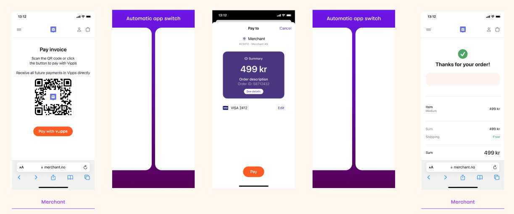

<!-- START_METADATA
---
title: Invoices
sidebar_label: Invoices
sidebar_position: 120
pagination_next: null
pagination_prev: null
---
END_METADATA -->

# Invoices

💥 Work in progress 💥

> **Please note:** This product will get a UX and API update in June 2023, as well as finalized guidelines on how to use it.

Use Vipps MobilePay to request payment from your customers for an invoice by doing a request to the
[ePayment](https://developer.vippsmobilepay.com/docs/APIs/epayment-api)
API. Include `receiptInfo` from the
[Order Management](https://developer.vippsmobilepay.com/docs/APIs/order-management-api) API.

This section will explain how to implement for different scenarios.

## Payment request sent directly to app

If you have the customer's phone number and their consent to send payment requests through Vipps, you can send payment requests for invoices directly.

Please note:

* The invoices should a link to a web view where the customer can get more details about the charges.
* The invoices must be hosted by you, the merchant.

1. Make a [create payment](https://developer.vippsmobilepay.com/api/epayment#tag/CreatePayments) request.

   Here is an example of a valid request body:

   ```json
   {
      "amount":{
         "currency":"NOK",
         "value":2000
      },
      "customer":{
         "phoneNumber":4791234567
      },
      "paymentMethod":{
         "type":"WALLET"
      },
      "receiptInfo":{
         "category": "GENERAL",
         "orderDetailsUrl": "https://example.com/orderdetails/acme-shop-123-order123abc"
      },
      "reference":"acme-shop-123-order123abc",
      "paymentDescription": "Invoice# 424243, due date: 01 Jan 2025",
      "returnUrl":"https://example.com/redirect?orderId=1512202",
      "userFlow":"PUSH_MESSAGE",
      "expiresAt":"2023-09-15T00:00:00Z"
   }
   ```

    For this solution, the following parameters must be set:

      * `reference` - The `orderId` used in Step 1.
      * `expiresAt` - The expiration date for the payment.
      * `userFlow`  - Must be `"PUSH_MESSAGE"`.
      * `customer.phoneNumber` - The customer's phone number.
      * `paymentDescription` - Short description with relevant information about the invoice.
      * `receiptInfo` (might be renamed)- Invoice information for the payment. It might be a link to a PDF or orderlines, more info will come June 2023.

2. The customer will receive a push notification in their Vipps app.
3. When the customer selects `See details` in the payment confirmation screen, they are presented with the order information provided by the merchant.
   In this scenario, they can tap this to view the invoice data hosted by the merchant in a web view without leaving the Vipps app or be shown orderlines directly.
4. The customer approves the payment.

   For example, the sequence might look like this:
   

   Invoice payments must have extended expiration dates, as specified in the
   [create payment](https://developer.vippsmobilepay.com/api/epayment#tag/CreatePayments) request.

   Users can soft-dismiss this payment
   by clicking `Cancel` -> `I'll pay later` and come back into the Vipps app to pay at a later time.

   For more information about extended expiration dates, see [Extended expiration for payments to merchants](../long-expiry-time-for-payments-to-merchants/README.md).

## Payment request as a link

   When a merchant does not know the phone number of the user and want to send a one-time request for payment for an invoice, they can use the Vipps API by following these steps.

1. In your website, mobile app, on paper document or email you send, provide your customers with an option for opting-in to receive payment request for invoices in the Vipps app.
1. Present them with the *Pay with Vipps*  option.

1. Send the [create payment](https://developer.vippsmobilepay.com/api/epayment#tag/CreatePayments) request.

   Request access to the user' phone number by including the `scope` parameter with a value of `phoneNumber`. In the `paymentDescription` field provide relevant information about the invoice.

   Here is an example of a valid request body:

   ```json
   {
      "amount":{
         "currency":"NOK",
         "value":2000
      },
      "paymentMethod":{
         "type":"WALLET"
      },
      "reference":"acme-shop-123-order123abc",
      "paymentDescription": "Invoice# 424242, due date: 31 Dec 2024",
      "returnUrl":"https://example.com/redirect?orderId=1512202",
      "userFlow":"WEB_REDIRECT"
   }
   ```

   For this solution, the following parameters must be set:

      * `reference` - The `orderId` used in Step 3.
      * `paymentDescription` - Short description with relevant information about the invoice.

1. If the customer is on a desktop computer, the
   [Vipps Landing page](https://developer.vippsmobilepay.com/docs/vipps-developers/common-topics/vipps-landing-page)
   opens. If on a mobile device, the Vipps app opens.

1. The customer approves the payment in the Vipps app.

   These steps can be visualized as:

   

## Payment request when sharing telephone number

When a merchant does not know the phone number of the user, they can request payment through the Vipps APIs by following these steps.

1. In your website, mobile app, on paper document or email you send, provide your customers with an option for opting-in to receive payment request for invoices in the Vipps app.
1. They view their invoice in your website or app.
1. Present them also with the *Pay with Vipps* option.
1. When they select *Pay with Vipps*, send the [create payment](https://developer.vippsmobilepay.com/api/epayment#tag/CreatePayments) request.

   Request access to the user' phone number by including the `scope` parameter with a value of `phoneNumber`. In the `paymentDescription` field provide relevant information about the invoice.

   Here is an example of a valid request body:

   ```json
   {
      "amount":{
         "currency":"NOK",
         "value":2000
      },
      "customer":{
         "phoneNumber":4791234567
      },
      "paymentMethod":{
         "type":"WALLET"
      },
      "profile":{
         "scope":"phoneNumber"
      },
      "receiptInfo":{
         "category": "GENERAL",
         "orderDetailsUrl": "https://example.com/orderdetails/acme-shop-123-order123abc"
      },
      "reference":"acme-shop-123-order123abc",
      "paymentDescription": "Invoice# 424242, due date: 31 Dec 2024",
      "returnUrl":"https://example.com/redirect?orderId=1512202",
      "userFlow":"WEB_REDIRECT"
   }
   ```

1. If the customer is on a desktop computer, the
   [Vipps Landing page](https://developer.vippsmobilepay.com/docs/vipps-developers/common-topics/vipps-landing-page)
   opens. If on a mobile device, the Vipps app opens.
1. The customer consents to share their phone number.
1. The customer approves the payment in the Vipps app.

   These steps can be visualized as:

   

1. To retrieve the user's phone number, start by making a request to
   [Get Payment](https://developer.vippsmobilepay.com/api/epayment#tag/QueryPayments/operation/getPayment) to get the `sub` value.
1. Then, make a request to
   [getUserinfo](https://developer.vippsmobilepay.com/api/userinfo#operation/getUserinfo).
   For details and more examples, see the
   [UserInfo API](https://developer.vippsmobilepay.com/docs/APIs/userinfo-api).

1. Finally, use the customer's phone number to send them direct payment requests in the future.
