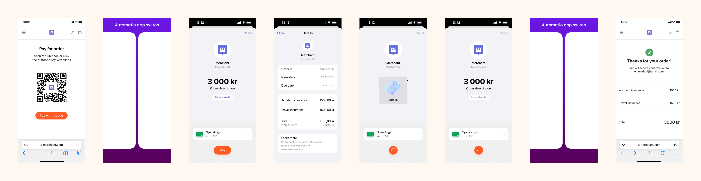
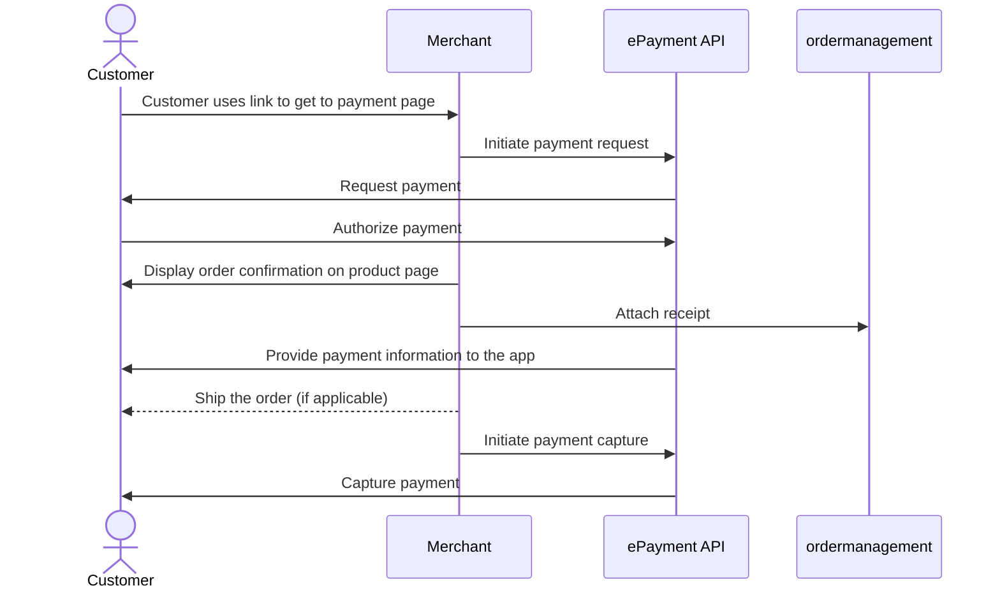

<!-- START_METADATA
---
title: Vipps MobilePay Payment request as a link
sidebar_label: Payment request as a link
sidebar_position: 52
hide_table_of_contents: true
pagination_next: null
pagination_prev: null
---

import ApiSchema from '@theme/ApiSchema';
import Tabs from '@theme/Tabs';
import TabItem from '@theme/TabItem';

import EX1 from './_create_payment_example.md'
END_METADATA -->

# Payment request as a link

If you don't know your customer's phone number, you can start by sending them a link to your own landing page. There, you can trigger a payment request through Vipps, which will request their phone number automatically.

The flow for the customer will look like this:

<Tabs
defaultValue="vipps"
groupId="app-choice"
values={[
{label: 'Vipps', value: 'vipps'},
{label: 'MobilePay', value: 'mobilepay'},
]}>
<TabItem value="vipps">

</TabItem>
<TabItem value="mobilepay">

</TabItem>
</Tabs>

1. Provide a QR code or link to your payment page where you present your customer with the option to pay with Vipps MobilePay.
2. When they select to pay with Vipps MobilePay, send the [create payment](https://developer.vippsmobilepay.com/api/epayment#tag/CreatePayments) request.

  <EX1 />

3. If the customer is a mobile device, the Vipps MobilePay app will open automatically.
   Otherwise, the
   [landing page](https://developer.vippsmobilepay.com/docs/vipps-developers/common-topics/vipps-landing-page)
   will open.

4. The customer authorizes the payment, and you provide them with a receipt.

## Sequence diagram

Sequence diagram for the standard online payment flow, where payment request is sent as a link.

