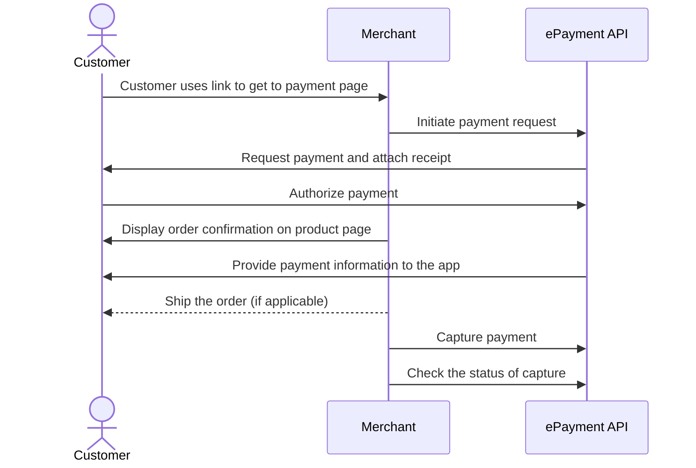

<!-- START_METADATA
---
title: Vipps MobilePay Payment request as a link
sidebar_label: Payment request as a link
sidebar_position: 52
hide_table_of_contents: false
pagination_next: null
pagination_prev: null
---

import ApiSchema from '@theme/ApiSchema';
import Tabs from '@theme/Tabs';
import TabItem from '@theme/TabItem';

import AUTHORIZEPAYMENT from '../_common/_customer_authorizes_epayment.md'
import FULLCAPTURE from '../_common/_full_capture.md'
END_METADATA -->

# Payment request as a link

If you don't know your customer's phone number, you can start by sending them a link to your own landing page. There, you can trigger a payment request through Vipps, which will request their phone number automatically.

The flow for the customer will look like this:

<Tabs
defaultValue="vipps"
groupId="app-choice"
values={[
{label: 'Vipps', value: 'vipps'},
{label: 'MobilePay', value: 'mobilepay'},
]}>
<TabItem value="vipps">


</TabItem>
<TabItem value="mobilepay">


</TabItem>
</Tabs>

## Details

### Step 1. Give the customer a QR or link to your page

Provide a QR code or link to your payment page where you present your customer with the option to pay with Vipps MobilePay.

### Step 2. Create a payment request

When they select to pay with Vipps MobilePay, send the [create payment](https://developer.vippsmobilepay.com/api/epayment#tag/CreatePayments) request.


<details>
<summary>Details</summary>
<div>

Your system can send the payment request by using the
[`createPayment`](https://developer.vippsmobilepay.com/api/epayment#tag/CreatePayments/operation/createPayment)
endpoint.

Set `userFlow` to `PUSH_MESSAGE`. This will send a push directly to the customer.
Attach the receipt simultaneously.

Here is an example HTTP POST:

[`POST:/epayment/v1/payments`](https://developer.vippsmobilepay.com/api/epayment#tag/CreatePayments/operation/createPayment)

With body:

```json
{
  "amount": {
    "value": 10000,
    "currency": "NOK"
  },
  "paymentMethod": {
    "type": "WALLET"
  },
  "customer": {
    "phoneNumber": 4791234567
  },
  "receipt":{
    "orderLines": [
      {
        "name": "socks",
        "id": "line_item_1",
        "totalAmount": 10000,
        "totalAmountExcludingTax": 8000,
        "totalTaxAmount": 2000,
        "taxPercentage": 25,
        "unitInfo": {
          "unitPrice": 4000,
          "quantity": "2",
          "quantityUnit": "PCS"
        },
      },
    ],
    "bottomLine": {
      "currency": "NOK",
      "posId": "pos_122"
    },
   "receiptNumber": "0527013501"
  },
  "reference": 2486791679658155992,
  "userFlow": "PUSH_MESSAGE",
  "returnUrl": "http://example.com/redirect?reference=2486791679658155992",
  "paymentDescription": "Payment to Butikken"
}
```


</div>
</details>

### Step 3. Customer approves the payment

<AUTHORIZEPAYMENT />

Note that, for long-living payments, customers also have the option of soft-dismissing the payment and postponing it for later.

### Step 5. Capture the payment

<FULLCAPTURE />

## Sequence diagram

Sequence diagram for the standard online payment flow, where payment request is sent as a link.


