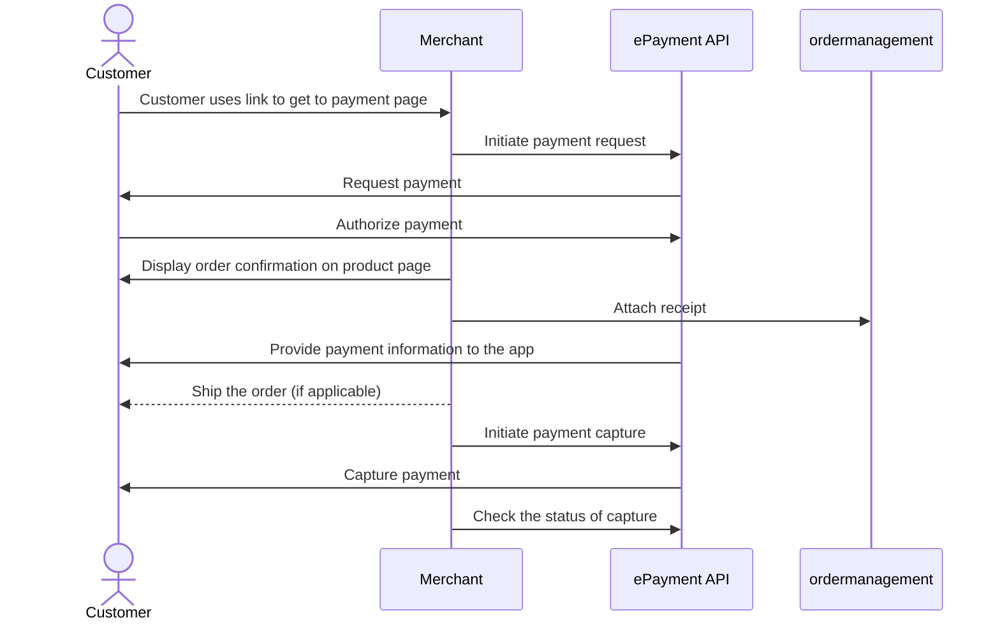

<!-- START_METADATA
---
title: Vipps MobilePay Payment request as a link
sidebar_label: Payment request as a link
sidebar_position: 52
hide_table_of_contents: false
pagination_next: null
pagination_prev: null
---

import ApiSchema from '@theme/ApiSchema';
import Tabs from '@theme/Tabs';
import TabItem from '@theme/TabItem';

import EX1 from './_create_payment_example.md'
import ATTACHRECEIPT from '../_common/_attach_receipt.md'
import FULLCAPTURE from '../_common/_full_capture.md'
END_METADATA -->

# Payment request as a link

If you don't know your customer's phone number, you can start by sending them a link to your own landing page. There, you can trigger a payment request through Vipps, which will request their phone number automatically.

The flow for the customer will look like this:

<Tabs
defaultValue="vipps"
groupId="app-choice"
values={[
{label: 'Vipps', value: 'vipps'},
{label: 'MobilePay', value: 'mobilepay'},
]}>
<TabItem value="vipps">

</TabItem>
<TabItem value="mobilepay">

</TabItem>
</Tabs>

## Details

### Step 1. Give the customer a QR or link to your page

Provide a QR code or link to your payment page where you present your customer with the option to pay with Vipps MobilePay.

### Step 2. Create a payment request

When they select to pay with Vipps MobilePay, send the [create payment](https://developer.vippsmobilepay.com/api/epayment#tag/CreatePayments) request.

<EX1 />

### Step 3. Customer approves the payment

The payment request will appear in the customer's Vipps app where they can authorize the payment.

To get confirmation that payment was approved, monitor
[webhooks](https://developer.vippsmobilepay.com/docs/APIs/webhooks-api) and
[query the payment](https://developer.vippsmobilepay.com/api/epayment#tag/QueryPayments/operation/getPayment).

### Step 4. Add a receipt

<ATTACHRECEIPT />

### Step 5. Capture the payment

<FULLCAPTURE />

## Sequence diagram

Sequence diagram for the standard online payment flow, where payment request is sent as a link.

