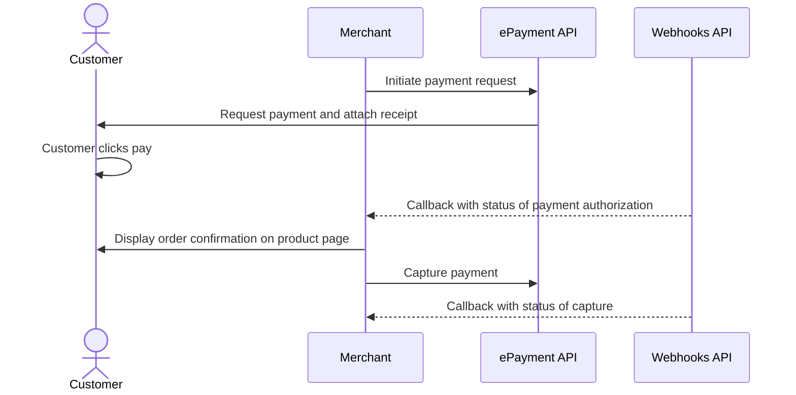

<!-- START_METADATA
---
title: Vipps MobilePay payment request sent directly to app
sidebar_label: Payment request sent directly to app
sidebar_position: 51
hide_table_of_contents: false
pagination_next: null
pagination_prev: null
---

import ApiSchema from '@theme/ApiSchema';
import Tabs from '@theme/Tabs';
import TabItem from '@theme/TabItem';

import AUTHORIZEPAYMENT from '../_common/_customer_authorizes_epayment.md'

END_METADATA -->

# Payment request sent directly to app

If you have the customer's phone number and their consent to send payment requests through Vipps MobilePay,
you can send payment requests directly to them.

The flow for the customer will look like this:

<Tabs
defaultValue="vipps"
groupId="app-choice"
values={[
{label: 'Vipps', value: 'vipps'},
{label: 'MobilePay', value: 'mobilepay'},
]}>
<TabItem value="vipps">


</TabItem>
<TabItem value="mobilepay">


</TabItem>
</Tabs>

## Details

### Step 1. Create a payment request

To create this payment, you first send a
[create payment](https://developer.vippsmobilepay.com/api/epayment#tag/CreatePayments) request,
where `customer.phoneNumber` is set.

The customer will receive a push notification in their Vipps MobilePay app.


<details>
<summary>Detailed example</summary>
<div>

Your system can send the payment request by using the
[`createPayment`](https://developer.vippsmobilepay.com/api/epayment#tag/CreatePayments/operation/createPayment)
endpoint.

Set `userFlow` to `PUSH_MESSAGE`. This will send a push directly to the customer.
Attach the receipt simultaneously.

Here is an example HTTP POST:

[`POST:/epayment/v1/payments`](https://developer.vippsmobilepay.com/api/epayment#tag/CreatePayments/operation/createPayment)

With body:

```json
{
  "amount": {
    "value": 300000,
    "currency": "NOK"
  },
  "paymentMethod": {
    "type": "WALLET"
  },
  "customer": {
    "phoneNumber": 4791234567
  },
  "receipt":{
    "orderLines": [
      {
        "name": "Accident insurance",
        "id": "12345",
        "totalAmount": 150000,
        "totalAmountExcludingTax": 112500,
        "totalTaxAmount": 37500,
        "taxPercentage": 25,
      },
      {
        "name": "Travel insurance",
        "id": "12345",
        "totalAmount": 150000,
        "totalAmountExcludingTax": 112500,
        "totalTaxAmount": 37500,
        "taxPercentage": 25,
      },
    ],
    "bottomLine": {
      "currency": "NOK",
    },
   "receiptNumber": "0527013501"
  },
  "reference": 2486791679658155992,
  "userFlow": "PUSH_MESSAGE",
  "returnUrl": "http://example.com/redirect?reference=2486791679658155992",
  "paymentDescription": "Spendings"
}
```

</div>
</details>

### Step 2. Customer approves the payment

<AUTHORIZEPAYMENT />

Since you have already attached order information to this payment, the customer will be able to see this in the Vipps MobilePay app.
When they select `See details` in the payment confirmation screen, they are presented with the order information without leaving the app.

Note that, for long-living payments, customers also have the option of soft-dismissing the payment and postponing it for later.

### Step 3. Capture the payment

Capture the payment and confirm that it was successful.

<details>
<summary>Detailed example</summary>
<div>

[`POST:/epayment/v1/payments/{reference}/capture`](/api/epayment/#tag/AdjustPayments/operation/capturePayment)

With body:

```json
{
  "modificationAmount": {
    "value": 300000,
    "currency": "NOK"
  }
}
```

</div>
</details>

## Sequence diagram

Sequence diagram for the standard online payment flow, where payment request is sent directly to app.


