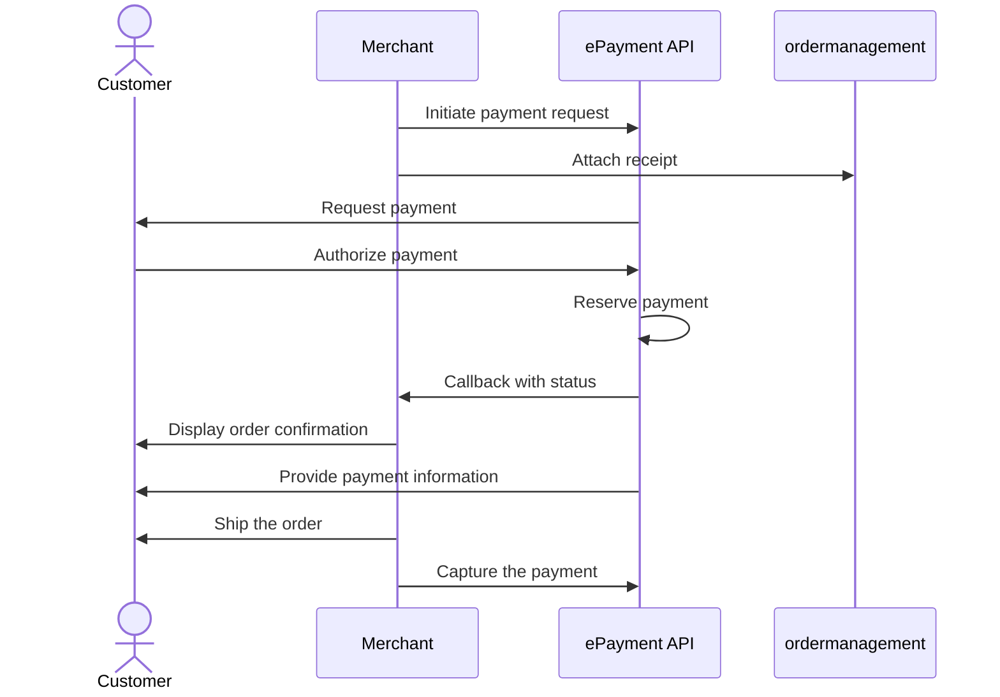

<!-- START_METADATA
---
title: Vipps MobilePay payment request sent directly to app
sidebar_label: Payment request sent directly to app
sidebar_position: 51
hide_table_of_contents: true
pagination_next: null
pagination_prev: null
---

import ApiSchema from '@theme/ApiSchema';
import Tabs from '@theme/Tabs';
import TabItem from '@theme/TabItem';

import EX1 from './_create_payment_example.md'
END_METADATA -->

# Payment request sent directly to app

If you have the customer's phone number and their consent to send payment requests through Vipps MobilePay,
you can send payment requests directly to the customer.

The flow for the customer will look like this:

<Tabs
defaultValue="vipps"
groupId="app-choice"
values={[
{label: 'Vipps', value: 'vipps'},
{label: 'MobilePay', value: 'mobilepay'},
]}>
<TabItem value="vipps">

</TabItem>
<TabItem value="mobilepay">

</TabItem>
</Tabs>

## Details

1. To create this payment, you first send a
   [create payment](https://developer.vippsmobilepay.com/api/epayment#tag/CreatePayments) request, where `customer.phoneNumber` is set.
  
  <EX1 />

2. The customer will receive a push notification in their Vipps or MobilePay app.
3. When the customer selects `See details` in the payment confirmation screen, they are presented with the order information provided by the merchant without leaving the app.
4. The customer approves the payment.

   Users also have the option of soft-dismissing the payment and postponing it for later.

## Sequence diagram

Sequence diagram for the standard online payment flow, where payment request is sent directly to app.

