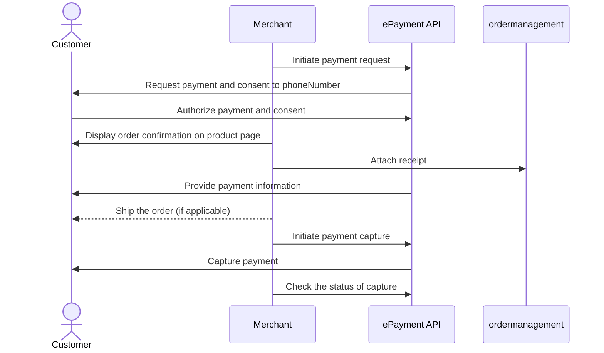

<!-- START_METADATA
---
title: Vipps MobilePay payment request with sharing of telephone number
sidebar_label: Payment request with sharing of telephone number
sidebar_position: 53
hide_table_of_contents: false
pagination_next: null
pagination_prev: null
---

import ApiSchema from '@theme/ApiSchema';
import Tabs from '@theme/Tabs';
import TabItem from '@theme/TabItem';

import AUTHORIZEPAYMENT from '../_common/_customer_authorizes_epayment.md'
import ATTACHRECEIPT from '../_common/_attach_receipt.md'
import FULLCAPTURE from '../_common/_full_capture.md'
END_METADATA -->

# Payment request with sharing of telephone number

The flow for the customer will look like this:

<Tabs
defaultValue="vipps"
groupId="app-choice"
values={[
{label: 'Vipps', value: 'vipps'},
{label: 'MobilePay', value: 'mobilepay'},
]}>
<TabItem value="vipps">

</TabItem>
<TabItem value="mobilepay">

</TabItem>
</Tabs>

## Details

This is very similar to [Payment request as a link](payment-sent-as-link.md).
The difference is that you will also ask the user to share their telephone number.

### Step 1. Give the customer a QR or link to your page

Provide a QR code or link to your payment page where you present your customer with the option to pay with Vipps MobilePay.

### Step 2. Create a payment request

When they select to pay with Vipps MobilePay, send the [create payment](https://developer.vippsmobilepay.com/api/epayment#tag/CreatePayments) request and include a consent request for the user's phone number.

This is done by setting the `scope` parameter with a value of `phoneNumber` in the
[create payment](https://developer.vippsmobilepay.com/api/epayment#tag/CreatePayments) request.

After the customer has finished the payment, you will get their phone number to keep for future payments. This means that, in the future, you can send the payment request directly to them without requiring a new login.

There is more info about fetching user data in the
[profile sharing](https://developer.vippsmobilepay.com/docs/APIs/epayment-api/features/profile-sharing/)
section of the ePayment API guide.

### Step 3. Customer approves the payment

<AUTHORIZEPAYMENT />

### Step 4. Add a receipt

<ATTACHRECEIPT />

### Step 5. Capture the payment

<FULLCAPTURE />

## Sequence diagram

Sequence diagram for the payment request with sharing of telephone number.

