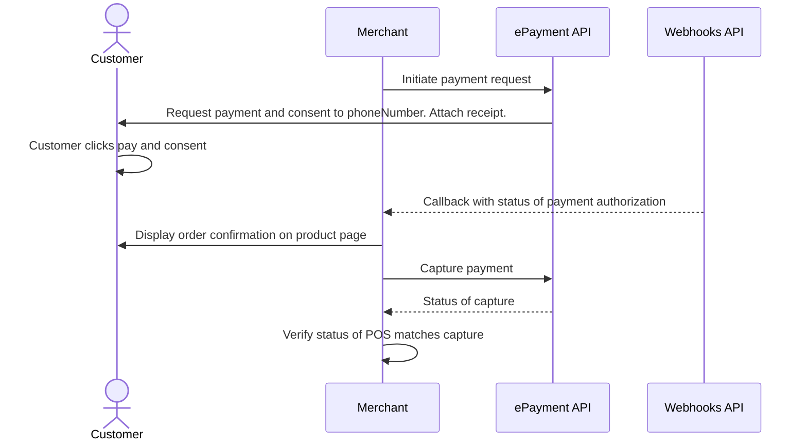

<!-- START_METADATA
---
title: Vipps MobilePay payment request with sharing of telephone number
sidebar_label: Payment request with sharing of telephone number
sidebar_position: 53
hide_table_of_contents: false
pagination_next: null
pagination_prev: null
---

import ApiSchema from '@theme/ApiSchema';
import Tabs from '@theme/Tabs';
import TabItem from '@theme/TabItem';

import REGISTERWEBHOOK from '../_common/_register_epayment_webhook.md'
import AUTHORIZEPAYMENT from '../_common/_customer_authorizes_epayment.md'

END_METADATA -->

# Payment request with sharing of telephone number

The flow for the customer will look like this:

<Tabs
defaultValue="vipps"
groupId="app-choice"
values={[
{label: 'Vipps', value: 'vipps'},
{label: 'MobilePay', value: 'mobilepay'},
]}>
<TabItem value="vipps">


</TabItem>
<TabItem value="mobilepay">


</TabItem>
</Tabs>

## Prerequisites

### QR code with to your page

Generate a
[merchant redirect QR code](https://developer.vippsmobilepay.com/docs/APIs/qr-api/vipps-qr-api#merchant-redirect-qr-codes)
that contains the link to your website.

<details>
<summary>How to create a QR code</summary>
<div>

The QR code contains a `Id` that connects it to the taxi where it is located.

Here is an example HTTP POST:

[`POST:/qr/v1/merchant-redirect`](https://developer.vippsmobilepay.com/api/qr/#operation/CreateMerchantRedirectQr)

```json
{
  "id": "user34",
  "redirectUrl": "https://example.com/mybill/1234678"
}
```

</div>
</details>

### Webhooks for ePayment events

<REGISTERWEBHOOK />

## Details

This is very similar to [Payment request as a link](payment-sent-as-link.md).
In addition, you will ask the user to share their telephone number.

### Step 1. Give the customer a QR to your page

Provide a QR code or link to your payment page.

### Step 2. Create a payment request

When they select to pay with Vipps MobilePay, send the [create payment](https://developer.vippsmobilepay.com/api/epayment#tag/CreatePayments) request and include a consent request for the user's phone number.

<details>
<summary>Detailed example</summary>
<div>

This is done by setting the `scope` parameter with a value of `phoneNumber` in the request.

Set `userFlow` to `PUSH_MESSAGE`. This will send a push directly to the customer.
Attach the receipt simultaneously.

Here is an example HTTP POST:

[`POST:/epayment/v1/payments`](https://developer.vippsmobilepay.com/api/epayment#tag/CreatePayments/operation/createPayment)

With body:

```json
{
  "amount": {
    "value": 300000,
    "currency": "NOK"
  },
  "paymentMethod": {
    "type": "WALLET"
  },
   "profile": {
    "scope": "phoneNumber"
  },
  "receipt":{
    "orderLines": [
      {
        "name": "Accident insurance",
        "id": "12345",
        "totalAmount": 150000,
        "totalAmountExcludingTax": 112500,
        "totalTaxAmount": 37500,
        "taxPercentage": 25,
      },
      {
        "name": "Travel insurance",
        "id": "12345",
        "totalAmount": 150000,
        "totalAmountExcludingTax": 112500,
        "totalTaxAmount": 37500,
        "taxPercentage": 25,
      },
    ],
    "bottomLine": {
      "currency": "NOK",
    },
   "receiptNumber": "0527013501"
  },
  "reference": 248679167965815592292,
  "userFlow": "PUSH_MESSAGE",
  "returnUrl": "http://example.com/redirect?reference=2486791679658155992",
  "paymentDescription": "Spendings"
}
```


</div>
</details>

After the customer has finished the payment, you will get their phone number to keep for future payments. This means that, in the future, you can send the payment request directly to them without requiring a new login.

There is more info about fetching user data in the
[profile sharing](https://developer.vippsmobilepay.com/docs/APIs/epayment-api/features/profile-sharing/)
section of the ePayment API guide.

### Step 3. Customer approves the payment

<AUTHORIZEPAYMENT />

### Step 4. Capture the payment

Capture the payment and confirm that it was successful.

<details>
<summary>Detailed example</summary>
<div>

[`POST:/epayment/v1/payments/{reference}/capture`](/api/epayment/#tag/AdjustPayments/operation/capturePayment)

With body:

```json
{
  "modificationAmount": {
    "value": 300000,
    "currency": "NOK"
  }
}
```

</div>
</details>

## Sequence diagram

Sequence diagram for the payment request with sharing of telephone number.


