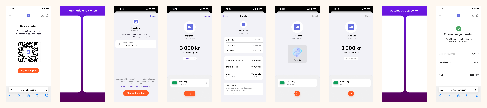
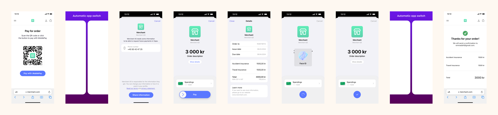
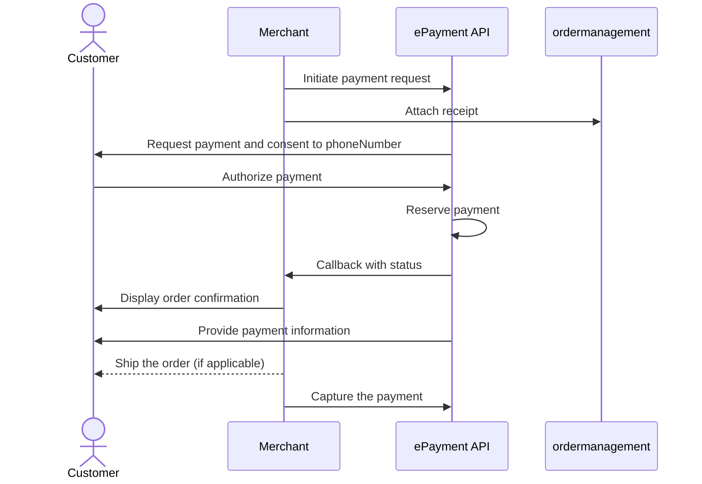

<!-- START_METADATA
---
title: Vipps MobilePay payment request with sharing of telephone number
sidebar_label: Payment request with sharing of telephone number
sidebar_position: 53
hide_table_of_contents: true
pagination_next: null
pagination_prev: null
---

import ApiSchema from '@theme/ApiSchema';
import Tabs from '@theme/Tabs';
import TabItem from '@theme/TabItem';

END_METADATA -->

# Payment request with sharing of telephone number

The flow for the customer will look like this:

<Tabs
defaultValue="vipps"
groupId="app-choice"
values={[
{label: 'Vipps', value: 'vipps'},
{label: 'MobilePay', value: 'mobilepay'},
]}>
<TabItem value="vipps">

</TabItem>
<TabItem value="mobilepay">

</TabItem>
</Tabs>

## Details

This is very similar to [Payment request as a link](payment-sent-as-link.md).
The difference is that you will also ask the user to share their telephone number.
This is done by setting the `scope` parameter with a value of `phoneNumber` in the
[create payment](https://developer.vippsmobilepay.com/api/epayment#tag/CreatePayments) request.

After the user have finished the payment, you will get the phone number of the customer. This means you can proceed with scenario 1 in the future and send the payment request directly to the customer. There is more info about fetching user data in the
[profile sharing](https://developer.vippsmobilepay.com/docs/APIs/epayment-api/features/profile-sharing/)
section of the ePayment API guide.

## Sequence diagram

Sequence diagram for the payment request with sharing of telephone number.

