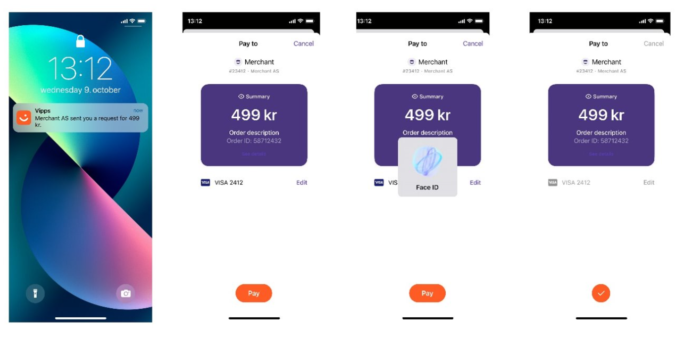
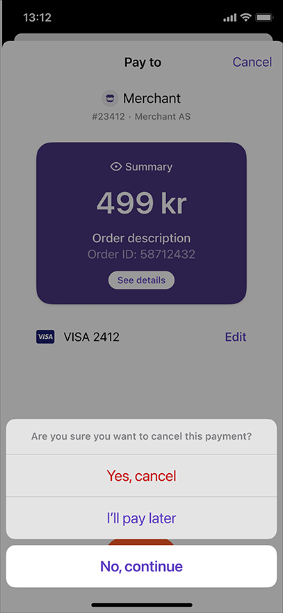
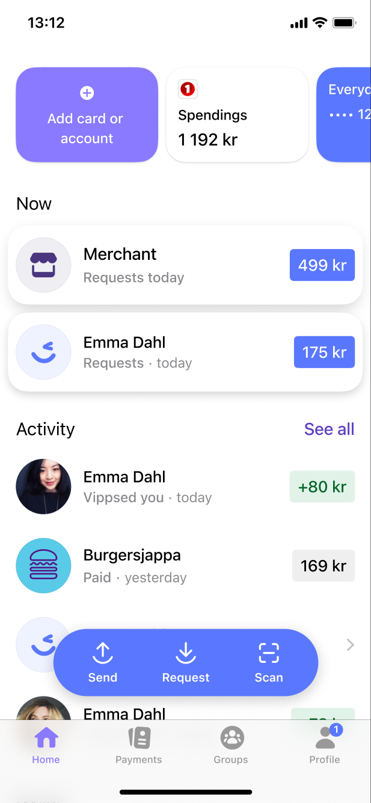

<!-- START_METADATA
---
title: Long-living payment
sidebar_position: 48
---
END_METADATA -->

<!-- START_COMMENT -->

ℹ️ Please use the new documentation:
[Vipps Technical Documentation](https://vippsas.github.io/vipps-developer-docs/).

<!-- END_COMMENT -->

# Long-living payment

💥 Work in progress. 💥

The expiration time for payments in the
[eCom API](https://vippsas.github.io/vipps-developer-docs/docs/APIs/ecom-api)
payment is 10 minutes, as described in
[Timeouts](https://vippsas.github.io/vipps-developer-docs/docs/vipps-developers/common-topics/timeouts).

In some cases this is not enough, for instance:
* Paying at a doctor's office, where the payment request may arrive as the patient
  is leaving the office and doesn't notice it.
* Paying at a toll road where the driver can not stop to complete the payment.

The
[ePayment API](https://vippsas.github.io/vipps-developer-docs/docs/APIs/epayment-api)
supports _long-living payments_, where the merchant can specify the expiration
time when initiating the payment with
[`POST:/epayment/v1/payments`](https://vippsas.github.io/vipps-developer-docs/api/epayment#tag/CreatePayments).

The expiration time is set with the `expiresAt` parameter.

**Please note:** Sale units (MSNs) must be specially approved to use this feature.
Vipps wants the user experience, including the standard timeout, to be as
consistent as possible, so `expiresAt` should only be used in special cases.
Please contact your key account manager (KAM) to get access to this feature.

A valid
[`POST:/epayment/v1/payments`](https://vippsas.github.io/vipps-developer-docs/api/epayment#tag/CreatePayments)
request with `expiresAt` looks like this:

```json
{
   "amount":{
      "currency":"NOK",
      "value":49900
   },
   "customer":{
      "phoneNumber":4791234567
   },
   "paymentMethod":{
      "type":"wallet"
   },
   "reference":"acme-shop-123-order123abc",
   "returnUrl":"https://example.io/redirect?orderId=1512202",
   "userFlow":"PUSH_MESSAGE",
   "expiresAt":"2023-02-15T00:00:00Z"
}
```

This will send a push message in Vipps to the specified user.

The `expiresAt` value must be between 10 minutes and 28 days (40320 minutes).

If the above is attempted for a sale unit that is not whitelisted, it will result in
an error similar to this:

```json
{
    "type": "",
    "title": "Long living Ecom not allowed",
    "status": 400,
    "detail": "Merchant serial number 123456 is not allowed to perform long living Ecom transactions",
    "instance": "/v1/payments/",
    "traceId": "00-631d10d7ee147e46941a0725ed2dcd6a-54bda84425e20140-01"
}
```

If the user's phone number is unknown, the API request can use `userFlow: "QR"`.
This will return the QR code for a payment with the expiration time set by the
merchant. The user can then scan and pay - either immediately or later.

The user clicks on the notification or scans the QR code to complete the payment flow in the app.



The user can soft dismiss this payment by clicking `Cancel` -> `I'll pay later`.
This option will only be shown to payments that have expiresAt property set by
the merchant.



Soft dismissed payment will be available in the App until expiry for the user to
pay. Vipps will send reminder to users who have a soft dismissed a payment and
that payment is about to expire.


