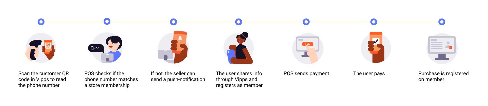
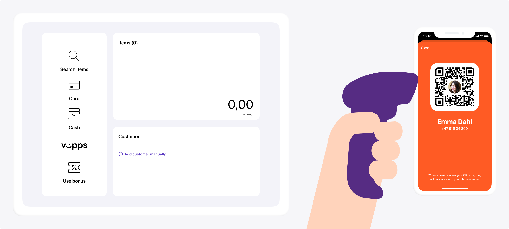
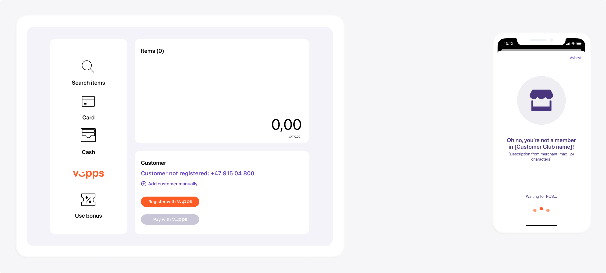
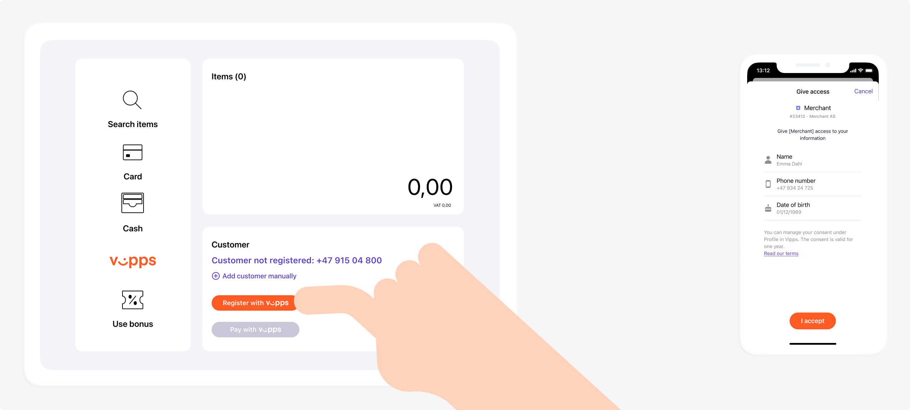
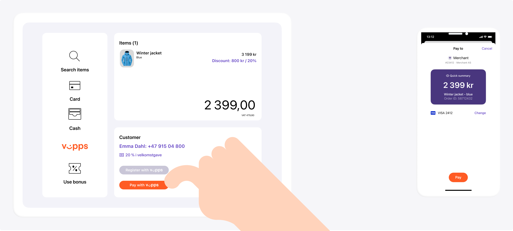
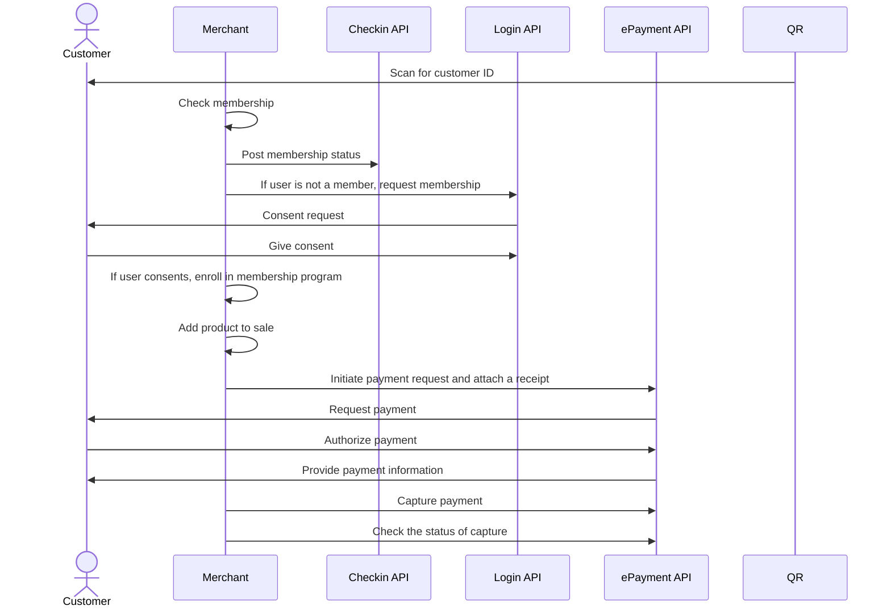

<!-- START_METADATA
---
title: Vipps MobilePay in-store payments with customer club flow
sidebar_label: In-store payments with customer club
sidebar_position: 30
description: Using Vipps MobilePay in a physical setting with customer club
hide_table_of_contents: false
pagination_next: null
pagination_prev: null
---

import AUTHORIZEPAYMENT from '../_common/_customer_authorizes_epayment.md'
import FULLCAPTURE from '../_common/_full_capture.md'
END_METADATA -->

# In-store payments with customer club

This flow makes a great product-market fit for
retail stores that want to combine loyalty with payments.
It's a great way to improve the payment experience for customers and simplify the process
of adding customers to the merchant loyalty club.

The solution is a combination of the personal QR codes in the Vipps or MobilePay app,
the
[Login API](https://developer.vippsmobilepay.com/docs/APIs/login-api),
the
[ePayment API](https://developer.vippsmobilepay.com/docs/APIs/epayment-api),
and the
[Check-in API](https://developer.vippsmobilepay.com/docs/APIs/check-in-api).

The following describes the process at a high level.



## Details

### Step 1: Identify the customer

The flow begins with the customer presenting their Vipps MobilePay QR code to the merchant.



<details>
<summary>How it works</summary>
<div>

This can happen in two ways:

* Customer-facing scanner - The store will have a permanent customer-facing scanner and customers can scan their QR code at any time.
* Cashier scanner - The QR code is scanned by the cashier using a wired scanner. This could happen while the cashier is scanning wares or immediately before the payment.

The customer's personal QR code contains a URL like this:
`https://qr.vipps.no/28/2/01/031/4791234567?v=1`, where `4791234567` is their phone number in
[MSISDN](https://en.wikipedia.org/wiki/MSISDN) format.

When this QR code is scanned, your POS system will get their phone number.
If you don't have a scanner, you can enter the customer's phone number manually.

</div>
</details>

### Step 2: Check membership

In your internal system, check the customer's membership status by using the phone number you received in the previous step.

Use the [Check-in API](https://developer.vippsmobilepay.com/docs/APIs/check-in-api/) to trigger a *waiting screen* in the app.

<details>
<summary>Detailed example</summary>
<div>

Here is an example HTTP POST:

[`POST:/point-of-sale/v1/loyalty-check-in`](https://developer.vippsmobilepay.com/api/check-in#tag/Loyalty-check-in/operation/initiateLoyaltyCheckIn)

With body:

```json
{
    "phoneNumber": "4791234567",
    "loyaltyProgramName": "Acme loyalty club",
    "isMember": true
}
```

</div>
</details>

If the customer is a not member, proceed to step 3 where you can enroll them by using the
[Login API](https://developer.vippsmobilepay.com/docs/APIs/login-api).

If they are already a member, skip step 3 and go to step 4 to send a payment request to the customer.



### Step 3: Request membership (skip if already a member)

If the customer is not a member of the loyalty program, request to enroll them by using
the [Vipps Login API](https://developer.vippsmobilepay.com/docs/APIs/login-api).

You already have their phone number from step 1, so just provide a button in
your user interface to allow the cashier to initiate the login.

Pressing the button will trigger a
[Login flow](https://developer.vippsmobilepay.com/docs/APIs/login-api/api-guide/flows/phone-number-ciba-flows)
to gather consent from the customer. The steps needed to get consent from the user are explained in detail there.
The CIBA flow will send a push to the user, and once the user has finished the flow, it should be reflected in the POS.

When this login flow is completed, the customer will be enrolled in the loyalty program.



### Step 4: Send a payment request

After membership status has been determined and all articles have been scanned, send a payment request to the customer.

You already have the phone number from step 1, so you don't need to ask for it again.
Just provide a button in your user interface to allow the cashier to send the payment request.

<details>
<summary>Detailed example</summary>
<div>

Your system can send the payment request by using the
[`createPayment`](https://developer.vippsmobilepay.com/api/epayment#tag/CreatePayments/operation/createPayment)
endpoint.

Set `userFlow` to `PUSH_MESSAGE`. This will send a push directly to the customer who scanned the QR code.
Attach the receipt simultaneously.

Here is an example HTTP POST:

[`POST:/epayment/v1/payments`](https://developer.vippsmobilepay.com/api/epayment#tag/CreatePayments/operation/createPayment)

With body:

```json
{
  "amount": {
    "value": 10000,
    "currency": "NOK"
  },
  "paymentMethod": {
    "type": "WALLET"
  },
  "customer": {
    "phoneNumber": 4791234567
  },
  "receipt":{
    "orderLines": [
      {
        "name": "winter jacket",
        "id": "jacket1234",
        "totalAmount": 239900,
        "totalAmountExcludingTax": 179925,
        "totalTaxAmount": 59975,
        "taxPercentage": 25,
        "discount": 80000
        "unitInfo": {
          "unitPrice": 319900,
          "quantity": "1",
          "quantityUnit": "PCS"
        },
      },
    ],
    "bottomLine": {
      "currency": "NOK",
      "posId": "pos_122"
    },
   "receiptNumber": "0527013501"
  },
  "reference": 2486791679658155992,
  "userFlow": "PUSH_MESSAGE",
  "returnUrl": "http://example.com/redirect?reference=2486791679658155992",
  "paymentDescription": "Winter jacket - blue"
}
```

</div>
</details>

### Step 5. Customer approves the payment

<AUTHORIZEPAYMENT />




### Step 6: Capture the payment

<FULLCAPTURE />

## Sequence diagram

Sequence diagram for in-store payment with customer club.


