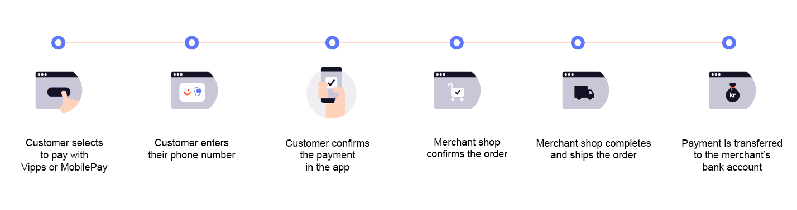
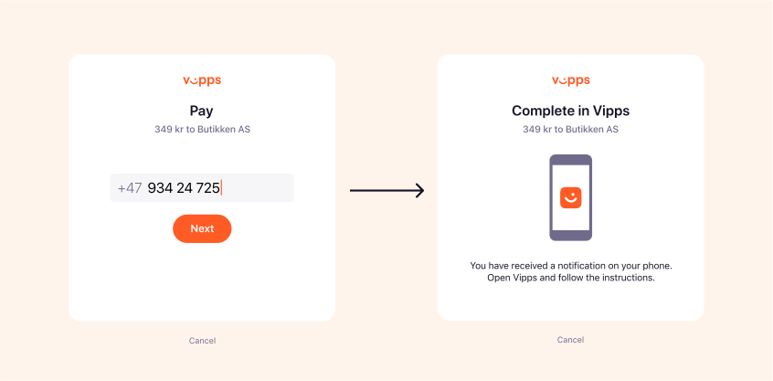
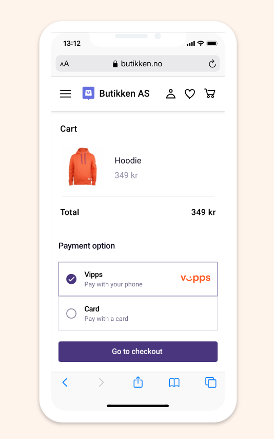
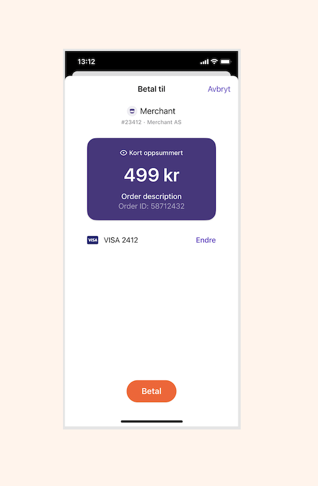
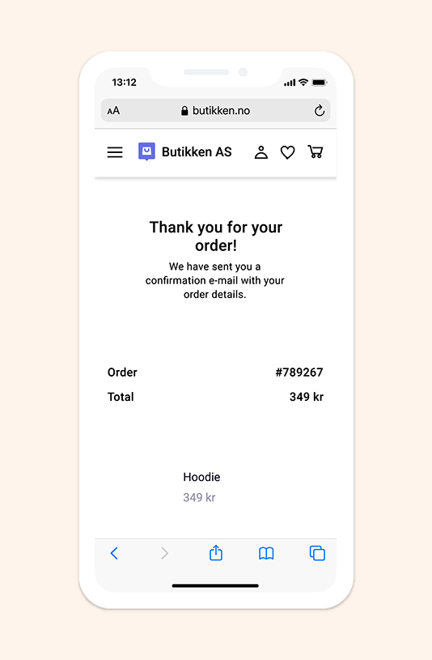
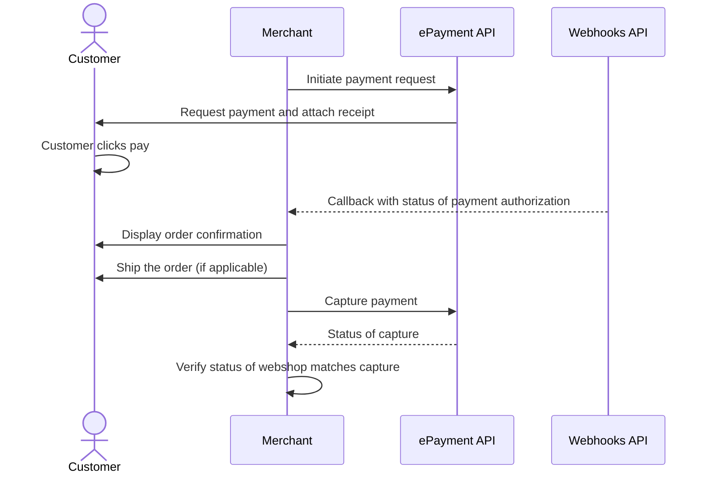

<!-- START_METADATA
---
title: Vipps MobilePay online payments flow
sidebar_label: Online payments
sidebar_position: 10
description: Using Vipps MobilePay in an online setting
hide_table_of_contents: false
pagination_next: null
pagination_prev: null
---

import REGISTERWEBHOOK from '../_common/_register_epayment_webhook.md'
END_METADATA -->

# Online payments

 *Available for Vipps.*

 *Available for MobilePay in selected markets at the [Vipps MobilePay joint platform launch](https://www.vippsmobilepay.com/#about).*

This flow combines multiple products to illustrate the recommended online payment flow.



## Prerequisites

### Webhooks for ePayment events

<REGISTERWEBHOOK />

## Details

### Step 1. Send the payment request

Add the products to the order and send the payment request by using the
[`createPayment`](https://developer.vippsmobilepay.com/api/epayment#tag/CreatePayments/operation/createPayment)
endpoint.

<details>
<summary>Detailed example</summary>
<div>

Set `userFlow` to `WEB_REDIRECT`, so the customer's browser will either do an automatic app-switch or open the landing page to confirm the mobile number.
Attach the receipt simultaneously.

Here is an example HTTP POST:

[`POST:/epayment/v1/payments`](https://developer.vippsmobilepay.com/api/epayment#tag/CreatePayments/operation/createPayment)

```json
{
  "amount": {
    "value": 34900,
    "currency": "NOK"
  },
  "paymentMethod": {
    "type": "WALLET"
  },
  "customer": {
    "phoneNumber": 4791234567
  },
  "customerInteraction": "CUSTOMER_NOT_PRESENT",
  "receipt":{
    "orderLines": [
      {
        "name": "Hoodie",
        "id": "hoodie1234",
        "totalAmount": 34900,
        "totalAmountExcludingTax": 26175,
        "totalTaxAmount": 8725,
        "taxPercentage": 25,
      },
    ],
    "bottomLine": {
      "currency": "NOK",
      "posId": "pos_122",
      "receiptNumber": "789267"
    },
  },
  "reference": 58712432,
  "userFlow": "WEB_REDIRECT",
  "returnUrl": "http://example.com/redirect?reference=58712432",
  "paymentDescription": "Hoodie"
}

```

</div>
</details>

### Step 2. The customer authorizes the payment

If the payment was started on a desktop device, the customer will be sent to the
[landing page](https://developer.vippsmobilepay.com/docs/common-topics/landing-page/).
There, they confirm their number and are prompted to log in through the Vipps or MobilePay app.



If the payment was started from a mobile device, the app will automatically open.





To get confirmation that payment was approved, monitor
[webhooks](https://developer.vippsmobilepay.com/docs/APIs/webhooks-api) and
[query the payment](https://developer.vippsmobilepay.com/api/epayment#tag/QueryPayments/operation/getPayment).

Once the payment is approved, update the status in your system.

### Step 3. Provide confirmation

When the user confirms the payment, they will get a confirmation in the app and
then be redirected back to your store.

Confirm to them that the order was successful.



### Step 4. Ship the order (if applicable)

Complete and ship the order to the customer.

### Step 5. Capture the payment

Capture the payment and confirm that it was successful.

<details>
<summary>Detailed example</summary>
<div>

[`POST:/epayment/v1/payments/{reference}/capture`](/api/epayment/#tag/AdjustPayments/operation/capturePayment)

With body:

```json
{
  "modificationAmount": {
    "value": 34900,
    "currency": "NOK"
  }
}
```

</div>
</details>

## Sequence diagram

Sequence diagram for the standard online payment flow.


