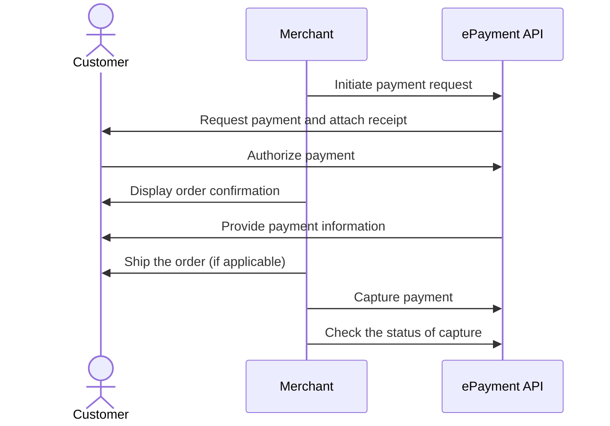

<!-- START_METADATA
---
title: Vipps MobilePay online payments flow
sidebar_label: Online payments
sidebar_position: 10
description: Using Vipps MobilePay in an online setting
hide_table_of_contents: false
pagination_next: null
pagination_prev: null
---

import AUTHORIZEPAYMENT from '../_common/_customer_authorizes_epayment.md'
import FULLCAPTURE from '../_common/_full_capture.md'
END_METADATA -->

# Online payments

This flow combines multiple products to illustrate the recommended online payment flow.


## Details

### Step 1. Add an option to pay with Vipps or MobilePay

Add the option to pay with Vipps or MobilePay on the product page of your website.

### Step 2. Send the payment request

Add the products to the order and send the payment request by using the
[`createPayment`](https://developer.vippsmobilepay.com/api/epayment#tag/CreatePayments/operation/createPayment)
endpoint.

<details>
<summary>Details</summary>
<div>

Set `userFlow` to `WEB_REDIRECT`, so the customer's browser will either do an automatic app-switch or open the landing page to confirm the mobile number.
Attach the receipt simultaneously.

Here is an example HTTP POST:

[`POST:/epayment/v1/payments`](https://developer.vippsmobilepay.com/api/epayment#tag/CreatePayments/operation/createPayment)

```json
{
  "amount": {
    "value": 10000,
    "currency": "NOK"
  },
  "paymentMethod": {
    "type": "WALLET"
  },
  "customer": {
    "phoneNumber": 4791234567
  },
  "receipt":{
    "orderLines": [
      {
        "name": "socks",
        "id": "line_item_1",
        "totalAmount": 10000,
        "totalAmountExcludingTax": 8000,
        "totalTaxAmount": 2000,
        "taxPercentage": 25,
        "unitInfo": {
          "unitPrice": 4000,
          "quantity": "2",
          "quantityUnit": "PCS"
        },
      },
    ],
    "bottomLine": {
      "currency": "NOK",
      "posId": "pos_122"
    },
   "receiptNumber": "0527013501"
  },
  "reference": 2486791679658155992,
  "userFlow": "WEB_REDIRECT",
  "returnUrl": "http://example.com/redirect?reference=2486791679658155992",
  "paymentDescription": "Purchase of socks"
}

```

</div>
</details>

### Step 3. The customer authorizes the payment

If the payment was started on a desktop device, the customer will be sent to the
[Vipps MobilePay landing page](https://developer.vippsmobilepay.com/docs/common-topics/landing-page/).
There, they confirm their number and are prompted to log in through the Vipps app on their phone.


If the payment was started from a mobile device, the Vipps MobilePay app will automatically open.


<AUTHORIZEPAYMENT />

### Step 4. Confirm the order

When the user confirms the payment, they will get a confirmation in the app and
then be redirected back to your store.

Confirm to them that the order was successful.


### Step 7. Ship the order (if applicable)

Complete and ship the order to the customer.

### Step 8. Capture the payment

<FULLCAPTURE />

## Sequence diagram

Sequence diagram for the standard online payment flow.


