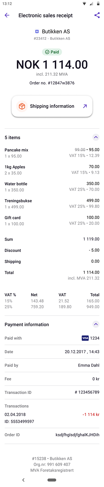
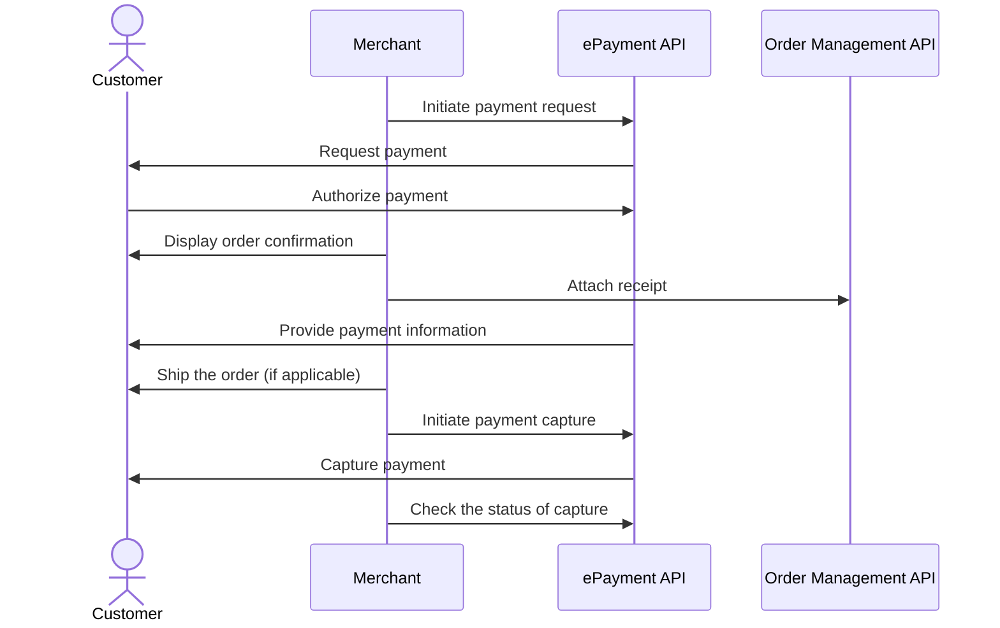

<!-- START_METADATA
---
title: Vipps MobilePay online payments flow
sidebar_label: Online payments
sidebar_position: 10
description: Using Vipps MobilePay in an online setting
hide_table_of_contents: true
pagination_next: null
pagination_prev: null
---
END_METADATA -->

# Online payments

This flow combines multiple products to illustrate the recommended online payment flow.


## Details

### Step 1. Add an option to pay with Vipps or MobilePay

Add the option to pay with Vipps or MobilePay on the product page of your website.

### Step 2. Send the payment request

Add the products to the order and send the payment request by using the
[`createPayment`](https://developer.vippsmobilepay.com/api/epayment#tag/CreatePayments/operation/createPayment)
endpoint.

<details>
<summary>Detailed example</summary>
<div>

```json
{
  "amount": {
    "value": 49900,
    "currency": "NOK"
  },
  "paymentMethod": {
    "type": "WALLET"
  },
  "customer": {
    "phoneNumber": 4796574209
  },
  "reference": 2486791679658155992,
  "userFlow": "WEB_REDIRECT",
  "returnUrl": "http://example.com/redirect?reference=2486791679658155992",
  "paymentDescription": "Purchase of socks"
}
```

Set `userFlow` to `WEB_REDIRECT`, so the customer's browser will either do an automatic app-switch or open the landing page to confirm the mobile number.
</div>
</details>

### Step 3. The customer authorizes the payment

If the payment was started on a desktop device, the customer will be sent to the
[Vipps MobilePay landing page](https://developer.vippsmobilepay.com/docs/vipps-developers/common-topics/vipps-landing-page/).
There, they confirm their number and are prompted to log in through the Vipps app on their phone.


If the payment was started from a mobile device, the Vipps MobilePay app will automatically open.


Once the customer authorizes the payment, update your system with the status.
To get confirmation that payment was approved, monitor
[webhooks](https://developer.vippsmobilepay.com/docs/APIs/webhooks-api) and
[query the payment](https://developer.vippsmobilepay.com/api/epayment#tag/QueryPayments/operation/getPayment).


### Step 4. Confirm the order

When the user confirms the payment, they will get a confirmation in the app.


The app redirects the customer back to your store, where you confirm that the order has been successful.


### Step 5. Add a receipt

Add a payment receipt to the order. This will appear in their app.

This `postReceipt` endpoint,
[`POST:/order-management/v2/ecom/receipts/{reference}`](https://developer.vippsmobilepay.com/api/order-management/#operation/postReceiptV2),
is for sending receipt information.
This is a combination of *order lines* and a *bottom line* with sum and VAT.
An *order line* is a description of each item present in the order.
See
[Adding a receipt](https://developer.vippsmobilepay.com/docs/APIs/order-management-api/vipps-order-management-api/#adding-a-receipt)
for more details.



### Step 6. Ship the order (if applicable)

Complete and ship the order to the customer.

### Step 7. Capture the payment

The
[`capturePayment`](https://developer.vippsmobilepay.com/api/epayment/#tag/AdjustPayments/operation/capturePayment) endpoint
allows you to capture a payment.

Be sure to check the status of the captured payment.


The payment is transferred to your account. This may take 2-3 days depending on your bank.

<details>
<summary>Detailed example</summary>
<div>
Here is an example HTTP POST:

[`POST:/epayment/v1/payments/{reference}/capture`](https://developer.vippsmobilepay.com/api/epayment/#tag/AdjustPayments/operation/capturePayment)

With body:

```json
{
  "modificationAmount": {
    "value": 49900,
    "currency": "NOK"
  }
}
```

</div>
</details>

## Sequence diagram

Sequence diagram for the standard online payment flow.


