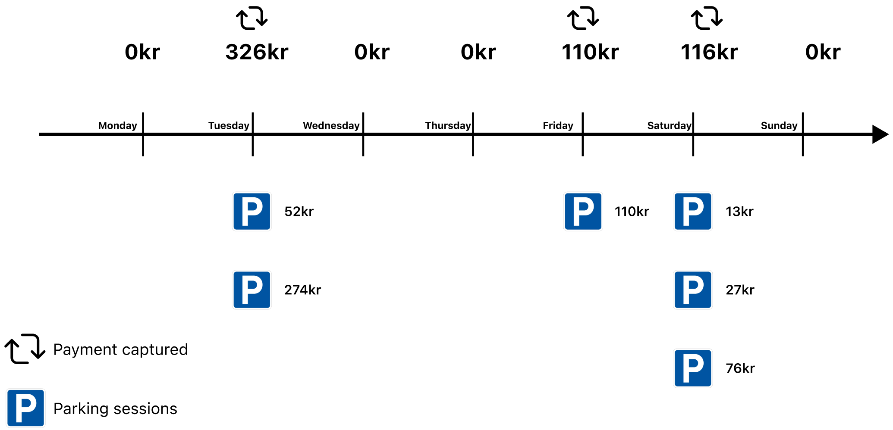

<!-- START_METADATA
---
title: Parking
pagination_next: null
pagination_prev: null
---
END_METADATA -->

# Parking

<!-- START_COMMENT -->
ℹ️ Please use the new documentation:
[Vipps Technical Documentation](https://vippsas.github.io/vipps-developer-docs/).
<!-- END_COMMENT -->

Vipps may be used in many ways to make paying for parking easy.

By combining the
[Login API](https://vippsas.github.io/vipps-developer-docs/docs/APIs/login-api),
[Recurring API](https://vippsas.github.io/vipps-developer-docs/docs/APIs/recurring-api)
and
[Recurring agreements with variable amount](https://vippsas.github.io/vipps-developer-docs/docs/APIs/recurring-api/vipps-recurring-api#recurring-agreements-with-variable-amount):

## Illustration

This illustration shows how Vipps can be used to charge for parking:
The user has entered an agreement that allows the parking company to charge for
parking every day, with the total amount for all parkings that day.

The same solution can of course be used to charge weekly, monthly or yearly.

## Details

1. The user scans a QR code and is sent to the parking company's website.
   See [Merchant Redirect QR codes](https://vippsas.github.io/vipps-developer-docs/docs/APIs/qr-api/vipps-qr-api#merchant-redirect-qr-codes).
2. The user logs in or creates an account with
   [Vipps Login](https://vippsas.github.io/vipps-developer-docs/docs/APIs/login-api/vipps-login-api-howitworks).
   The user now has an account, with verified user data, and is able to both log in and pay.
3. The user enters an Agreement as usual. See
   [Create an agreement](https://vippsas.github.io/vipps-developer-docs/docs/APIs/recurring-api/vipps-recurring-api#create-an-agreement).
4. The user parks one or more times.
5. The accumulated parking fees are used to create one charge with the totalt amount.
   Vipps supports
   [Recurring agreements with variable amount](https://vippsas.github.io/vipps-developer-docs/docs/APIs/recurring-api/vipps-recurring-api#recurring-agreements-with-variable-amount).
   See:
   [Create a charge](https://vippsas.github.io/vipps-developer-docs/docs/APIs/recurring-api/vipps-recurring-api#create-a-charge).
