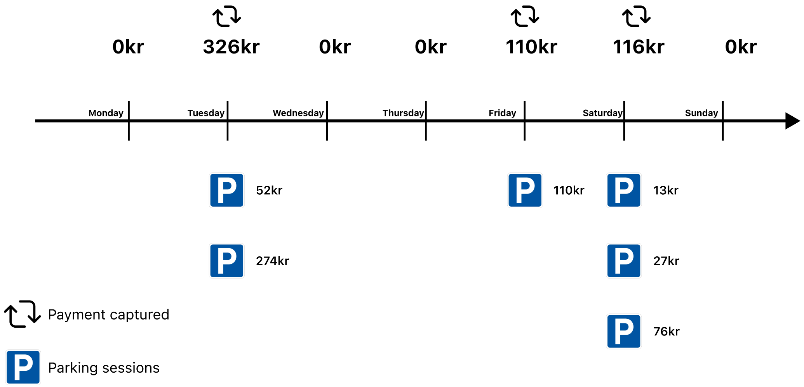
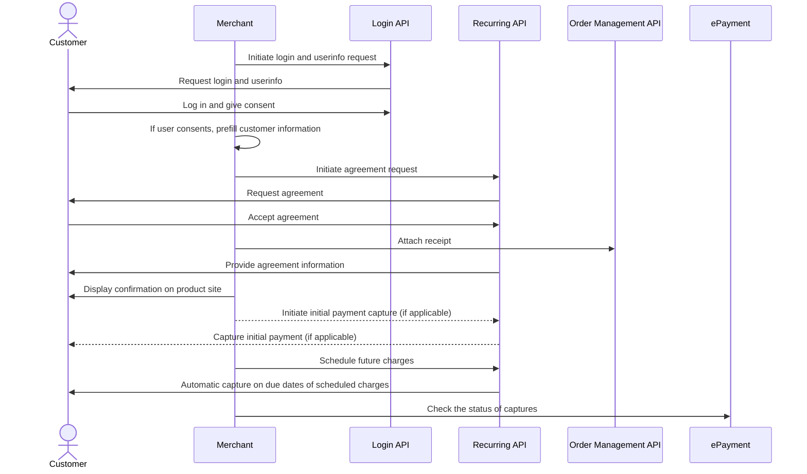

<!-- START_METADATA
---
title: 'Vipps MobilePay parking and "Pay-as-you-go" flow'
sidebar_label: 'Parking and "Pay-as-you-go"'
sidebar_position: 90
description: Using Vipps MobilePay in a parking solution
hide_table_of_contents: true
pagination_next: null
pagination_prev: null
---
END_METADATA -->

# Parking and "Pay-as-you-go"

Vipps MobilePay can make it easier for your customers to pay for parking and other and "pay-as-you-go" services.

The solution is a combination of the
[Login](https://developer.vippsmobilepay.com/docs/APIs/login-api) and
[Recurring](https://developer.vippsmobilepay.com/docs/APIs/recurring-api) APIs,
and makes special use of:
[Recurring agreements with variable amount](https://developer.vippsmobilepay.com/docs/APIs/recurring-api/vipps-recurring-api#recurring-agreements-with-variable-amount).

## Parking scenario

The following illustration shows how Vipps MobilePay can be used to charge for parking.

The customer has entered an agreement that allows the parking company to charge for
parking every day. They specify the total amount they are allowed to be for all parking that day.

The same solution can of course be used to charge weekly, monthly, or yearly.

## Details

1. The customer scans a QR code and is sent to the parking company's website.
   See [Merchant Redirect QR codes](https://developer.vippsmobilepay.com/docs/APIs/qr-api/vipps-qr-api#merchant-redirect-qr-codes).
2. The customer logs in or creates an account with
   [Login](https://developer.vippsmobilepay.com/docs/APIs/login-api/how-it-works/vipps-login-api-howitworks).
   The customer now has an account, with verified user data, and is able to both log in and pay.
3. The customer enters an agreement, as usual. See
   [Create an agreement](https://developer.vippsmobilepay.com/docs/APIs/recurring-api/vipps-recurring-api#create-an-agreement).
4. The customer parks one or more times.
5. The accumulated parking fees are used to create one charge with the total amount.
   Vipps MobilePay supports
   [Recurring agreements with variable amount](https://developer.vippsmobilepay.com/docs/APIs/recurring-api/vipps-recurring-api#recurring-agreements-with-variable-amount).
   See:
   [Create a charge](https://developer.vippsmobilepay.com/docs/APIs/recurring-api/vipps-recurring-api#create-a-charge).
6. Check the status of captured charges.

## Relevant comments

* For parking and "pay-as-you-go" cases, we usually recommend that you set up a
  [Recurring agreement with variable amount](https://developer.vippsmobilepay.com/docs/APIs/recurring-api/vipps-recurring-api#recurring-agreements-with-variable-amount)
  and `daily` interval.
* You can create as many charges as you want within the interval, but we recommend that you
  sum up the usage over the day and create one charge for that day.
* You need to take the `maxAmount` limit into account. For example, if the agreement is set to `daily`
  and `maxAmount` is `1000`, you will not be able to create charges that bring the total to more
  than 1000 for that day. Remember that it is you, as the merchant, who set the `suggestMaxAmount`,
  so you can guide the users to a suitable limit.
* If the total sum is more than `maxAmount` and you create a charge that is larger than `maxAmount`,
  the end user will be notified in the Vipps or MobilePay app to increase their limit for this agreement.
* In general using the Recurring API you need to send in the charge two days before due date. However, for use cases like parking and "pay-as-you-go" we allow for creating charges that will be due the day after (for example you send in the charge at 10pm at day 0, the user will be charged in the morning of day 1). Do get access to this opportunity you need to be part of a whitelist. Contact Vipps MobilePay if this is relevant for you.

## Sequence diagram

Sequence diagram for the parking and "Pay-as-you-go" flow.

