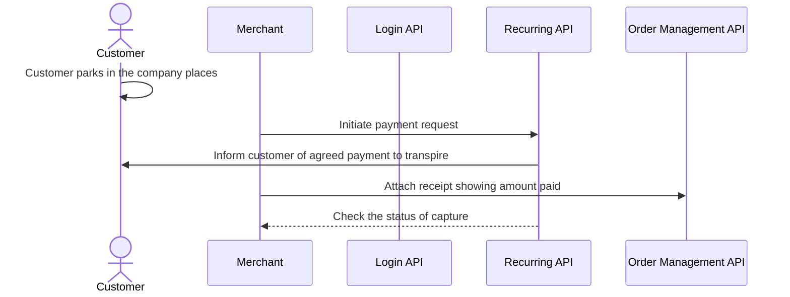

<!-- START_METADATA
---
title: 'Vipps MobilePay parking and "Pay-as-you-go" flow'
sidebar_label: 'Parking and "Pay-as-you-go"'
sidebar_position: 90
description: Using Vipps MobilePay in a parking solution
hide_table_of_contents: false
pagination_next: null
pagination_prev: null
---

END_METADATA -->

# Parking and "Pay-as-you-go"

Vipps MobilePay can make it easier for your customers to pay for parking and other and "pay-as-you-go" services.

The solution is a combination of the
[Login](https://developer.vippsmobilepay.com/docs/APIs/login-api) and
[Recurring](https://developer.vippsmobilepay.com/docs/APIs/recurring-api) APIs,
and makes special use of
[Recurring agreements with variable amount](https://developer.vippsmobilepay.com/docs/APIs/recurring-api/vipps-recurring-api#recurring-agreements-with-variable-amount).

## Parking scenario

The following illustration shows how Vipps MobilePay can be used to charge for parking.


The customer has entered an agreement that allows the parking company to charge for
parking every day. They specify the total amount they are allowed to be for all parking that day.

The same solution can of course be used to charge weekly, monthly, or yearly.

## Details

### Step 1: Generate a merchant redirect QR code

Generate a merchant redirect QR code with a
[merchant redirect QR](https://developer.vippsmobilepay.com/docs/APIs/qr-api/vipps-qr-api#merchant-redirect-qr-codes)
linking to your company website.

The customer scans the QR code and is redirected to your website.

<details>
<summary>Detailed example</summary>
<div>

The QR code contains a `Id` that connects it to the taxi where it is located.

Here is an example HTTP POST:

[`POST:/qr/v1/merchant-redirect`](https://developer.vippsmobilepay.com/api/qr/#operation/CreateMerchantRedirectQr)

```json
{
  "id": "company_site",
  "redirectUrl": "https://example.com/myParkingCompany"
}
```

</div>
</details>


### Step 2. The customer logs in

The customer identifies themselves by logging in with Vipps Login.

See [Log in with browser](https://developer.vippsmobilepay.com/docs/APIs/login-api/vipps-login-api-quick-start/#log-in-with-browser) for a detailed example.

### Step 3. Create agreement

The customer now has an account, with verified user data, and is able to both log in and pay.
Send them an agreement request with a variable amount.

<details>
<summary>Detailed example</summary>
<div>

Create an agreement and specify `pricing.type="VARIABLE"`.
Set a `suggestedMaxAmount`. The user can modify this amount later, and that will be set in a `maxAmount` field.

Here is an example HTTP POST:

[`POST:/agreements`](https://developer.vippsmobilepay.com/api/recurring#tag/Agreement-v3-endpoints/operation/DraftAgreementV3)

With body:

```json
{
   "interval": {
      "unit" : "DAY",
      "count": 1
   },
   "pricing": {
      "suggestedMaxAmount": 200000,
      "currency": "NOK",
      "type": "VARIABLE"
   },
   "merchantRedirectUrl": "https://example.com/myParkingCompany",
   "merchantAgreementUrl": "https://example.com/myParkingCompany/agreement-url",
   "phoneNumber": "91234567",
   "productName": "Pay-as-you-go"
}
```

</div>
</details>

See [Recurring agreements with variable amount](https://developer.vippsmobilepay.com/docs/APIs/recurring-api/vipps-recurring-api#recurring-agreements-with-variable-amount) for more information.

### Step 4. Customer accepts agreement

The customer accepts the agreement in the Vipps MobilePay app.

### Step 5. Charge for variable amounts

The customer parks one or more times.
The accumulated parking fees are used to create one charge with the total amount.

<details>
<summary>Detailed example</summary>
<div>

The amount of the charge/charges in the interval cannot be higher than the `suggestedMaxAmount` or `maxAmount` field, depending on which is highest.

Here is an example HTTP POST:

[POST:/recurring/v3/agreements/{agreementId}/charges](https://developer.vippsmobilepay.com/api/recurring/#tag/Charge-v3-endpoints/operation/CreateChargeV3)

With body:

```json
{
  "amount": 32600,
  "transactionType": "DIRECT_CAPTURE",
  "description": "Parking on Tuesday.",
  "due": "2025-08-08",
  "retryDays": 0
}
```

</div>
</details>

### Step 6. Attach a receipt

Send a digital receipt for the parking session.

<details>
<summary>Detailed example</summary>
<div>


Here is an example HTTP POST:

[`POST:/order-management/v2/{paymentType}/receipts/{orderId}`](https://developer.vippsmobilepay.com/api/order-management/#operation/postReceiptV2)

Use `recurring` for recurring payments.
For `orderId`, use the `chargeId` of the charge.

Body:

```json
{
  "orderLines": [
    {
        "name": "parking",
        "id": "line_item_1",
        "totalAmount": 5200,
        "totalAmountExcludingTax": 3900,
        "totalTaxAmount": 1300,
        "taxPercentage": 25,
      },
    {
        "name": "parking",
        "id": "line_item_1",
        "totalAmount": 27400,
        "totalAmountExcludingTax": 20550,
        "totalTaxAmount": 6850,
        "taxPercentage": 25,
      },
    },
  ],
  "bottomLine": {
    "currency": "NOK",
    "posId": "parking_lot_012"
  }
}

```

</div>
</details>


## Relevant comments

* For parking and "pay-as-you-go" cases, we usually recommend that you set up a
  [Recurring agreement with variable amount](https://developer.vippsmobilepay.com/docs/APIs/recurring-api/vipps-recurring-api#recurring-agreements-with-variable-amount)
  and `daily` interval.
* You can create as many charges as you want within the interval, but we recommend that you
  sum up the usage over the day and create one charge for that day.
* You need to take the `maxAmount` limit into account. For example, if the agreement is set to `daily`
  and `maxAmount` is `1000`, you will not be able to create charges that bring the total to more
  than 1000 for that day. Remember that it is you, as the merchant, who set the `suggestMaxAmount`,
  so you can guide the users to a suitable limit.
* If the total sum is more than `maxAmount` and you create a charge that is larger than `maxAmount`,
  the end user will be notified in the Vipps or MobilePay app to increase their limit for this agreement.
* In general using the Recurring API you need to send in the charge two days before due date. However, for use cases like parking and "pay-as-you-go" we allow for creating charges that will be due the day after (for example you send in the charge at 10pm at day 0, the user will be charged in the morning of day 1). Do get access to this opportunity you need to be part of a whitelist. Contact Vipps MobilePay if this is relevant for you.

## Sequence diagrams

Signing up for the "Pay-as-you-go" plan:


Daily charges, if parking was done:

