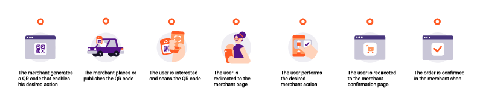
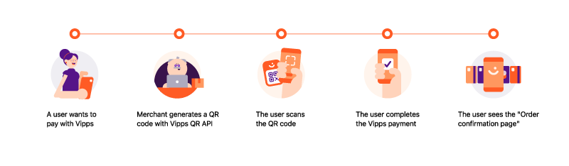

<!-- START_METADATA
---
title: Provide QR codes
sidebar_label: Provide QR codes
sidebar_position: 150
description: Provide QR codes with Vipps MobilePay
pagination_next: null
pagination_prev: null
---
END_METADATA -->

# Provide QR codes

QR codes can give your users easy access to your payment pages.
Provide QR codes with the [QR API](https://developer.vippsmobilepay.com/docs/APIs/qr-api) and
[ePayment API](https://developer.vippsmobilepay.com/docs/APIs/epayment-api).

You can use QR codes with Vipps in two ways:

* [Merchant redirect QR](#merchant-redirect-qr-codes)
* [One-Time payment QR](#one-time-payment-qr-codes)

Only
[Merchant Redirect QR codes](https://developer.vippsmobilepay.com/docs/APIs/qr-api/vipps-qr-api#merchant-redirect-qr-codes)
should be printed, as [One-Time Payment QR codes](https://developer.vippsmobilepay.com/docs/APIs/qr-api/vipps-qr-api#one-time-payment-qr-codes) typically expire after 5 minutes.

## Merchant Redirect QR codes

Merchant Redirect QR codes contain a URL to a merchant's website.

The user flow is like this:

This creates a QR that works as a redirect back to the merchant. The website is specified as the `redirectUrl` in the [`POST:/qr/v1/merchant-redirect`](https://developer.vippsmobilepay.com/api/qr#tag/Merchant-redirect-QR/operation/CreateMerchantRedirectQr) request.

Learn more about these on the [Merchant Redirect QR codes](https://developer.vippsmobilepay.com/docs/APIs/qr-api/vipps-qr-api#merchant-redirect-qr-codes) page.

## One-Time Payment QR codes

One-Time Payment QR codes lead directly to a payment confirmation screen in Vipps.

Initiate a payment which generates a One-Time Payment QR code through the
[ePayment API](https://developer.vippsmobilepay.com/docs/APIs/epayment-api).
Send the [`POST:/epayment/v1/payments`](https://developer.vippsmobilepay.com/api/epayment#tag/CreatePayments/operation/createPayment) request.

Learn more about these on the [One-Time Payment QR codes](https://developer.vippsmobilepay.com/docs/APIs/epayment-api/features/qr-payments) page.

## Relevant comments

The user must be presented with the terms and conditions
of the purchase before confirming the payment in Vipps. There is no functionality
for showing terms and conditions on the payment screen in Vipps. This is why
the answer to the following question is "No":
[Can I send a Vipps payment link in an SMS, QR, or email?](https://developer.vippsmobilepay.com/docs/vipps-developers/faqs/reserve-and-capture-faq#can-i-send-a-vipps-payment-link-in-an-sms-qr-or-email)
But, there is an important exception:

> It may be acceptable to automatically trigger the Vipps payment when the user
> enters your website. This requires that the payment process is user initiated,
> and that there are no relevant terms and conditions or that the user has
> accepted any terms and conditions at an earlier stage.

This means that for printed QR codes there are two alternatives:

* Use a QR code that contains a URL to the merchant's website, and
  use
  [Vipps Hurtigkasse (express checkout)](https://developer.vippsmobilepay.com/docs/APIs/ecom-api/vipps-ecom-api#express-checkout-payments)
  or a regular Vipps payment there.
* Present the terms and conditions of the purchase together with the
  QR code. Use a QR code that contains a URL to the website, but simply
  create a payment instantly and then redirect the user directly to the Vipps
  payment instead of showing and content on the website.
