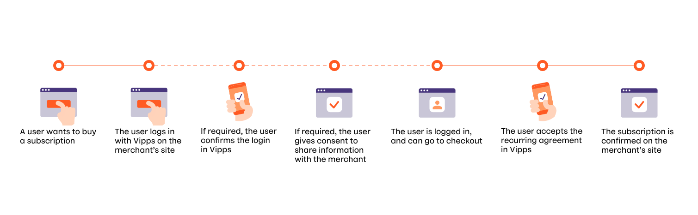
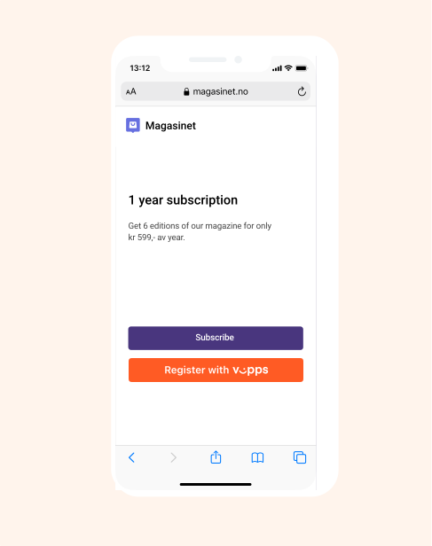
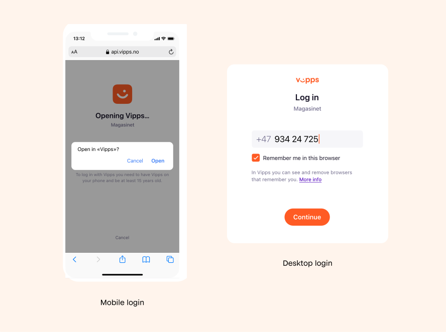
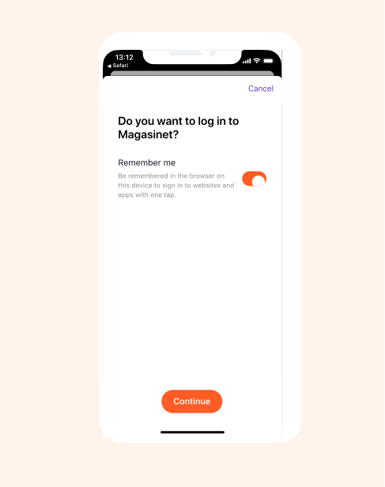
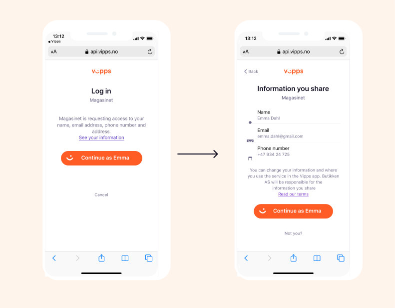
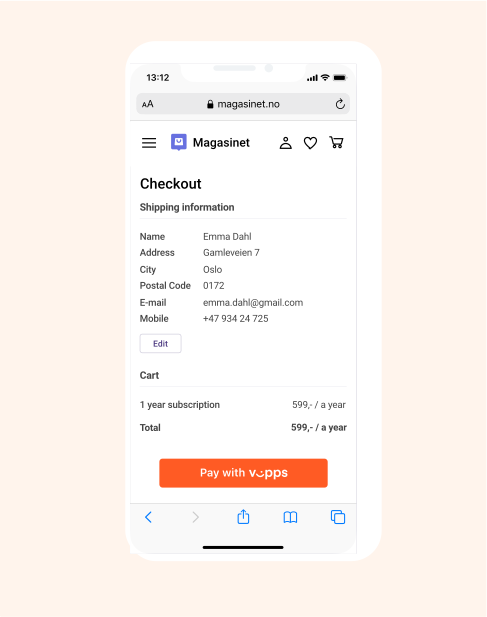
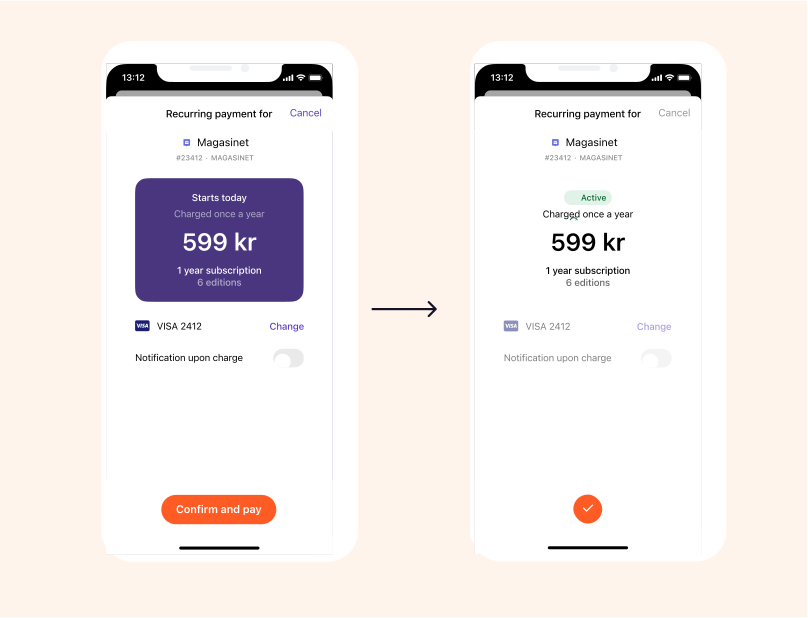
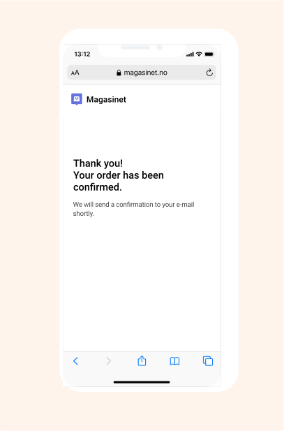
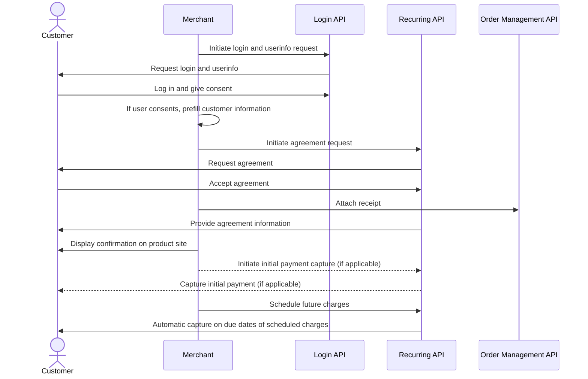

<!-- START_METADATA
---
title: Vipps MobilePay subscriptions flow
sidebar_label: Subscriptions
sidebar_position: 70
description: Simplify subscriptions by using the Login API and Recurring API together.
pagination_next: null
pagination_prev: null
---
END_METADATA -->

# Subscriptions

The
[Recurring API](https://developer.vippsmobilepay.com/docs/APIs/recurring-api)
and the
[Login API](https://developer.vippsmobilepay.com/docs/APIs/login-api)
can be used together making registration and payment of subscriptions simple for your customers.

## Details

### Step 1. Customer buys a subscription

A customer wants to buy a subscription through your website or app.

### Step 2. Initiate login

The customer identifies themselves by logging in with Vipps Login.

From a browser:

* If they are remembered from earlier, the login will be completed directly there.
* Otherwise, they will enter their phone number and be taken to the app to the Vipps app.

From a mobile app:

* They will be switched over to the Vipps MobilePay app automatically.

### Step 3. Customer confirms login

The customer will confirm the login in the Vipps MobilePay app.

If the customer was remembered from an earlier login to this site or app, they will skip this step.

### Step 4. Customer gives consent to share information

The customer will give consent to sharing information with the merchant.

If the customer has previously consented to sharing information with the merchant, they will skip this step.

The customer can later see the information they have consented to share, by clicking *See your information* in the Vipps MobilePay app.

### Step 5. Check out

The customer is now logged in to your service and can proceed to set up the payment for the subscription.

The information they have shared with you should be pre-filled in the form, where they have the possibility to update it.

See [Create an agreement](https://developer.vippsmobilepay.com/docs/APIs/recurring-api/vipps-recurring-api/#create-an-agreement) in the Recurring API guide for more information.

If there is an initial payment, specify this in the agreement.

### Step 6. Accept agreement

The customer accepts the agreement in the Vipps MobilePay app.

### Step 7. Customer confirms subscription

The customer is returned to the merchant's website or app, and the subscription is confirmed on the merchant's site.

### Step 8. Capture initial payment (if applicable)

If you had an initial payment, the charge for this will have been created as part of the agreement. Then, you will need to capture that reserved amount with the
[capture](https://developer.vippsmobilepay.com/api/recurring/#tag/Charge-v3-endpoints/operation/RefundChargeV3)
endpoint.

### Step 9. Schedule and capture charges

Your system must schedule and place all the future agreed charges.
Use the [create charge](https://developer.vippsmobilepay.com/api/recurring/#tag/Charge-v3-endpoints/operation/CreateChargeV3) endpoint to place the charge and specify the due date. A charge must be scheduled a minimum of two days before the payment will occur.
It will be automatically captured on the due date.

For more information, see:

* [Recurring API guide: Charges](https://developer.vippsmobilepay.com/docs/APIs/recurring-api/vipps-recurring-api/#charges)
* [Recurring API quick start guide](https://developer.vippsmobilepay.com/docs/APIs/recurring-api/vipps-recurring-api-quick-start/)

## Sequence diagram

Sequence diagram for the subscriptions with login flow.

