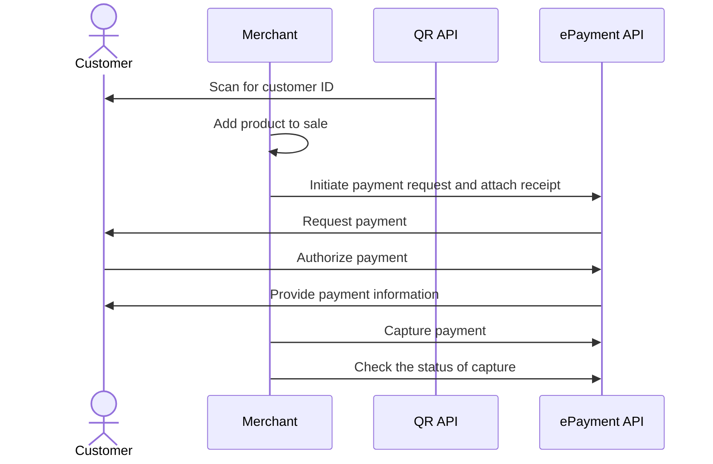

<!-- START_METADATA
---
title: In-store using static QR flow
sidebar_label: In-store using static QR
sidebar_position: 40
hide_table_of_contents: false
pagination_next: null
pagination_prev: null
---

import AUTHORIZEPAYMENT from '../_common/_customer_authorizes_epayment.md'
import FULLCAPTURE from '../_common/_full_capture.md'
END_METADATA -->

# In-store using static QR

In this flow, a user pays by scanning a QR, such as a sticker with their Vipps or MobilePay app. The merchant gets their ID and sends a payment request to their app. They approve it, and the merchant sends them a receipt.

## Details

The flow is a combination of the
[QR API: Merchant Callback QRs](https://developer.vippsmobilepay.com/docs/APIs/qr-api/vipps-qr-api#merchant-callback-qr-codes)
and the
[ePayment API](https://developer.vippsmobilepay.com/docs/APIs/epayment-api).
Before implementing this flow, please see the recommended [in-store payments flow](../in-store/README.md).


### Step 1: Generate a static QR code

Generate a static QR code using our
[QR API](https://developer.vippsmobilepay.com/docs/APIs/qr-api/vipps-qr-api/#merchant-callback-qr-codes).
The QR code contains a `posId` that connects it to a POS or cash register in your store.

For example, the QR could be shown on a screen or placed on a cash register, a portable POS, or a
[vending machine](../vending-machines/qr-direct-to-payment-in-app.md).

### Step 2: The customer scans the static QR

When the customer scans the QR, your system will receive a notification that the customer is ready to pay with Vipps or MobilePay.
The notification will contain a token the merchant can use to start a payment.

### Step 3: Send the payment request

Use the token to send the customer a
[Create Payment request](https://developer.vippsmobilepay.com/api/epayment/#tag/CreatePayments/operation/createPayment).

<details>
<summary>Detailed example</summary>
<div>

Specify `"customerInteraction": "CUSTOMER_PRESENT"` and `"userFlow": "WEB_REDIRECT"` to redirect user to the app.

Here is an example HTTP POST:

[`POST:/epayment/v1/payments`](https://developer.vippsmobilepay.com/api/epayment#tag/CreatePayments/operation/createPayment)

```json
{
  "amount": {
    "value": 10000,
    "currency": "NOK"
  },
  "paymentMethod": {
    "type": "WALLET"
  },
  "customer": {
    "personalQr": "personalQr_string"
  },
  "receipt":{
    "orderLines": [
      {
        "name": "socks",
        "id": "line_item_1",
        "totalAmount": 10000,
        "totalAmountExcludingTax": 8000,
        "totalTaxAmount": 2000,
        "taxPercentage": 25,
        "unitInfo": {
          "unitPrice": 4000,
          "quantity": "2",
          "quantityUnit": "PCS"
        },
      },
    ],
    "bottomLine": {
      "currency": "NOK",
      "posId": "pos_122"
    },
   "receiptNumber": "0527013501"
  },
  "reference": 2486791679658155992,
  "userFlow": "WEB_REDIRECT",
  "returnUrl": "http://example.com/redirect?reference=2486791679658155992",
  "paymentDescription": "Purchase of socks"
}

```

</div>
</details>

### Step 4: The customer authorizes the payment

<AUTHORIZEPAYMENT />

### Step 5: Capture the payment

<FULLCAPTURE />

## Sequence diagram

Sequence diagram for in-store using static QR.


