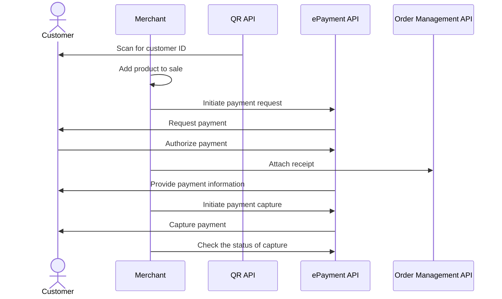

<!-- START_METADATA
---
title: In-store using static QR flow
sidebar_label: In-store using static QR
sidebar_position: 40
hide_table_of_contents: true
pagination_next: null
pagination_prev: null
---
END_METADATA -->

# In-store using static QR

In this flow, a user pays by scanning a QR, such as a sticker with their Vipps or MobilePay app. The merchant gets their ID and sends a payment request to their app. They approve it, and the merchant sends them a receipt.

## Details

The flow is a combination of the
[QR API: Merchant Callback QRs](https://developer.vippsmobilepay.com/docs/APIs/qr-api/vipps-qr-api#merchant-callback-qr-codes)
and the
[ePayment API](https://developer.vippsmobilepay.com/docs/APIs/epayment-api).
Before implementing this flow, please see the recommended [in-store payments flow](../in-store/README.md).

### Step 1: Generate a static QR code

Generate a static QR code with a
[merchant redirect QR](https://developer.vippsmobilepay.com/docs/APIs/qr-api/vipps-qr-api#merchant-redirect-qr-codes) linking to your system.

For example, the QR could be shown on a screen or placed on a cash register, a portable POS, or a [vending machine](../vending-machines/qr-direct-to-payment-in-app.md).

### Step 2: The customer scans the static QR

When the customer scans the QR, your system will receive a notification that the QR has been scanned and will be able to get the customer's phone number.

### Step 3: Send the payment request

Use the customer's phone number to send them a [Create Payment request](https://developer.vippsmobilepay.com/api/epayment/#tag/CreatePayments/operation/createPayment) for the taxi fare through Vipps.

Specify `"customerInteraction": "CUSTOMER_PRESENT"` and `"userFlow": "WEB_REDIRECT"` to redirect user to the app.

### Step 4: The customer authorizes the payment

The payment request will appear in the customer's Vipps app where they can authorize the payment.

To get confirmation that payment was approved, monitor
[webhooks](https://developer.vippsmobilepay.com/docs/APIs/webhooks-api) and
[query the payment](https://developer.vippsmobilepay.com/api/epayment#tag/QueryPayments/operation/getPayment).

### Step 5: Attach a receipt to the order

The
[`postReceipt`](https://developer.vippsmobilepay.com/api/order-management/#operation/postReceiptV2) endpoint
allows you to send receipt information to the customer's app.

The customer will get the receipt in their Vipps MobilePay app.

See
[Adding a receipt](https://developer.vippsmobilepay.com/docs/APIs/order-management-api/vipps-order-management-api/#adding-a-receipt)
for more details.

### Step 6: Capture the payment

Once the customer authorizes the payment, update the POS system with the status.

The
[`capturePayment`](https://developer.vippsmobilepay.com/api/epayment/#tag/AdjustPayments/operation/capturePayment) endpoint
allows you to capture a payment.

Be sure to check the status of the captured payment.

## Sequence diagram

Sequence diagram for in-store using static QR.

