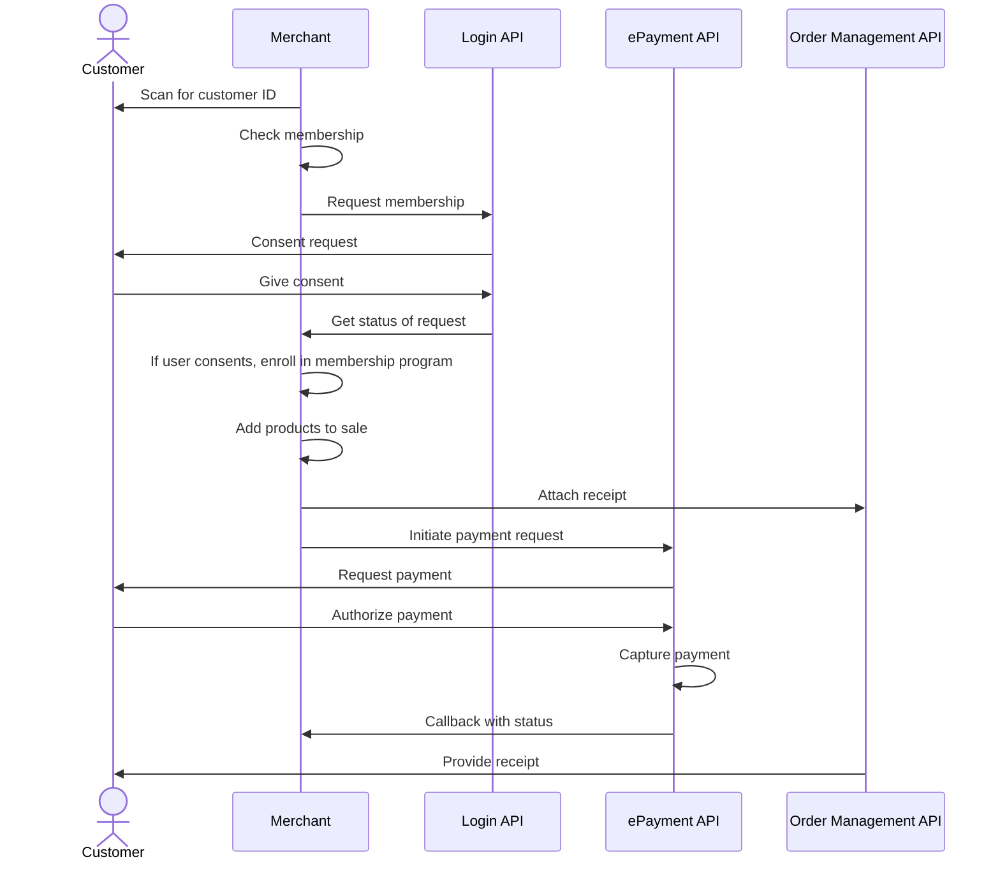

<!-- START_METADATA
---
title: In-store using static QR flow
sidebar_label: In-store using static QR
sidebar_position: 40
hide_table_of_contents: true
pagination_next: null
pagination_prev: null
---
END_METADATA -->

# In-store using static QR

In this flow, a user pays by scanning a QR, such as a sticker with their Vipps or MobilePay app. The merchant gets their ID and sends a payment request to their app. They approve it, and the merchant sends them a receipt.

Before implementing this flow, please see the recommended [in-store payments flow](../in-store/README.md).

## Details

The flow is a combination of the
[QR API: Merchant Callback QRs](https://developer.vippsmobilepay.com/docs/APIs/qr-api/vipps-qr-api#merchant-callback-qr-codes)
and the
[ePayment API](https://developer.vippsmobilepay.com/docs/APIs/epayment-api).

The following describes the process at a high level.

### Step 1: The customer scans the static QR

The user scans the static merchant callback QR. The QR could for example be shown on a screen,
or be printed out and placed on a cash register, a portable POS, or a vending machine.

### Step 2: Customer sees the waiting screen

The Vipps or MobilePay app will show a waiting screen to the user. Thus, the user understands that the scan was successful.

### Step 3: Merchant receives an ID

When the user scans the QR, the merchant will receive a notification that the QR has been scanned.

### Step 4: Merchant sends the payment request

The merchant uses the customer's ID to send the payment request to the user through Vipps MobilePay.

### Step 5: The customer authorizes the payment in their app

If the user has the app open, the payment screen will open automatically.
Otherwise, the payment screen will appear to them upon opening and logging into the app.

### Step 6: The customer gets a receipt

The customer sees the receipt in their Vipps MobilePay app.

## Sequence diagram

Sequence diagram for in-store using static QR.

