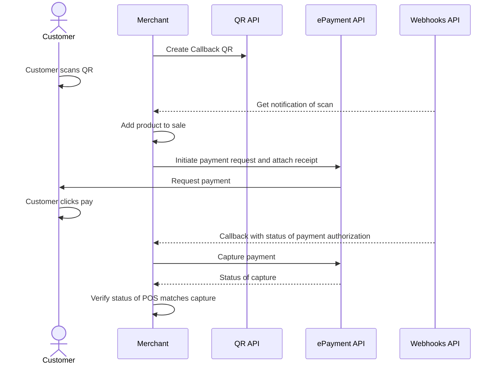

<!-- START_METADATA
---
title: In-store using static QR flow
sidebar_label: In-store using static QR
sidebar_position: 40
hide_table_of_contents: false
pagination_next: null
pagination_prev: null
---

import REGISTERWEBHOOKQR from '../_common/_register_epayment_and_qr_webhook.md'
import AUTHORIZEPAYMENT from '../_common/_customer_authorizes_epayment.md'

END_METADATA -->

# In-store using Merchant Callback QR

 *Available for Vipps in Q4 2023.*

 *Available for MobilePay in selected markets at the [Vipps MobilePay joint platform launch](https://www.vippsmobilepay.com/#about).*

Before implementing this flow, please see the recommended [in-store payments flow](../in-store/README.md).

In this flow, a user pays by scanning a QR with their Vipps MobilePay app.
The merchant gets their ID and sends a payment request to them through the app.


## Prerequisites

### Merchant Callback QR

Generate a [merchant callback QR code](https://developer.vippsmobilepay.com/docs/APIs/qr-api/vipps-qr-api/#merchant-callback-qr-codes).

<details>
<summary>How to create a merchant callback QR code</summary>
<div>

The QR code contains a `Id` that connects it to a specific POS or cash register in your store.

Here is an example HTTP PUT:

[`PUT:/qr/v1/merchant-callback/{merchantQrId}`](https://developer.vippsmobilepay.com/api/qr/#operation/CreateMerchantRedirectQr)


```json
{
  "locationDescription": "pos_2345",
}
```

</div>
</details>

### Registered webhooks

<REGISTERWEBHOOKQR />


## Details


### Step 1: The customer scans the QR

When the customer scans the QR, your system will receive a notification that the customer is ready to pay with Vipps MobilePay.
The notification will contain a token the merchant can use to start a payment.

### Step 2: Send the payment request

Use the token to send the customer a
[Create Payment request](https://developer.vippsmobilepay.com/api/epayment/#tag/CreatePayments/operation/createPayment).

<details>
<summary>Detailed example</summary>
<div>

Specify `"userFlow": "WEB_REDIRECT"` to redirect the user to the app.

You may attach the receipt at this time.

Specify `"customerInteraction": "CUSTOMER_PRESENT"`.

Here is an example HTTP POST:

[`POST:/epayment/v1/payments`](https://developer.vippsmobilepay.com/api/epayment#tag/CreatePayments/operation/createPayment)

```json
{
  "amount": {
    "value": 10000,
    "currency": "NOK"
  },
  "paymentMethod": {
    "type": "WALLET"
  },
  "customer": {
    "token": "insert customerToken here"
  },
  "receipt":{
    "orderLines": [
      {
        "name": "socks",
        "id": "line_item_1",
        "totalAmount": 10000,
        "totalAmountExcludingTax": 8000,
        "totalTaxAmount": 2000,
        "taxPercentage": 25,
        "unitInfo": {
          "unitPrice": 4000,
          "quantity": "2",
          "quantityUnit": "PCS"
        },
      },
    ],
    "bottomLine": {
      "currency": "NOK",
      "posId": "pos_122"
    },
   "receiptNumber": "0527013501"
  },
  "reference": 2486791679658155992,
  "userFlow": "WEB_REDIRECT",
  "returnUrl": "http://example.com/redirect?reference=2486791679658155992",
  "paymentDescription": "Purchase of socks"
}

```

</div>
</details>

### Step 3: The customer authorizes the payment

<AUTHORIZEPAYMENT />

### Step 4: Capture the payment

Capture the payment and confirm that it was successful.

<details>
<summary>Detailed example</summary>
<div>

[`POST:/epayment/v1/payments/{reference}/capture`](/api/epayment/#tag/AdjustPayments/operation/capturePayment)

With body:

```json
{
  "modificationAmount": {
    "value": 10000,
    "currency": "NOK"
  }
}
```

</div>
</details>

## Related links

* [Merchant Callback QR codes](https://developer.vippsmobilepay.com/docs/APIs/qr-api/vipps-qr-api/#merchant-callback-qr-codes)

## Sequence diagram

Sequence diagram for in-store using static QR.


