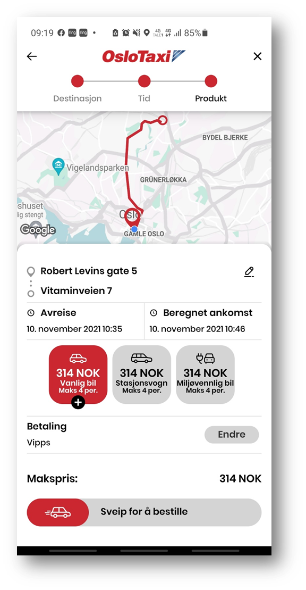

<!-- START_METADATA
---
title: Taxi companies
sidebar_label: Taxi companies
sidebar_position: 70
pagination_next: null
pagination_prev: null
---
END_METADATA -->

# Taxi companies

Use Vipps to simplify the payment flow in your taxi solutions.

## Scenario 1 - Customer scans QR code which leads to payment page

The customer scans a QR and follows instructions to pay from the taxi company's landing page.

The flow is described in our [merchant redirect QR section](https://developer.vippsmobilepay.com/docs/vipps-solutions/qr-code-print#merchant-redirect-qr-codes).

## Scenario 2 - Customer orders and pays through taxi app

The customer pays the taxi company from their app when ordering the taxi. The amount is reserved until the final amount is known, at which time the payment is captured.

Read more about the flow in our [how it works guide](https://developer.vippsmobilepay.com/docs/APIs/epayment-api/how-it-works/vipps-epayment-api-how-it-works-online).

## Scenario 3 - Customer orders through taxi app and taximeter initiates Vipps push

The customer orders a taxi in the taxi company's app. After the journey, the taximeter initiates a push to Vipps. It is not necessary to enter the phone number manually, because it is already known.
The Vipps app opens on the customer's phone and the customer pays the amount due.

Use the [ePayment API](https://developer.vippsmobilepay.com/docs/APIs/epayment-api) with `userFlow:PUSH_MESSAGE` and `customerInteraction: CUSTOMER_PRESENT` while initiating the payment.

After final amount is confirmed do a [partial capture](https://developer.vippsmobilepay.com/docs/APIs/epayment-api/operations/capture#partial-capture)
and release the remaining amount from reservation with a [partial cancel](https://developer.vippsmobilepay.com/docs/APIs/epayment-api/operations/cancel#cancel-after-a-partial-capture) request.

## Scenario 4 - Taximeter initiates Vipps push with manually entered phone number

The driver enters the customer's mobile number into the taximeter, which initiates a push.
The Vipps app opens on the customer's phone and the customer pays the amount due.

Use the [ePayment API](https://developer.vippsmobilepay.com/docs/APIs/epayment-api) with `userFlow:PUSH_MESSAGE` and `"customerInteraction": "CUSTOMER_PRESENT"` while initiating the payment.
Finally, when reservation is completed perform a [full capture](https://developer.vippsmobilepay.com/docs/APIs/epayment-api/operations/capture#capture-via-the-api).
