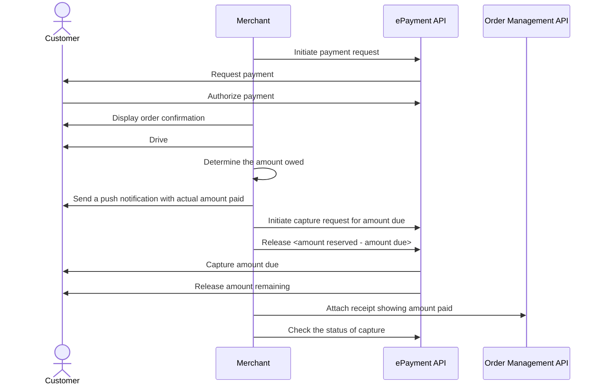

<!-- START_METADATA
---
sidebar_position: 102
hide_table_of_contents: false
pagination_next: null
pagination_prev: null
---

import AUTHORIZEPAYMENT from '../_common/_customer_authorizes_epayment.md'
import PARTIALCAPTURE from '../_common/_partial_capture.md'
END_METADATA -->

# Payment through company app

The customer pays the taxi company from their app when ordering the taxi and selects to pay with Vipps.
The amount is reserved until the final amount is known, at which time the payment is captured.


This flow combines multiple products to illustrate the recommended online payment flow.

## Details

### Step 1. Get the customer's the payment method

Display an option to pay with Vipps on your app.

### Step 2. Initiate a payment request

When the customer is ready to pay, initiate a payment request.

<details>
<summary>Detailed example</summary>
<div>

To create this payment, you first send a
[create payment](https://developer.vippsmobilepay.com/api/epayment#tag/CreatePayments) request, where `customer.phoneNumber` is set.

Specify `"customerInteraction": "CUSTOMER_PRESENT"` and `"userFlow": "WEB_REDIRECT"` to redirect user to the app.

The payment request amount should be large enough to cover the cost of the journey.
Do not include the receipt yet, since a receipt is immutable and the true amount is not known yet.

If the payment is approved, this amount will be reserved on customer's account.
The amount that is unused will be released when the journey is finished.

Here is an example HTTP POST:

[`POST:/epayment/v1/payments`](https://developer.vippsmobilepay.com/api/epayment#tag/CreatePayments/operation/createPayment)

```json
{
  "amount": {
    "value": 10000,
    "currency": "NOK"
  },
  "paymentMethod": {
    "type": "WALLET"
  },
  "customer": {
    "phoneNumber": 4791234567
  },
  "customerInteraction": "CUSTOMER_PRESENT",
  "reference": 2486791679658155992,
  "userFlow": "WEB_REDIRECT",
  "returnUrl": "http://example.com/redirect?reference=2486791679658155992",
  "paymentDescription": "Travel from Oslo central station to Oslo airport"
}

```

</div>
</details>

### Step 3. The customer authorizes the payment

<AUTHORIZEPAYMENT />

### Step 4. Confirm the order

Upon authorization, the Vipps app should automatically redirect the customer to your app.
Confirm that the order has been successful in your app.

### Step 5. Complete the journey

### Step 6. Finalize the payment and attach a receipt

After the drive is complete, calculate how much the customer owes and provide a receipt.

<details>
<summary>Detailed example</summary>
<div>

Here is an example HTTP POST:

[`POST:/order-management/v2/{paymentType}/receipts/{orderId}`](https://developer.vippsmobilepay.com/api/order-management/#operation/postReceiptV2)

For `paymentType`, use `eCom` for eCom or ePayment payments.
For `orderId`, use the `chargeId` of the charge.

Body:

```json
{
  "orderLines": [
    {
        "name": "trip",
        "id": "line_item_1",
        "totalAmount": 100000,
        "totalAmountExcludingTax": 80000,
        "totalTaxAmount": 20000,
        "taxPercentage": 25,
        "productUrl": "https://www.example.com/taxiride",
      },
    },
  ],
  "bottomLine": {
    "currency": "NOK",
    "posId": "taxi_122",
    "tipAmount": 10000
  }
}
```

</div>
</details>


### Step 7. Capture the amount due

<PARTIALCAPTURE />

## Related information

* [ePayment Quick start guide](https://developer.vippsmobilepay.com/docs/APIs/epayment-api/quick-start/)
* [Order Management Quick start guide](https://developer.vippsmobilepay.com/docs/APIs/order-management-api/vipps-order-management-api-quick-start/)

## Sequence diagram


