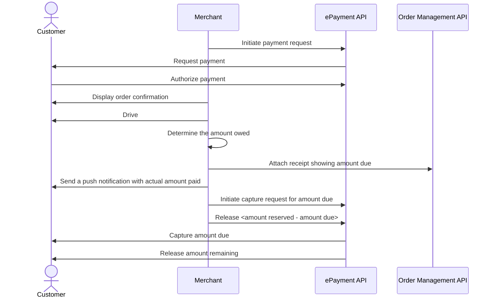

<!-- START_METADATA
---
title: Vipps MobilePay taxi payments flow: Customer orders and pays through taxi app
sidebar_label: Customer orders and pays through taxi app
sidebar_position: 102
hide_table_of_contents: true
pagination_next: null
pagination_prev: null
---
END_METADATA -->

# Customer orders and pays through taxi app

The customer pays the taxi company from their app when ordering the taxi. The amount is reserved until the final amount is known, at which time the payment is captured.


This flow combines multiple products to illustrate the recommended online payment flow.

## Details

### Step 1. Get the customer's the payment method

Display an option to pay with Vipps on your app.

### Step 2. Send the payment request to Vipps

Reserve an amount large enough to cover the payment Vipps.

The app automatically switches over to the Vipps app.


<details>
<summary>Detailed example</summary>
<div>
Here is an example HTTP POST:

[`POST:/epayment/v1/payments`](/api/epayment#tag/CreatePayments/operation/createPayment)

With body:

```json
{
  "amount": {
    "value": 49900,
    "currency": "NOK"
  },
  "paymentMethod": {
    "type": "WALLET"
  },
  "customer": {
    "phoneNumber": 4796574209
  },
  "reference": 2486791679658155992,
  "userFlow": "WEB_REDIRECT",
  "returnUrl": "http://example.com/redirect?reference=2486791679658155992",
  "paymentDescription": "Purchase of socks"
}
```

Set `userFlow` to `WEB_REDIRECT`, so the customer's browser will either do an automatic app-switch or open the landing page to confirm the mobile number.
</div>
</details>

### Step 3. The customer authorizes the payment

The customer receives a push notification in their app where they confirm the payment.
Poll or monitor callbacks to see that the payment is approved, then reserve it and
provide a receipt.

### Step 4. Confirm the order

The Vipps app redirects the customer back to your app, where you confirm that the order has been successful.

### Step 5. Add a receipt

After the drive is complete, calculate how much the customer owes and provide a receipt.
Add a payment receipt to the order by using [`POST:/order-management/v2/ecom/receipts/{reference}`](https://developer.vippsmobilepay.com/api/order-management/#operation/postReceiptV2).

This will appear in their app.

### Step 7. Capture the payment

[Capture](https://developer.vippsmobilepay.com/api/epayment#tag/AdjustPayments/operation/capturePayment) the amount due before releasing the remaining reserved amount on the customer's account. This is done by doing a [cancel](https://developer.vippsmobilepay.com/api/epayment#tag/AdjustPayments/operation/cancelPayment) API request.

The payment is transferred to your account. This may take 2-3 days depending on your bank.

Read more about the flow:

* [ePayment how it works guide](https://developer.vippsmobilepay.com/docs/APIs/epayment-api/how-it-works/vipps-epayment-api-how-it-works-online)
* [Recommended flow for online payments](../online/README.md)

## Sequence diagram

Sequence diagram for the payment through the taxi app.


