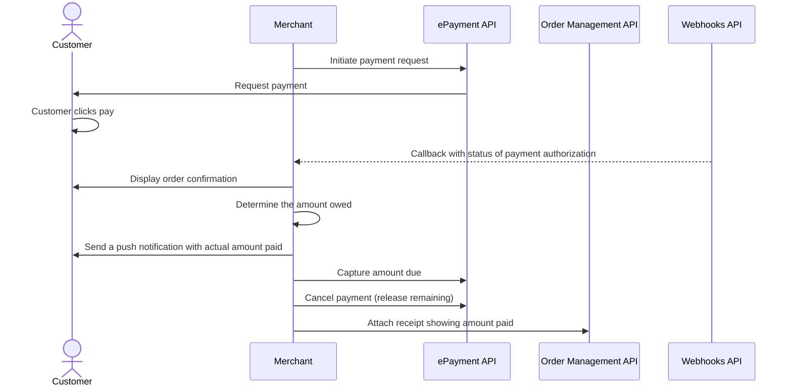

<!-- START_METADATA
---
sidebar_position: 102
hide_table_of_contents: false
pagination_next: null
pagination_prev: null
---

import REGISTERWEBHOOK from '../_common/_register_epayment_webhook.md'
import AUTHORIZEPAYMENT from '../_common/_customer_authorizes_epayment.md'
END_METADATA -->

# Payment through company app

 *Available for Vipps.*

 *Available for MobilePay in selected markets at the [Vipps MobilePay joint platform launch](https://www.vippsmobilepay.com/#about).*

The customer pays the taxi company from their app when ordering the taxi and selects to pay with Vipps MobilePay.
The amount is reserved until the final amount is known, at which time the payment is captured.

This flow combines multiple products to illustrate the recommended online payment flow.

## Prerequisites

### Webhooks for ePayment events

<REGISTERWEBHOOK />

## Details

### Step 1. Initiate a payment request

When the customer is ready to pay, initiate a payment request.

The payment request amount should be large enough to cover the cost of the journey.
Do not include the receipt yet, since a receipt is immutable and the true amount is not known yet.

This amount will be reserved on the customer's account, and the unused amount will be released when the journey is finished.

<details>
<summary>Detailed example</summary>
<div>

To create this payment, you first send a
[create payment](https://developer.vippsmobilepay.com/api/epayment#tag/CreatePayments) request.

Since the customer is selecting this from an app on their phone, you don't need their phone number.
This payment command can do an app-switch and open their app with the payment request.
Specify `"userFlow": "WEB_REDIRECT"` to redirect user to the app.

Specify `"customerInteraction": "CUSTOMER_PRESENT"`.

Here is an example HTTP POST:

[`POST:/epayment/v1/payments`](https://developer.vippsmobilepay.com/api/epayment#tag/CreatePayments/operation/createPayment)

```json
{
  "amount": {
    "value": 31400,
    "currency": "NOK"
  },
  "paymentMethod": {
    "type": "WALLET"
  },
  "customerInteraction": "CUSTOMER_PRESENT",
  "reference": 2486791679658155992,
  "userFlow": "WEB_REDIRECT",
  "returnUrl": "http://example.com/redirect?reference=2486791679658155992",
  "paymentDescription": "Travel from Oslo central station to Storo"
}

```

</div>
</details>

### Step 2. The customer authorizes the payment

<AUTHORIZEPAYMENT />

### Step 3. Confirm the order

Upon authorization, the Vipps MobilePay app should automatically redirect the customer to your app.
Confirm that the order has been successful in your app.

### Step 4. Capture the amount due

After the drive is complete, calculate how much the customer owes and do a
[partial capture](https://developer.vippsmobilepay.com/docs/APIs/epayment-api/operations/capture#partial-capture).

Check the status of the captured payment.

<details>
<summary>Detailed example</summary>
<div>

[`POST:/epayment/v1/payments/{reference}/capture`](https://developer.vippsmobilepay.com/api/epayment/#tag/AdjustPayments/operation/capturePayment)

With body:

```json
{
  "modificationAmount": {
    "value": 29900,
    "currency": "NOK"
  }
}
```

</div>
</details>

### Step 5. Cancel remaining amount

Release the remaining amount from the reservation with a
[cancel](https://developer.vippsmobilepay.com/docs/APIs/epayment-api/operations/cancel#cancel-after-a-partial-capture).

[`POST:/epayment/v1/payments/{reference}/cancel`](https://developer.vippsmobilepay.com/api/epayment/#tag/AdjustPayments/operation/capturePayment)

### Step 6. Attach a receipt

Attach a receipt with the amount paid.

<details>
<summary>Detailed example</summary>
<div>

Here is an example HTTP POST:

[`POST:/order-management/v2/{paymentType}/receipts/{orderId}`](https://developer.vippsmobilepay.com/api/order-management/#operation/postReceiptV2)

For `paymentType`, use `eCom` for eCom or ePayment payments.
For `orderId`, use the `chargeId` of the charge.

Body:

```json
{
  "orderLines": [
    {
        "name": "trip",
        "id": "line_item_1",
        "totalAmount": 29900,
        "totalAmountExcludingTax": 22425,
        "totalTaxAmount": 7475,
        "taxPercentage": 25,
        "productUrl": "https://www.example.com/taxiride",
      },
    },
  ],
  "bottomLine": {
    "currency": "NOK",
    "posId": "taxi_122",
  }
}
```

</div>
</details>

## Related information

* [ePayment Quick start guide](https://developer.vippsmobilepay.com/docs/APIs/epayment-api/quick-start/)
* [Order Management Quick start guide](https://developer.vippsmobilepay.com/docs/APIs/order-management-api/vipps-order-management-api-quick-start/)

## Sequence diagram


