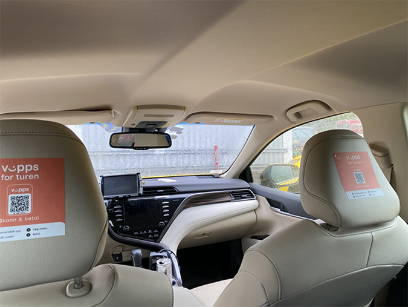
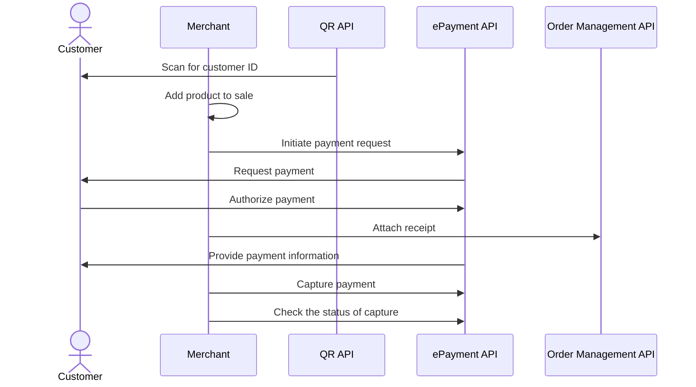

<!-- START_METADATA
---
sidebar_position: 101
hide_table_of_contents: false
pagination_next: null
pagination_prev: null
---

import AUTHORIZEPAYMENT from '../_common/_customer_authorizes_epayment.md'
import ATTACHRECEIPT from '../_common/_attach_receipt.md'
import FULLCAPTURE from '../_common/_full_capture.md'
END_METADATA -->

# Payment through company website

The customer scans a Vipps QR code and is directed to the taxi company's landing page.
There, they follow instructions and pay with Vipps.

## Details

The flow is a variation of the [In-store using static QR](../static-qr-at-pos/README.md) flow.

### Step 1: Generate a static QR code

Generate a static QR code with a
[merchant redirect QR](https://developer.vippsmobilepay.com/docs/APIs/qr-api/vipps-qr-api#merchant-redirect-qr-codes)
linking to your website or app.

### Step 2: The customer scans the static QR

When the customer scans the QR, your system will receive a notification that the QR has been scanned and will be able to get the customer's phone number.

### Step 3: Send the payment request

Use the customer's phone number to send them a [Create Payment request](https://developer.vippsmobilepay.com/api/epayment/#tag/CreatePayments/operation/createPayment) for the taxi fare through Vipps.

Specify `"customerInteraction": "CUSTOMER_PRESENT"` and `"userFlow": "WEB_REDIRECT"` to redirect user to the app.

### Step 4: The customer authorizes the payment

<AUTHORIZEPAYMENT />

### Step 5: Attach a receipt

<ATTACHRECEIPT />

See
[Adding a receipt](https://developer.vippsmobilepay.com/docs/APIs/order-management-api/vipps-order-management-api/#adding-a-receipt)
for more details.

### Step 6: Capture the payment

<FULLCAPTURE />

## Sequence diagram

