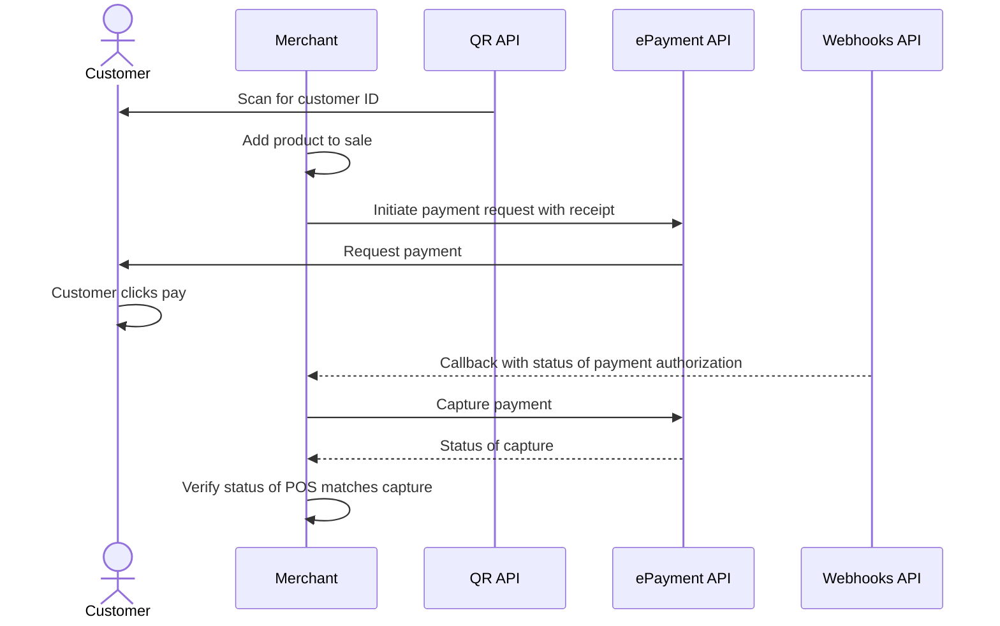

<!-- START_METADATA
---
sidebar_position: 101
hide_table_of_contents: false
pagination_next: null
pagination_prev: null
---

import REGISTERWEBHOOK from '../_common/_register_epayment_webhook.md'
import AUTHORIZEPAYMENT from '../_common/_customer_authorizes_epayment.md'

END_METADATA -->

# Payment through company website

The customer scans a QR code and is directed to the taxi company's landing page.
The company sends a payment request to them through the Vipps MobilePay app.

[](images/labeling_in_the_taxi.png)

## Prerequisites

### QR code in the taxi

Generate a
[merchant redirect QR](https://developer.vippsmobilepay.com/docs/APIs/qr-api/vipps-qr-api#merchant-redirect-qr-codes)
linking to your website or app.
Print and place the QR code in your taxi.

<details>
<summary>How to create a QR code</summary>
<div>

The QR code contains a `Id` that connects it to the taxi where it is located.

Here is an example HTTP POST:

[`POST:/qr/v1/merchant-redirect`](https://developer.vippsmobilepay.com/api/qr/#operation/CreateMerchantRedirectQr)

```json
{
  "id": "taxi_122_qr",
  "redirectUrl": "https://example.com/myTaxiCompany"
}
```

</div>
</details>

### Webhooks for ePayment events

<REGISTERWEBHOOK />

## Details

### Step 1: The customer scans the QR

When the customer scans the QR with their phone, they will be redirected to the `redirectUrl`.

### Step 2: Send the payment request

Send a payment request to the customer

<details>
<summary>Detailed example</summary>
<div>

Since the customer has scanned from their phone, you don't need their phone number.
This payment command can do an app-switch and open their Vipps MobilePay app with the payment request.
Specify `"userFlow": "WEB_REDIRECT"` to redirect user to the app.
Specify `"customerInteraction": "CUSTOMER_PRESENT"`.

Here is an example HTTP POST:

[`POST:/epayment/v1/payments`](https://developer.vippsmobilepay.com/api/epayment#tag/CreatePayments/operation/createPayment)

```json
{
  "amount": {
    "value": 10000,
    "currency": "NOK"
  },
  "paymentMethod": {
    "type": "WALLET"
  },
  "customerInteraction": "CUSTOMER_PRESENT",
  "receipt":{
    "orderLines": [
      {
        "name": "trip",
        "id": "line_item_1",
        "totalAmount": 100000,
        "totalAmountExcludingTax": 80000,
        "totalTaxAmount": 20000,
        "taxPercentage": 25,
      },
    ],
    "bottomLine": {
      "currency": "NOK",
      "posId": "taxi_122",
      "tipAmount": 10000
    },
   "receiptNumber": "0527013501"
  },
  "reference": 2486791679658155992,
  "userFlow": "WEB_REDIRECT",
  "returnUrl": "http://example.com/redirect?reference=2486791679658155992",
  "paymentDescription": "Travel from Oslo central station to Oslo airport"
}

```

</div>
</details>

### Step 3: The customer authorizes the payment

<AUTHORIZEPAYMENT />

### Step 4: Capture the payment

Capture the payment and confirm that it was successful.

<details>
<summary>Detailed example</summary>
<div>

[`POST:/epayment/v1/payments/{reference}/capture`](/api/epayment/#tag/AdjustPayments/operation/capturePayment)

With body:

```json
{
  "modificationAmount": {
    "value": 10000,
    "currency": "NOK"
  }
}
```

</div>
</details>

## Related links

* [Merchant Redirect QR codes](https://developer.vippsmobilepay.com/docs/APIs/qr-api/vipps-qr-api/#merchant-callback-qr-codes)

## Sequence diagram


