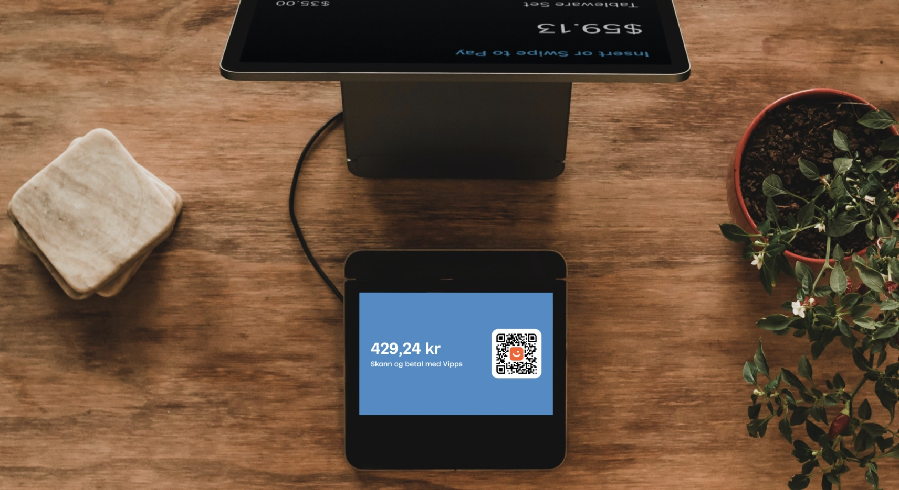
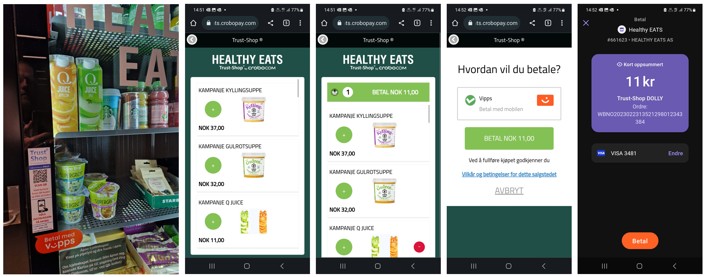

<!-- START_METADATA
---
title: Vending machines
sidebar_label: Vending machines
sidebar_position: 80
pagination_next: null
pagination_prev: null
---
END_METADATA -->

# Vending machines

💥 Improvements coming soon. 💥

Vipps can make it easier for your customers to pay for products in vending machines.
The following are the most common scenarios.

## Scenario 1 - One-time payment QR direct to payment in Vipps app

A [Vipps QR code](https://developer.vippsmobilepay.com/docs/APIs/qr-api/vipps-qr-one-time-payment-api-howitworks) is presented on the vending machine.

When the customer scans the QR code, they go directly to the Vipps payment screen on their phone, where they can approve the payment.

The QR code is a dynamic representation of the payment URL, and the user needs to scan the QR code within 5 minutes.  

**When to use:**

* The One-Time payment QR code is the preferred flow when it's possible to show a dynamic QR code on the vending machine.

**How to use:**

* Vipps [ePayment API](https://developer.vippsmobilepay.com/docs/APIs/epayment-api) supports both the One-time payment QR and payment in the
[CreatePaymentRequest](https://developer.vippsmobilepay.com/api/epayment#tag/CreatePayments).
Specify `"customerInteraction": "CUSTOMER_PRESENT"` and  `"userFlow": "QR"` to generate the QR code to be presented on the customer facing screen.

## Scenario 2 - QR to a merchant site where products are selected

A merchant-generated QR code is posted on the vending machine.

When the customer scans the QR code,
they are taken to the merchant's landing page, where products can select.
The price is presented, and the user pays for the product in their Vipps app.

**When to use:**

* The merchant redirect QR code can be used when it is not possible to present the dynamic one-time payment QR described in scenario 1.

**How to use:**

* Generate a static QR code with a [merchant redirect QR](https://developer.vippsmobilepay.com/docs/APIs/qr-api/vipps-qr-api#merchant-redirect-qr-codes)
linking to a webshop connected to the specific vending machine. The user selects the products and clicks the `pay` button that generates a
[CreatePaymentRequest](https://developer.vippsmobilepay.com/docs/APIs/epayment-api/quick-start) based on the selected products.

* Specify `"customerInteraction": "CUSTOMER_PRESENT"` and `"userFlow": "WEB_REDIRECT"` to redirect user to Vipps.

## Scenario 3 - QR to a merchant site for payment options

A merchant-generated QR code is posted on the vending machine.

When the customer scans the QR code, they are taken to the merchant's landing page, which is waiting for the product to be selected on the vending machine.
The price is presented, and the user pays for the product in their Vipps app.

**How to use:**

* Generate a static QR code with a
  [merchant redirect QR](https://developer.vippsmobilepay.com/docs/APIs/qr-api/vipps-qr-api#merchant-redirect-qr-codes)
  linking to a web page containing the selected product from the vending machine. The user clicks the pay button that generates a
  [CreatePaymentRequest](https://developer.vippsmobilepay.com/docs/APIs/epayment-api/quick-start) with the selected amount.

* Specify `"customerInteraction": "CUSTOMER_PRESENT"` and `"userFlow": "WEB_REDIRECT"` to redirect the user to Vipps.

## Scenario 4 - QR direct to payment in Vipps app

A [Vipps QR code](https://developer.vippsmobilepay.com/docs/APIs/qr-api/vipps-qr-api#merchant-redirect-qr-codes) is posted on the vending machine.

When the customer scans the QR code, they go directly to the Vipps payment screen on their phone, where they can approve the payment.

The payment amount should be the max amount of the vending machine products. After reservation, the amount of the selected product must be captured, and the remaining amount must be released.

**When to use:**

* The merchant redirect QR code can be used when it is not possible to present the dynamic one-time payment QR described in scenario 1.

**How to use:**

* Generate a static QR code with [merchant redirect QR](https://developer.vippsmobilepay.com/docs/APIs/qr-api/vipps-qr-api#merchant-redirect-qr-codes)
linking to a web service that generates a
[CreatePaymentRequest](https://developer.vippsmobilepay.com/docs/APIs/epayment-api/quick-start) with a specific amount.
Specify `"customerInteraction": "CUSTOMER_PRESENT"` and `"userFlow": "WEB_REDIRECT"` to redirect user to Vipps.

* After reservation and product selection, [capture](https://developer.vippsmobilepay.com/docs/APIs/epayment-api/operations/capture) the set amount before
[cancelling the remaining amount](https://developer.vippsmobilepay.com/docs/APIs/epayment-api/operations/cancel#cancel-after-a-partial-capture).

