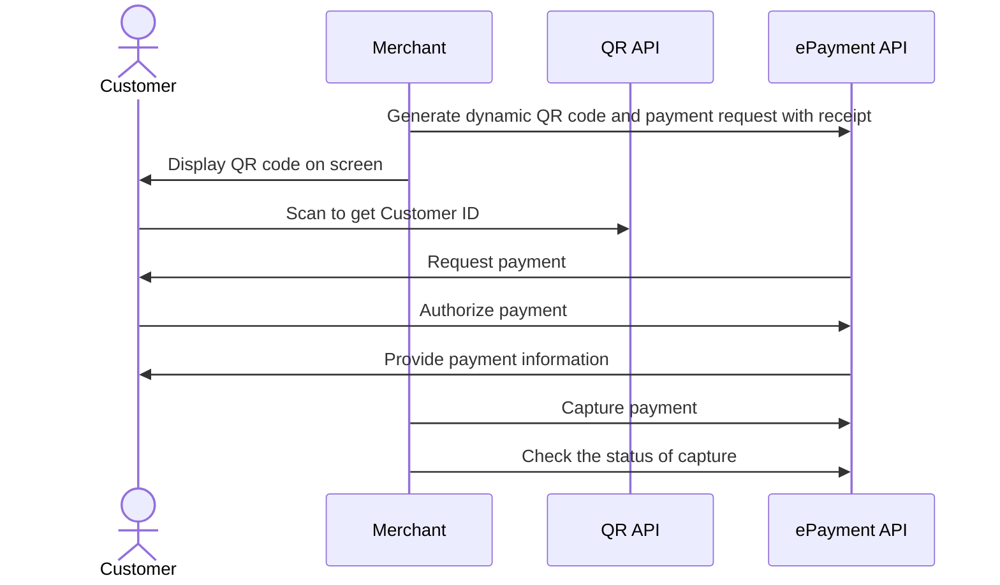

<!-- START_METADATA
---
title: Dynamic QR directing to the app for payment
sidebar_label: Dynamic QR direct to the app for payment
sidebar_position: 10
hide_table_of_contents: false
pagination_next: null
pagination_prev: null
---

import AUTHORIZEPAYMENT from '../_common/_customer_authorizes_epayment.md'
import FULLCAPTURE from '../_common/_full_capture.md'
END_METADATA -->

# Dynamic QR directing to the app for payment

This flow uses a one-time payment QR (i.e., a dynamic QR) that is shown on a screen.
The QR directs the customer to the Vipps MobilePay app, where they authorize the payment.

## When to use

This is the preferred flow when it's possible to show a dynamic QR code on the vending machine.

Use this flow when you have a screen connected.

## Details

A [one-time payment QR code](https://developer.vippsmobilepay.com/docs/APIs/qr-api/vipps-qr-api/#one-time-payment-qr-codes) is presented on the vending machine.
The QR code is a dynamic representation of the payment URL, and the customer needs to scan the QR code within 5 minutes.

When the customer scans the QR code, they go directly to the Vipps or MobilePay payment screen on their phone, where they can approve the payment.

### Step 1: Generate a dynamic QR code and payment request

When the customer selects a product, generate the dynamic QR code and display it on the screen.

To generate the dynamic QR code and associated payment request, send the
[Create Payment](https://developer.vippsmobilepay.com/api/epayment#tag/CreatePayments) request
with `"customerInteraction": "CUSTOMER_PRESENT"` and  `"userFlow": "QR"`.

Include a receipt in the ePayment request.

### Step 2: The customer authorizes the payment

<AUTHORIZEPAYMENT />

### Step 3: Capture the payment

<FULLCAPTURE />

## Sequence diagram

Sequence diagram for the vending machine flow with dynamic QR directing to the app for payment.

