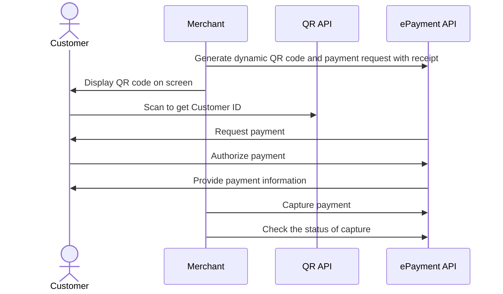

<!-- START_METADATA
---
title: Dynamic QR directing to the app for payment
sidebar_label: Dynamic QR direct to the app for payment
sidebar_position: 10
hide_table_of_contents: false
pagination_next: null
pagination_prev: null
---

import AUTHORIZEPAYMENT from '../_common/_customer_authorizes_epayment.md'

END_METADATA -->

# Dynamic QR directing to the app for payment

This flow uses a one-time payment QR (i.e., a dynamic QR) that is shown on a screen.
The QR directs the customer to the Vipps MobilePay app, where they authorize the payment.


## When to use

This is the preferred flow when it's possible to show a dynamic QR code on the vending machine.

Use this flow when you have a screen connected.

## Details

A [one-time payment QR code](https://developer.vippsmobilepay.com/docs/APIs/qr-api/vipps-qr-api/#one-time-payment-qr-codes)
is presented on the vending machine.
The QR code is a dynamic representation of the payment URL, and the customer needs to scan the QR code within 5 minutes.

When the customer scans the QR code, they go directly to the Vipps or MobilePay payment screen on their phone, where they can approve the payment.

### Step 1: Generate a dynamic QR code and payment request

When the customer selects a product, generate the payment request with a dynamic QR code.
Display the QR on the screen.


<details>
<summary>Detailed example</summary>
<div>

To generate the dynamic QR code and associated payment request, send the
[Create Payment](https://developer.vippsmobilepay.com/api/epayment#tag/CreatePayments) request
with `"customerInteraction": "CUSTOMER_PRESENT"` and  `"userFlow": "QR"`.

Include a receipt in the ePayment request.

Here is an example HTTP POST:

[`POST:/epayment/v1/payments`](https://developer.vippsmobilepay.com/api/epayment#tag/CreatePayments/operation/createPayment)

With body:

```json
{
  "amount": {
    "value": 3000,
    "currency": "NOK"
  },
  "paymentMethod": {
    "type": "WALLET"
  },
  "customerInteraction": "CUSTOMER_PRESENT",
  "receipt":{
    "orderLines": [
      {
        "name": "Fanta",
        "id": "21231211",
        "totalAmount": 3000,
        "totalAmountExcludingTax": 2250,
        "totalTaxAmount": 750,
        "taxPercentage": 25,
      },
    ],
    "bottomLine": {
      "currency": "NOK",
      "posId": "vending_machine_12345"
    },
   "receiptNumber": "0527013501"
  },
  "reference": 2486791679658155992,
  "userFlow": "QR",
  "returnUrl": "http://example.com/redirect?reference=2486791679658155992",
  "paymentDescription": "Vending machine purchase",
  "qrFormat": {
    "format": "IMAGE/SVG+XML",
    "size": 1024
  }
}
```

</div>
</details>


### Step 2: The customer authorizes the payment

The customer scans the QR code to begin authorizing the payment.

<AUTHORIZEPAYMENT />


### Step 3: Capture the payment

Capture the payment and confirm that it was successful.

<details>
<summary>Detailed example</summary>
<div>

[`POST:/epayment/v1/payments/{reference}/capture`](/api/epayment/#tag/AdjustPayments/operation/capturePayment)

With body:

```json
{
  "modificationAmount": {
    "value": 3000,
    "currency": "NOK"
  }
}
```

</div>
</details>

## Sequence diagram

Sequence diagram for the vending machine flow with dynamic QR directing to the app for payment.


