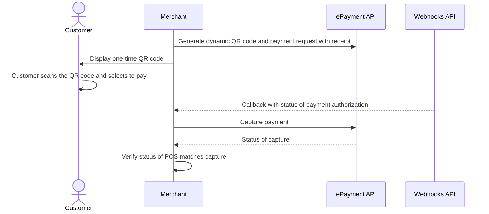

<!-- START_METADATA
---
title: Dynamic QR directing to the app for payment
sidebar_label: Dynamic QR direct to the app for payment
sidebar_position: 10
hide_table_of_contents: false
pagination_next: null
pagination_prev: null
---

import REGISTERWEBHOOK from '../_common/_register_epayment_webhook.md'
import AUTHORIZEPAYMENT from '../_common/_customer_authorizes_epayment.md'

END_METADATA -->

# Dynamic QR directing to the app for payment

 *Available for Vipps.*

 *Available for MobilePay in selected markets at the [Vipps MobilePay joint platform launch](https://www.vippsmobilepay.com/#about).*

This flow uses a one-time payment QR (i.e., a dynamic QR) that is shown on a screen.
The QR directs the customer to the Vipps or MobilePay app, where they authorize the payment.


## When to use

This is the preferred flow when it's possible to show a dynamic QR code on the vending machine.

Use this flow when you have a screen connected.

## Prerequisites

### Screen

You need a screen to display the one-time QR.

### Webhooks for ePayment events

<REGISTERWEBHOOK />


## Details

A [one-time payment QR code](https://developer.vippsmobilepay.com/docs/APIs/qr-api/vipps-qr-api/#one-time-payment-qr-codes)
is presented on the vending machine.
The QR code is a dynamic representation of the payment URL, and the customer needs to scan the QR code within 5 minutes.

### Step 1: Generate a dynamic QR code and payment request

When the customer selects a product, generate the payment request with a dynamic QR code.

<details>
<summary>Detailed example</summary>
<div>

To generate the dynamic QR code and associated payment request, specify `"userFlow": "QR"`.
You may also specify the `qrFormat` and `size` for the QR.

Specify `"customerInteraction": "CUSTOMER_PRESENT"`.

You can also include a receipt at this time.

Since the customer will scan from their phone, you don't need their phone number.
This payment command can do an app-switch and open their Vipps or MobilePay app with the payment request.

Here is an example HTTP POST:

[`POST:/epayment/v1/payments`](https://developer.vippsmobilepay.com/api/epayment#tag/CreatePayments/operation/createPayment)


With body:

```json
{
  "amount": {
    "value": 42924,
    "currency": "NOK"
  },
  "paymentMethod": {
    "type": "WALLET"
  },
  "customerInteraction": "CUSTOMER_PRESENT",
  "receipt":{
    "orderLines": [
      {
        "name": "Ear buds",
        "id": "21231211",
        "totalAmount": 42924,
        "totalAmountExcludingTax": 32193,
        "totalTaxAmount": 10731,
        "taxPercentage": 25,
      },
    ],
    "bottomLine": {
      "currency": "NOK",
      "posId": "vending_machine_12345",
      "receiptNumber": "0527013501"
    },
  },
  "reference": 2486791679658155992,
  "userFlow": "QR",
  "returnUrl": "http://example.com/redirect?reference=2486791679658155992",
  "paymentDescription": "Ear buds",
  "qrFormat": {
    "format": "IMAGE/SVG+XML",
    "size": 1024
  }
}
```

</div>
</details>

### Step 2: Display the QR on the screen

Display the one-time QR on a screen facing the customer.

### Step 3: The customer authorizes the payment

The customer scans the QR code and are directed to the Vipps or MobilePay app.
The payment screen is presented and they click *Pay*.

To get confirmation that payment was approved, monitor your
[webhooks](https://developer.vippsmobilepay.com/docs/APIs/webhooks-api).

Once the payment is approved, update the status in your system.

### Step 4: Capture the payment

Capture the payment and confirm that it was successful.

<details>
<summary>Detailed example</summary>
<div>

[`POST:/epayment/v1/payments/{reference}/capture`](/api/epayment/#tag/AdjustPayments/operation/capturePayment)

With body:

```json
{
  "modificationAmount": {
    "value": 42924,
    "currency": "NOK"
  }
}
```

</div>
</details>

## Sequence diagram

Sequence diagram for the vending machine flow with dynamic QR directing to the app for payment.


