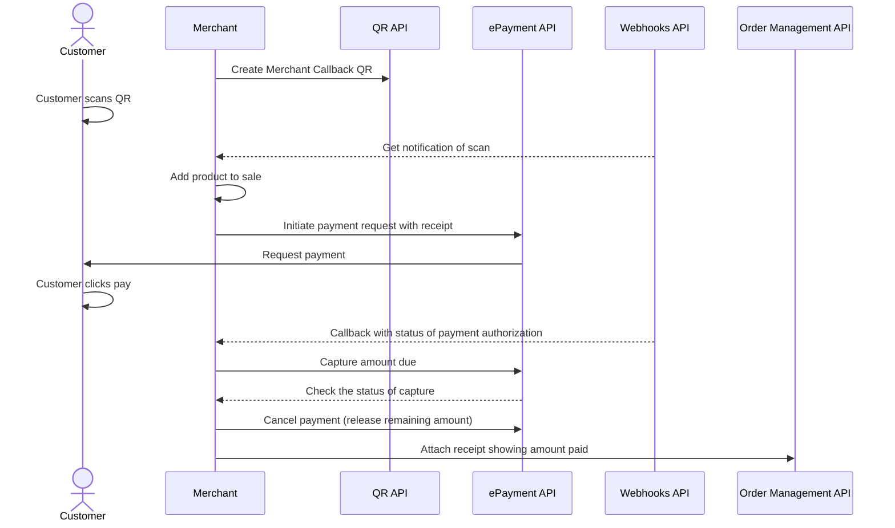

<!-- START_METADATA
---
title: Static QR directing to the app for payment
sidebar_label: Static QR direct to the app for payment
sidebar_position: 20
pagination_next: null
pagination_prev: null
draft: true
---

import REGISTERWEBHOOKQR from '../_common/_register_epayment_and_qr_webhook.md'
import AUTHORIZEPAYMENT from '../_common/_customer_authorizes_epayment.md'
END_METADATA -->

# Static QR directing to the app for payment

 *Partially available for Vipps now.*

 *Available for MobilePay in selected markets at the [Vipps MobilePay joint platform launch](https://www.vippsmobilepay.com/#about).*

💥 *The APIs are still being implemented, and are not yet available. Planned release is Q4 2023.* 💥

This flow uses a QR code that is posted on the vending machine. The QR directs the user to the payment screen in their Vipps or MobilePay app.


## When to use

This QR code can be used when you don't have a screen, and it's not possible to present the dynamic [one-time payment QR](one-time-payment.md).

## Prerequisites

### Merchant Callback QR

Generate a [merchant callback QR code](https://developer.vippsmobilepay.com/docs/APIs/qr-api/vipps-qr-api/#merchant-callback-qr-codes).

<details>
<summary>How to create a merchant callback QR code</summary>
<div>

The QR code contains a `Id` that connects it to a specific POS or cash register in your store.

Here is an example HTTP PUT:

[`PUT:/qr/v1/merchant-callback/{merchantQrId}`](https://developer.vippsmobilepay.com/api/qr/#operation/CreateMerchantRedirectQr)


```json
{
  "locationDescription": "pos_2345",
}
```

</div>
</details>

### Registered webhooks

<REGISTERWEBHOOKQR />

## Details

A Vipps MobilePay [QR code](https://developer.vippsmobilepay.com/docs/APIs/qr-api/vipps-qr-api#merchant-redirect-qr-codes) is posted on the vending machine.

When the customer scans the QR code, they go directly to the payment screen on their phone, where they can approve the payment.

The payment amount should be the max amount of the vending machine products. After reservation, the amount of the selected product must be captured, and the remaining amount must be released.


### Step 1: Initiate a payment request

When the user scans the QR code, send a
[Create Payment request](https://developer.vippsmobilepay.com/api/epayment/#tag/CreatePayments/operation/createPayment).


<details>
<summary>Detailed example</summary>
<div>

Specify the amount of the most expensive item in your vending machine so that any selection they make can be successful.

Specify `"customerInteraction": "CUSTOMER_PRESENT"`.
Specify `"userFlow": "WEB_REDIRECT"` to redirect user to the app.

Here is an example HTTP POST:

[`POST:/epayment/v1/payments`](https://developer.vippsmobilepay.com/api/epayment#tag/CreatePayments/operation/createPayment)

With body:

```json
{
  "amount": {
    "value": 5000,
    "currency": "NOK"
  },
  "paymentMethod": {
    "type": "WALLET"
  },
  "customer": {
    "customerToken": "123456789"
  },
  "customerInteraction": "CUSTOMER_PRESENT",
  "reference": 2486791679658155992,
  "userFlow": "WEB_REDIRECT",
  "returnUrl": "http://example.com/redirect?reference=2486791679658155992",
  "paymentDescription": "Vending machine purchase"
}
```

</div>
</details>

### Step 2: Customer authorizes the payment

<AUTHORIZEPAYMENT />

### Step 3. Capture the amount due

After the selection is made, determine how much the customer owes and provide a receipt.
After final amount is confirmed, do a
[partial capture](https://developer.vippsmobilepay.com/docs/APIs/epayment-api/operations/capture#partial-capture).

Check the status of the captured payment.

<details>
<summary>Detailed example</summary>
<div>

[`POST:/epayment/v1/payments/{reference}/capture`](https://developer.vippsmobilepay.com/api/epayment/#tag/AdjustPayments/operation/capturePayment)

With body:

```json
{
  "modificationAmount": {
    "value": 3000,
    "currency": "NOK"
  }
}
```

</div>
</details>

### Step 4 Cancel remaining amount

Release the remaining amount from the reservation with a
[cancel](https://developer.vippsmobilepay.com/docs/APIs/epayment-api/operations/cancel#cancel-after-a-partial-capture).

[`POST:/epayment/v1/payments/{reference}/cancel`](https://developer.vippsmobilepay.com/api/epayment/#tag/AdjustPayments/operation/capturePayment)

### Step 5. Add a receipt

Attach a receipt with the amount paid.

<details>
<summary>Detailed example</summary>
<div>

Here is an example HTTP POST:

[`POST:/order-management/v2/{paymentType}/receipts/{orderId}`](https://developer.vippsmobilepay.com/api/order-management/#operation/postReceiptV2)

For `paymentType`, use `eCom` for eCom or ePayment payments.
For `orderId`, use the `chargeId` of the charge.

Body:

```json
{
  "orderLines": [
      {
        "name": "Fanta",
        "id": "21231211",
        "totalAmount": 3000,
        "totalAmountExcludingTax": 2250,
        "totalTaxAmount": 750,
        "taxPercentage": 25,
      },
    ],
    "bottomLine": {
      "currency": "NOK",
      "posId": "vending_machine_12345"
    }
}
```

</div>
</details>

## Related links

* [Merchant Redirect QR codes](https://developer.vippsmobilepay.com/docs/APIs/qr-api/vipps-qr-api/#merchant-callback-qr-codes)
* [In-store using static QR](../static-qr-at-pos/README.md)

## Sequence diagram

Sequence diagram for the vending machine flow with static QR directing to the app for payment.


