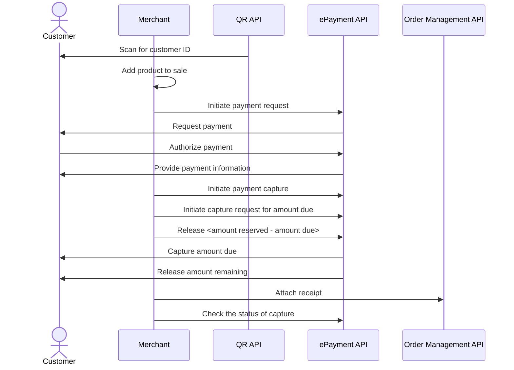

<!-- START_METADATA
---
title: Static QR directing to the app for payment
sidebar_label: Static QR direct to the app for payment
sidebar_position: 20
pagination_next: null
pagination_prev: null
---

import PARTIALCAPTURE from '../_common/_partial_capture.md'
import AUTHORIZEPAYMENT from '../_common/_customer_authorizes_epayment.md'
import ATTACHRECEIPT from '../_common/_attach_receipt.md'
END_METADATA -->

# Static QR directing to the app for payment

This flow uses a static QR code that is posted on the vending machine. The QR directs the user to the payment screen in their Vipps MobilePay app.

## When to use

This QR code can be used when you don't have a screen, and it's not possible to present the dynamic [one-time payment QR](one-time-payment.md).

## Details

This is a variation of the [In-store using static QR](../static-qr-at-pos/README.md) flow.

A Vipps MobilePay [QR code](https://developer.vippsmobilepay.com/docs/APIs/qr-api/vipps-qr-api#merchant-redirect-qr-codes) is posted on the vending machine.

When the customer scans the QR code, they go directly to the Vipps or MobilePay payment screen on their phone, where they can approve the payment.

The payment amount should be the max amount of the vending machine products. After reservation, the amount of the selected product must be captured, and the remaining amount must be released.

### Step 1: Generate a static QR code

Generate a static QR code with [merchant redirect QR](https://developer.vippsmobilepay.com/docs/APIs/qr-api/vipps-qr-api#merchant-redirect-qr-codes)
linking to your system.

### Step 2: Generate a payment request

When the user scans the QR code, send a [Create Payment request](https://developer.vippsmobilepay.com/api/epayment/#tag/CreatePayments/operation/createPayment).

Specify the amount of the most expensive item in your vending machine so that any selection they make can be successful.

Specify `"customerInteraction": "CUSTOMER_PRESENT"` and `"userFlow": "WEB_REDIRECT"` to redirect user to the app.

### Step 3: Customer authorizes the payment

<AUTHORIZEPAYMENT />

### Step 4: Attach a receipt to the order

<ATTACHRECEIPT />

### Step 5: Capture the amount due

<PARTIALCAPTURE />

## Sequence diagram

Sequence diagram for the vending machine flow with static QR directing to the app for payment.

