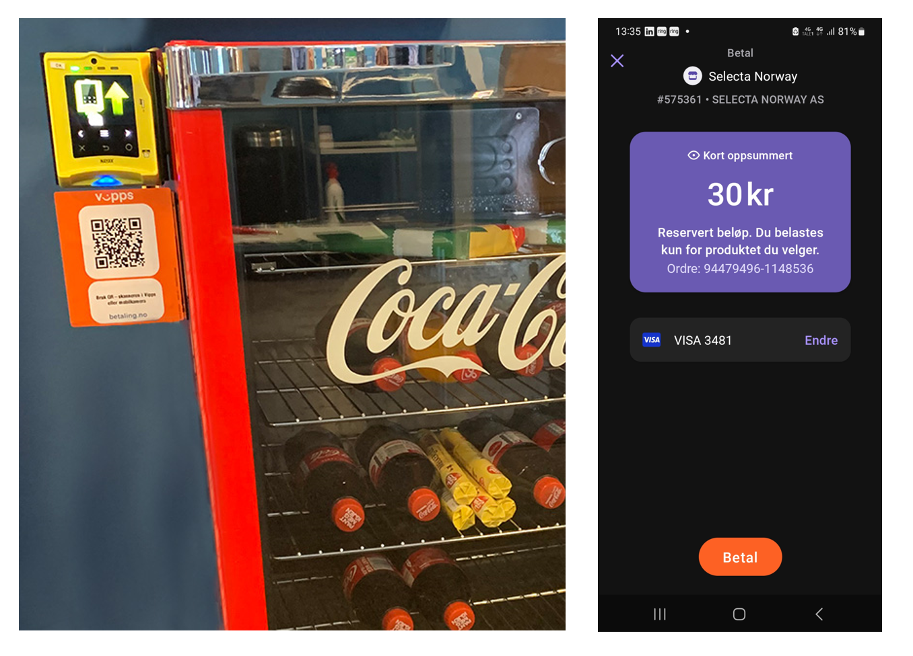

<!-- START_METADATA
---
title: Static QR directing to the app for payment
sidebar_label: Static QR direct to the app for payment
sidebar_position: 20
pagination_next: null
pagination_prev: null
---
END_METADATA -->

# Static QR directing to the app for payment

This flow uses a static QR code that is posted on the vending machine. The QR directs the user to the payment screen in their Vipps or MobilePay app.

## Details

A Vipps or MobilePay [QR code](https://developer.vippsmobilepay.com/docs/APIs/qr-api/vipps-qr-api#merchant-redirect-qr-codes) is posted on the vending machine.

When the customer scans the QR code, they go directly to the Vipps or MobilePay payment screen on their phone, where they can approve the payment.

The payment amount should be the max amount of the vending machine products. After reservation, the amount of the selected product must be captured, and the remaining amount must be released.

**When to use:**

* This QR code can be used when you don't have a screen, and it's not possible to present the dynamic [one-time payment QR](one-time-payment.md).

**How to use:**

* Generate a static QR code with [merchant redirect QR](https://developer.vippsmobilepay.com/docs/APIs/qr-api/vipps-qr-api#merchant-redirect-qr-codes)
linking to a web service that generates a
[Create Payment request](https://developer.vippsmobilepay.com/api/epayment/#tag/CreatePayments/operation/createPayment) with a specific amount.
Specify `"customerInteraction": "CUSTOMER_PRESENT"` and `"userFlow": "WEB_REDIRECT"` to redirect user to the app.

* After reservation and product selection, [capture](https://developer.vippsmobilepay.com/docs/APIs/epayment-api/operations/capture) the set amount before
[cancelling the remaining amount](https://developer.vippsmobilepay.com/docs/APIs/epayment-api/operations/cancel#cancel-after-a-partial-capture).

