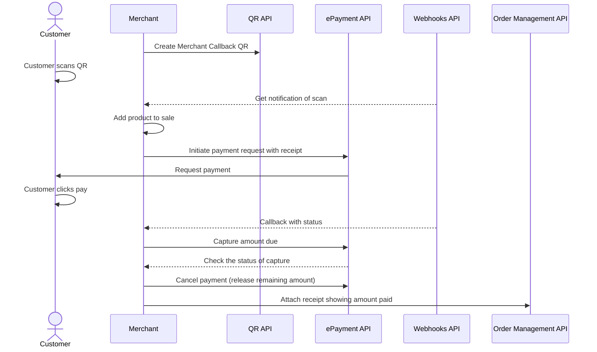

<!-- START_METADATA
---
title: Static QR directing to the app for payment
sidebar_label: Static QR direct to the app for payment
sidebar_position: 20
pagination_next: null
pagination_prev: null
draft: true
---

import AUTHORIZEPAYMENT from '../_common/_customer_authorizes_epayment.md'
END_METADATA -->


This should use merchant redirect QR, which is not ready.
 Currently, the qr goes to our landing page which opens their vipps app.


# Static QR directing to the app for payment


💥 Please note: The Merchant Callback QR feature is being implemented, and is not yet available. Planned release is Q2 2023. 💥


This flow uses a QR code that is posted on the vending machine. The QR directs the user to the payment screen in their Vipps MobilePay app.


## When to use

This QR code can be used when you don't have a screen, and it's not possible to present the dynamic [one-time payment QR](one-time-payment.md).

## Details

A Vipps MobilePay [QR code](https://developer.vippsmobilepay.com/docs/APIs/qr-api/vipps-qr-api#merchant-redirect-qr-codes) is posted on the vending machine.

When the customer scans the QR code, they go directly to the Vipps or MobilePay payment screen on their phone, where they can approve the payment.

The payment amount should be the max amount of the vending machine products. After reservation, the amount of the selected product must be captured, and the remaining amount must be released.

### Step 1: Generate a callback QR code

Generate a callback QR code linking to your company landing page.
Print and place the QR code at your cash register or Point of Sale (POS).


<details>
<summary>Detailed example</summary>
<div>

The QR code contains a `Id` that connects it to a specific POS or cash register in your store.

Here is an example HTTP PUT:

[`PUT:/qr/v1/merchant-callback/{merchantQrId}`](https://developer.vippsmobilepay.com/api/qr/#operation/CreateMerchantRedirectQr)


```json
{
  "locationDescription": "pos_2345",
}
```

</div>
</details>


### Step 2: Create a webhook

Create a webhook that will send callbacks when this QR code is scanned by a Vipps user.

*The Merchant Callback QR feature is being implemented, and is not yet available.*

<details>
<summary>Detailed example</summary>
<div>


Here is an example HTTP POST:

[`POST:/webhooks/v1/webhooks`](https://developer.vippsmobilepay.com/api/webhooks/#tag/v1/paths/~1v1~1webhooks/post)

```json
{  
    "url": "<CALLBACK-URL>", 
    "events": [<future event is to be provided>] 
}
```

</div>
</details>


### Step 3: Initiate a payment request

When the user scans the QR code, send a
[Create Payment request](https://developer.vippsmobilepay.com/api/epayment/#tag/CreatePayments/operation/createPayment).


<details>
<summary>Detailed example</summary>
<div>

Specify the amount of the most expensive item in your vending machine so that any selection they make can be successful.

Specify `"customerInteraction": "CUSTOMER_PRESENT"`.
Specify `"userFlow": "WEB_REDIRECT"` to redirect user to the app.

Here is an example HTTP POST:

[`POST:/epayment/v1/payments`](https://developer.vippsmobilepay.com/api/epayment#tag/CreatePayments/operation/createPayment)

With body:

```json
{
  "amount": {
    "value": 5000,
    "currency": "NOK"
  },
  "paymentMethod": {
    "type": "WALLET"
  },
  "customer": {
    "customerToken": "123456789"
  },
  "customerInteraction": "CUSTOMER_PRESENT",
  "reference": 2486791679658155992,
  "userFlow": "WEB_REDIRECT",
  "returnUrl": "http://example.com/redirect?reference=2486791679658155992",
  "paymentDescription": "Vending machine purchase"
}
```

</div>
</details>

### Step 4: Customer authorizes the payment

<AUTHORIZEPAYMENT />

### Step 5. Capture the amount due

After the selection is made, determine how much the customer owes and provide a receipt.
After final amount is confirmed, do a
[partial capture](https://developer.vippsmobilepay.com/docs/APIs/epayment-api/operations/capture#partial-capture).

Check the status of the captured payment.

<details>
<summary>Detailed example</summary>
<div>

[`POST:/epayment/v1/payments/{reference}/capture`](https://developer.vippsmobilepay.com/api/epayment/#tag/AdjustPayments/operation/capturePayment)

With body:

```json
{
  "modificationAmount": {
    "value": 3000,
    "currency": "NOK"
  }
}
```

</div>
</details>

### Step 6. Cancel remaining amount

Release the remaining amount from the reservation with a
[cancel](https://developer.vippsmobilepay.com/docs/APIs/epayment-api/operations/cancel#cancel-after-a-partial-capture).

[`POST:/epayment/v1/payments/{reference}/cancel`](https://developer.vippsmobilepay.com/api/epayment/#tag/AdjustPayments/operation/capturePayment)

### Step 7. Add a receipt

Attach a receipt with the amount paid.

<details>
<summary>Detailed example</summary>
<div>

Here is an example HTTP POST:

[`POST:/order-management/v2/{paymentType}/receipts/{orderId}`](https://developer.vippsmobilepay.com/api/order-management/#operation/postReceiptV2)

For `paymentType`, use `eCom` for eCom or ePayment payments.
For `orderId`, use the `chargeId` of the charge.

Body:

```json
{
  "orderLines": [
      {
        "name": "Fanta",
        "id": "21231211",
        "totalAmount": 3000,
        "totalAmountExcludingTax": 2250,
        "totalTaxAmount": 750,
        "taxPercentage": 25,
      },
    ],
    "bottomLine": {
      "currency": "NOK",
      "posId": "vending_machine_12345"
    }
}
```

</div>
</details>

## Related links

* [Merchant Redirect QR codes](https://developer.vippsmobilepay.com/docs/APIs/qr-api/vipps-qr-api/#merchant-callback-qr-codes)
* [In-store using static QR](../static-qr-at-pos/README.md)

## Sequence diagram

Sequence diagram for the vending machine flow with static QR directing to the app for payment.


