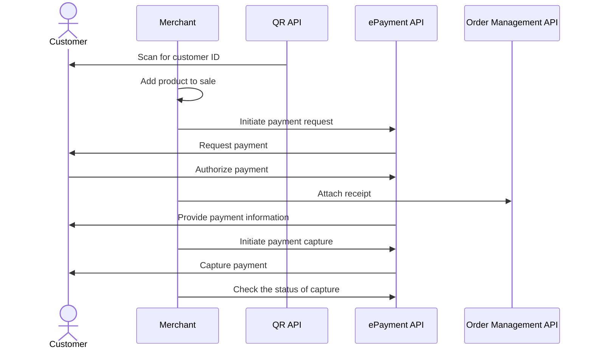

<!-- START_METADATA
---
title: Static QR directing to the merchant site for payment
sidebar_label: Static QR direct to merchant site for payment
sidebar_position: 30
hide_table_of_contents: false
pagination_next: null
pagination_prev: null
---

import ATTACHRECEIPT from '../_common/_attach_receipt.md'
import FULLCAPTURE from '../_common/_full_capture.md'
END_METADATA -->

# Static QR directing to the merchant site for payment

This flow uses a static QR code that is posted on the vending machine.
The QR directs the user to the merchant's landing page where payment is initiated.

## When to use

This QR code can be used when you don't have a screen, and it's not possible to present the dynamic [one-time payment QR](one-time-payment.md).
This is almost identical to [Static QR directing to the app for payment](qr-direct-to-payment-in-app.md), but here you use
your payment interface to provide many types of payment options.

## Details

This is a variation of the [In-store using static QR](../static-qr-at-pos/README.md) flow.

A merchant-generated QR code is posted on the vending machine.

When the customer scans the QR code, they are taken to the merchant's landing page, which is waiting for the product to be selected on the vending machine.
The price is presented, and the user pays for the product in their Vipps MobilePay app.

### Step 1: Generate a static QR code

Generate a static QR code with a
[merchant redirect QR](https://developer.vippsmobilepay.com/docs/APIs/qr-api/vipps-qr-api#merchant-redirect-qr-codes)
linking to a web page containing payment options for the selected product from the vending machine.

### Step 2: Generate a payment request

When the user clicks the pay button, generate a
[Create Payment request](https://developer.vippsmobilepay.com/api/epayment/#tag/CreatePayments/operation/createPayment) with the selected amount.

Specify `"customerInteraction": "CUSTOMER_PRESENT"` and `"userFlow": "WEB_REDIRECT"` to redirect the user to the Vipps MobilePay app.

### Step 3: The customer authorizes the payment

The payment request will appear in the customer's Vipps app where they can authorize the payment.

To get confirmation that payment was approved, monitor
[webhooks](https://developer.vippsmobilepay.com/docs/APIs/webhooks-api) and
[query the payment](https://developer.vippsmobilepay.com/api/epayment#tag/QueryPayments/operation/getPayment).

### Step 4: Attach a receipt to the order

<ATTACHRECEIPT />

### Step 5: Capture the payment

<FULLCAPTURE />

## Sequence diagram

Sequence diagram for the vending machine flow with static QR directing to the merchant site for payment.

