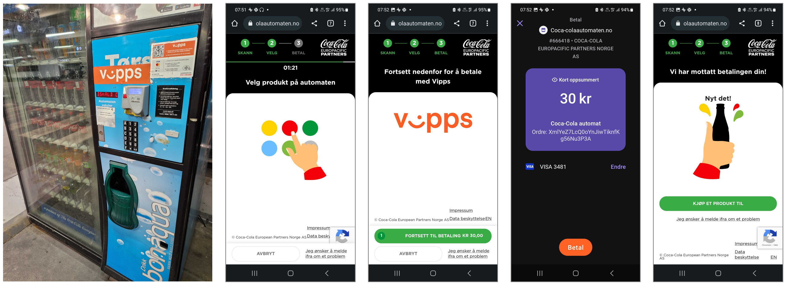
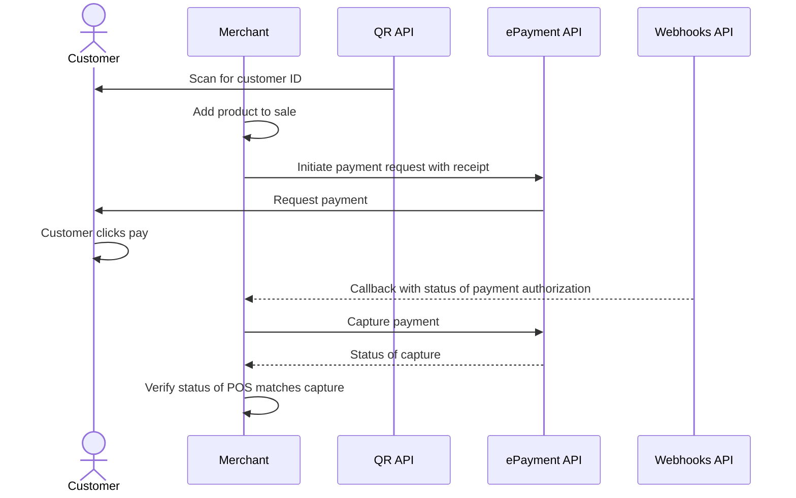

<!-- START_METADATA
---
title: Static QR directing to the merchant site for payment
sidebar_label: Static QR direct to merchant site for payment
sidebar_position: 30
hide_table_of_contents: false
pagination_next: null
pagination_prev: null
---

import REGISTERWEBHOOK from '../_common/_register_epayment_webhook.md'
import AUTHORIZEPAYMENT from '../_common/_customer_authorizes_epayment.md'

END_METADATA -->

# Static QR directing to the merchant site for payment

This flow uses a static QR code that is posted on the vending machine.
The QR directs the user to the merchant's landing page where payment is initiated.

[](images/2_qr_to_landing_page_waiting_for_selection.png)

## When to use

This QR code can be used when you don't have a screen, and it's not possible to present the dynamic [one-time payment QR](one-time-payment.md).

## Prerequisites

### QR code on the vending machine

Generate a [merchant redirect QR code](https://developer.vippsmobilepay.com/docs/APIs/qr-api/vipps-qr-api#merchant-redirect-qr-codes)
linking to a web page containing payment options.

<details>
<summary>How to create a QR code</summary>
<div>

The QR code contains a `Id` that connects it to the vending machine where it is located.

Here is an example HTTP POST:

[`POST:/qr/v1/merchant-redirect`](https://developer.vippsmobilepay.com/api/qr/#operation/CreateMerchantRedirectQr)

```json
{
  "id": "vending_machine_122_qr",
  "redirectUrl": "https://example.com/myvendingmachines"
}
```
</div>
</details>

### Webhooks for ePayment events

<REGISTERWEBHOOK />

## Details

### Step 1: The customer scans the code

When the customer scans the QR code, they are taken to the merchant's landing page, which is waiting for the product to be selected on the vending machine.
The price is presented, and the user pays for the product in their Vipps MobilePay app.

### Step 2: Initiate a payment request

When the user clicks the pay button, create a payment request with the selected amount.

<details>
<summary>Detailed example</summary>
<div>

Since the customer has scanned from their phone, you don't need their phone number.
This payment command can do an app-switch and open their Vipps MobilePay app with the payment request.
Specify `"userFlow": "WEB_REDIRECT"` to redirect the user to the app.

You may include a receipt at this time.

Specify `"customerInteraction": "CUSTOMER_PRESENT"`.

Here is an example HTTP POST:

[`POST:/epayment/v1/payments`](https://developer.vippsmobilepay.com/api/epayment#tag/CreatePayments/operation/createPayment)

With body:

```json
{
  "amount": {
    "value": 3000,
    "currency": "NOK"
  },
  "paymentMethod": {
    "type": "WALLET"
  },
  "customer": {
    "phoneNumber": 4791234567
  },
  "customerInteraction": "CUSTOMER_PRESENT",
  "receipt":{
    "orderLines": [
      {
        "name": "Fanta",
        "id": "21231211",
        "totalAmount": 3000,
        "totalAmountExcludingTax": 2250,
        "totalTaxAmount": 750,
        "taxPercentage": 25,
      },
    ],
    "bottomLine": {
      "currency": "NOK",
      "posId": "vending_machine_12345"
    },
   "receiptNumber": "0527013501"
  },
  "reference": 2486791679658155992,
  "userFlow": "WEB_REDIRECT",
  "returnUrl": "http://example.com/redirect?reference=2486791679658155992",
  "paymentDescription": "Vending machine purchase"
}
```

</div>
</details>


### Step 3: The customer authorizes the payment

<AUTHORIZEPAYMENT />


### Step 4: Capture the payment

<details>
<summary>Detailed example</summary>
<div>

[`POST:/epayment/v1/payments/{reference}/capture`](/api/epayment/#tag/AdjustPayments/operation/capturePayment)

With body:

```json
{
  "modificationAmount": {
    "value": 3000,
    "currency": "NOK"
  }
}
```

</div>
</details>

## Related links

* [Merchant redirect QR code](https://developer.vippsmobilepay.com/docs/APIs/qr-api/vipps-qr-api#merchant-redirect-qr-codes)

## Sequence diagram

Sequence diagram for the vending machine flow with static QR directing to the merchant site for payment.


