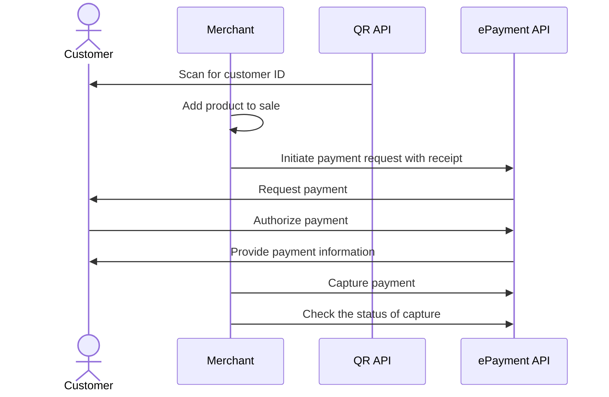

<!-- START_METADATA
---
title: Static QR directing to the merchant site for product selection
sidebar_label: Static QR direct to merchant site for product selection
sidebar_position: 40
hide_table_of_contents: false
pagination_next: null
pagination_prev: null
---

import AUTHORIZEPAYMENT from '../_common/_customer_authorizes_epayment.md'

END_METADATA -->

# Static QR directing to the merchant site for product selection

This flow uses a static QR code that is posted on the vending machine.
The QR directs the user to the merchant's landing page which provides a user interface for selecting products and paying.


## When to use

This QR code can be used when you don't have a screen, and it's not possible to present the dynamic
[one-time payment QR](one-time-payment.md)
and when you want to offer product selection through your user interface.

## Details

A merchant-generated QR code is posted on the vending machine.

When the customer scans the QR code,
they are taken to the merchant's landing page, where products can select.
The price is presented, and the user pays for the product in their Vipps or MobilePay app.

### Step 1: Generate a static QR code

Generate a static QR code with a
[merchant redirect QR](https://developer.vippsmobilepay.com/docs/APIs/qr-api/vipps-qr-api#merchant-redirect-qr-codes)
linking to a webshop connected to the specific vending machine.

### Step 2: Generate a payment request

When the user selects the products and clicks the `pay` button, generate a
[Create payment request](https://developer.vippsmobilepay.com/api/epayment/#tag/CreatePayments/operation/createPayment)
based on the selected products.

Specify `"customerInteraction": "CUSTOMER_PRESENT"` and `"userFlow": "WEB_REDIRECT"` to redirect user to Vipps MobilePay.

Include a receipt in the ePayment request.

### Step 3: The customer authorizes the payment

<AUTHORIZEPAYMENT />


### Step 4: Capture the payment

<details>
<summary>Detailed example</summary>
<div>

[`POST:/epayment/v1/payments/{reference}/capture`](/api/epayment/#tag/AdjustPayments/operation/capturePayment)

With body:

```json
{
  "modificationAmount": {
    "value": 3000,
    "currency": "NOK"
  }
}
```

</div>
</details>

## Sequence diagram

Sequence diagram for the vending machine flow with static QR directing to the merchant site for product selection and payment.


